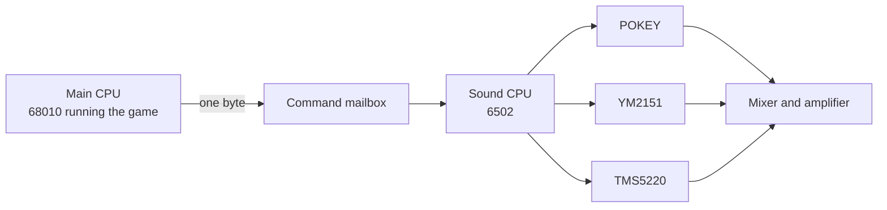

# Chapter 1 — Two Computers in One Cabinet

*Before this chapter: nothing.*

Your Elf walks over a plate of food. The plate vanishes, the health counter
climbs, and a short falling blip plays. The program that moved the Elf did not
make that blip. It wrote a single number into a one-byte pigeonhole and went
straight back to worrying about ghosts and grunts. Something else picked the
number up. That something else is a whole second computer, sitting on its own
board inside the cabinet, and this book is about what it does with that number.

## Why the sound needs its own computer

Gauntlet II runs on a Motorola 68010. In 1986 that was a serious processor, and
it has a lot to get through: four players, dozens of monsters, generators
spawning more of them, collision detection, scrolling, and a scoreboard, all
sixty times a second.

Sound will not fit into that schedule. A tone is not a thing you start and then
forget about. It is a stream of small adjustments: nudge this volume down a
step, move that pitch up, release that note, start the next one, hand the speech
chip its next byte. Do those adjustments late and the music stumbles audibly. A
processor that is halfway through untangling four players and a horde of
demons cannot promise to be anywhere at a particular microsecond.

Atari's answer was to stop asking. The sound lives on its own board with its own
MOS 6502 processor, its own 4 KB of RAM, its own 48 KB of ROM, and its own three
sound chips. That board has exactly one job, so it can afford to be
interrupted about 240 times a second, forever, and never miss an appointment.
[Chapter 4](04_heartbeat.md) is about that heartbeat.

The two computers are joined by something much smaller than you might expect.

## The one-byte conversation

The entire vocabulary between the game and its sound board is a set of numbers
from 0 to 218. The main CPU writes one of them to a fixed address. That is the
whole protocol in the outgoing direction. There is no packet, no length field,
no acknowledgement, and no way to send a parameter alongside the number.



*Every sound in Gauntlet II starts as one byte crossing the boundary in the
middle of this picture. Everything to the right of the mailbox is the subject of
this book.*

Traffic in the other direction is thinner still. The sound board can hand back
single status bytes, and the game asks for those only occasionally: what is the
coin door doing, are you the ROM I expect, are you still alive.

Our worked example throughout the book is command 13, which the sound command
list in this repository calls **Food Eaten**. From here on it is written `$0D`.
The dollar sign is the notation used in 6502 assembly language for a hexadecimal number,
and `$0D` means the same thing as `0x0D` in C or Python. Hexadecimal shows up
constantly in this material because the interesting boundaries in a ROM fall on
round hexadecimal numbers rather than round decimal ones.

So: eat food, and the game writes `$0D`. What happens between that write and the
blip coming out of the speaker takes fourteen more chapters to describe
properly, and involves a scheduler, a linked-list allocator, and a small
purpose-built programming language.

## What one byte has to accomplish

It is worth being precise about how little information `$0D` carries, because
the rest of the book is a consequence of it.

The byte says which sound. It does not say how loud, or how long, or on which
chip voice, or at what pitch, or what should happen if something is already
playing there. The game does not know any of those things and has no way to
express them. Every one of those decisions has to be made on the sound board,
from information already baked into the ROM.

That constraint shapes the entire design:

- Somewhere in ROM there must be a table saying what kind of job command `$0D`
  is, so the board knows whether it is a sound, a spoken phrase, a volume
  change, or a question. [Chapter 6](06_taking_orders.md).
- Somewhere there must be a description of the sound itself, detailed enough to
  cover pitch, timbre, and articulation over time. That description turns out to
  be a program in a small language invented for the purpose.
  [Chapters 8](08_sequence_language_time.md) and [9](09_sequence_language_opcodes.md).
- Something has to decide which of the twelve available chip voices the sound
  gets, and what to do when all twelve are busy, because the game will happily
  ask for a ninth simultaneous sound in the middle of the theme song.
  [Chapter 7](07_command_to_channel.md).

Adding a new sound to Gauntlet II therefore means editing tables and writing a
little program in the ROM's sound language, with the 6502 code left alone. That
is why a single program drives every noise the game makes.

## Three ways to make a noise

The board has three sound chips, and none of them work alike.

| Chip | What it does |
|---|---|
| POKEY | Counts a fast clock down to make square waves, buzzes, and noise |
| YM2151 | FM synthesis: eight voices, each built from four interacting oscillators |
| TMS5220 | Speech, by simulating a human vocal tract rather than replaying a recording |

None of the three can play a sampled recording. There is no digitized sound
effect anywhere in Gauntlet II. Every noise the machine makes is either computed
on the fly by one of the two synthesis chips, or spoken by the speech chip from a
compressed description of the sounds a throat makes.

The names invite an assumption. POKEY is an Atari chip with four sound channels, the
board documentation calls it the effects chip, and the YM2151 is a music
synthesizer, so surely POKEY does the sound effects and the YM2151 plays the
theme song. Right?

In reality, the ROM divides the work differently. Of the 182 sound descriptions it
contains, 11 are aimed at the POKEY. The other 171 go to the YM2151, and they
include the food blip, the death of every player, the treasure room, and every
piece of music. The POKEY is reserved for a handful of specific noises. [Chapter 3](03_three_sound_chips.md)
gives the exact list and explains what the POKEY is better at, including one job
that has nothing to do with sound at all.

## Getting a copy of the ROM

Everything in this book can be checked against the actual sound ROM, and the
tooling in this repository will do the checking for you. The ROM itself is not
included here, because the code is still Atari's. You will need to supply it.

The sound board carries two EPROMs. Concatenate them, first one first, to get
the 48 KB image the rest of the book calls `soundrom.bin`:

| Part number | Board location | Size | SHA-1 |
|---|---|---|---|
| 136043-1120 | 16R | 16 KB | `045ad571db34ef870b1bf003e77eea403204f55b` |
| 136043-1119 | 16S | 32 KB | `6d0d8493609974bd5a63be858b045fe4db35d8df` |

```bash
cat 136043-1120 136043-1119 > soundrom.bin
```

The result should be exactly 49,152 bytes with SHA-1
`a9795393899fd20ce23ef98811195b9406485ed0`. Check it before going further,
because every later exercise assumes a byte-exact image:

```bash
sha1sum soundrom.bin
```

On macOS the equivalent is `shasum -a 1 soundrom.bin`.

Put the file in the root of this repository. The disassembler is a single
self-contained Python script, and `uv` installs its one dependency (NumPy) for
you the first time you run it, so this is all the setup there is:

```bash
uv run gauntlet_disasm.py soundrom.bin --list
```

That exact form works on Windows, macOS, and Linux, and every "Try it yourself"
box in this book is written to be pasted verbatim. One optional extra is worth
knowing about now: the human names for the sounds ("Food Eaten", "NEEDS FOOD,
BADLY.") live in a separate file that the tool will use if you point at it.

```bash
uv run gauntlet_disasm.py soundrom.bin --list --csv hw_docs/soundcmds.csv
```

Without that flag the listing still shows every command and its internals, with
the description column left blank.

The 48 KB image is the whole of the sound board's ROM, and the 6502 sees it at
addresses `$4000` through `$FFFF`. Byte 0 of the file is what the CPU calls
`$4000`. That single fact makes it possible to find anything in the file that
this book gives an address for: subtract `$4000`. [Chapter 2](02_tour_of_the_board.md) draws the rest of the map.

## How to read this book

The book is in four movements.

**The machine ([2](02_tour_of_the_board.md) to [4](04_heartbeat.md)).** What the
sound CPU can see and touch, what the three chips do, and the interrupt that
drives everything. [Chapter 4](04_heartbeat.md) defines the unit of time that the
rest of the book measures in, so it is the one chapter to read slowly.

**Waking up and taking orders ([5](05_waking_up.md) and
[6](06_taking_orders.md)).** Power-on, self-test, and the pipeline that turns an
arriving byte into a decision about what to play.

**Making a sound ([7](07_command_to_channel.md) to [13](13_speaking.md)).** The
heart of it. How one command becomes as many as eight simultaneous strands of
sound, the small programming language that describes every one of them, the
envelopes that shape it, and the last few inches into each of the three chips.

**Watching it happen ([14](14_chip_tests.md) and [15](15_case_studies.md)).**
Complete walkthroughs. The three self-test sounds first, because they were
written to be obvious, and then three real game sounds traced end to end.

Two closing chapters step outside the machine. [Chapter 16](16_how_this_was_figured_out.md) describes how this
ROM was taken apart, and [Chapter 17](17_open_questions.md) is an honest list of what nobody
has worked out yet.

Chapters 1 through 15 state things plainly. Behind that flat tone is a set of
reference documents in [`docs/`](../docs/README.md) that record how confident each claim is and
what evidence supports it. Nothing in this book goes beyond what those
documents call verified or strongly supported. That is a floor rather than a
guarantee: a later consistency audit still found errors this book had inherited
from its own sources, and [Chapter 16](16_how_this_was_figured_out.md) lists
them. If a sentence here makes you suspicious, the "Going deeper" list at the end
of each chapter points at the chapter of `docs/` that will argue the case
properly.

> **Try it yourself**
>
> ```bash
> uv run gauntlet_disasm.py soundrom.bin --list --csv hw_docs/soundcmds.csv
> ```
>
> All 219 commands scroll past, one per line, from `$00` to `$DA`. Find `$0D`
> and you will see `Food Eaten`, handler type 7, with a sequence pointer of
> `$7FB5` and a channel count of 2. Find `$3B` and you get the Gauntlet II theme
> song, also type 7, but with eight channels. Find `$5A` and you get
> `NEEDS FOOD, BADLY.`, handler type 11, with a pointer into a completely
> different part of the ROM and no channel count at all. Three commands from the
> same list, two different subsystems, and a hint that "type 7" and "type 11"
> are going to matter.

## What you now know

- Sound in Gauntlet II runs on a second computer with its own CPU, RAM, ROM, and
  sound chips.
- The two computers communicate through one byte at a time, chosen from 219
  command numbers.
- `$3B` is hexadecimal notation for 59, and it is how this book writes numbers
  that come out of the ROM.
- The ROM is a single 48 KB file that the sound CPU sees at `$4000`–`$FFFF`, so
  file offset 0 is address `$4000`.
- Almost all of Gauntlet II's sound, music and effects alike, comes out of the
  YM2151.

## Where this leads

[Chapter 2](02_tour_of_the_board.md) takes the lid off the sound board and looks at what the 6502 can
reach: 4 KB of RAM, 48 KB of ROM, and a small window of addresses where
writing a number does not store anything at all.

## Going deeper

- [`docs/01_hardware.md`](../docs/01_hardware.md) — board components, clock tree,
  interrupt sources.
- [`docs/08_command_reference.md`](../docs/08_command_reference.md) — the command
  space and how the 219 values divide up.
- [`docs/generated/command_catalog.csv`](../docs/generated/command_catalog.csv) —
  every command as a row.
- [`hw_docs/operation.txt`](../hw_docs/operation.txt) — the board notes this
  project started from.
- The repository [`README.md`](../README.md) — ROM part numbers and checksums.
