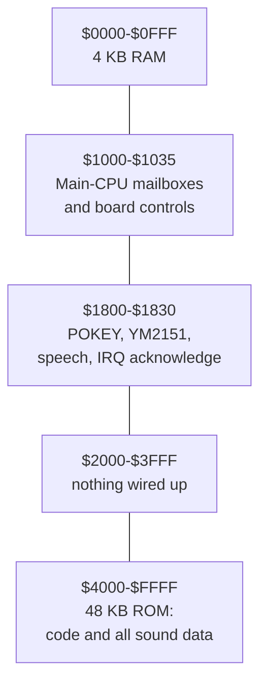

# Chapter 2 — A Tour of the Sound Board

*Before this chapter: [Chapter 1](01_two_computers.md).*

Speech, effects, and music each have their own volume level in a Gauntlet II
cabinet, and the sound CPU sets all three by storing a single byte at address
`$1020`. That store does not save the byte anywhere. It moves three analog
volume controls. This chapter is about how a processor that only knows how to
read and write numbered boxes ends up in charge of an amplifier, two
synthesizers, and a pair of coin counters.

## Sixty-five thousand numbered boxes

The 6502 has a simple picture of the world. There is one long row of boxes,
numbered from 0 to 65,535, and each box holds one byte. Every instruction the
CPU can execute either reads a byte out of a numbered box or writes a byte into
one. There is no distinction in the instruction set between memory, storage, and
peripherals, because as far as the CPU is concerned there is only ever the row of
boxes.

Addresses are written in hexadecimal for a practical reason: the row is wired up
in blocks, and the block boundaries land on values like `$1000` and `$4000`,
which are round numbers in hex and ugly ones in decimal.

Most of the boxes behave the way you would expect. Write 7 into box `$0300`,
read box `$0300` back later, get 7. That is RAM.

Some of them do not. Write 7 into box `$1800` and nothing is stored. The write
lands on a pin of the POKEY chip and changes the pitch of a tone. Read box
`$1800` back and you get something unrelated, because the read is wired to a
different part of the chip than the write. Write a byte to `$1820` and it
disappears into the speech chip's input queue.

This arrangement is called **memory-mapped I/O**, and it is how essentially all
6502 machines talk to hardware. Chips are wired so that certain addresses select
their registers, and from then on controlling the chip is ordinary programming.
Starting a tone on the POKEY looks like this:

```python
poke(0x1801, 0xA8)   # channel 1 control: clean square wave, volume 8 of 15
poke(0x1800, divider)  # channel 1 pitch: smaller number, higher note
```

Two stores, and the chip holds that note until somebody stores something else.
It is worth pausing on the consequence, because it shapes everything later in
this book: to the sound program, playing a note and storing a variable are the
same kind of operation. The only difference is which box you pick.

There is a second consequence that catches people out. Since a write to a
hardware address goes into the chip rather than into memory, the CPU generally
cannot read back what it last wrote. If the program needs to know the current
setting of a POKEY register, it has to keep its own copy in RAM. Several of the
RAM structures in later chapters exist for exactly that reason.

## The map

Here is the whole address space of the sound board.



*The sound CPU's entire world, stacked in address order with the lowest address
at the top. The two hardware bands are thin; roughly three quarters of the
address space is ROM.*

In table form, with the detail that matters later:

| Range | Size | What is there |
|---|---:|---|
| `$0000`–`$00FF` | 256 B | Zero page: the CPU's fastest, cheapest storage |
| `$0100`–`$01FF` | 256 B | The 6502 stack |
| `$0200`–`$0FFF` | 3.5 KB | Command queues, thirty channel records, workspace |
| `$1000`–`$1035` | 54 B | Talking to the main CPU; volume; coin hardware |
| `$1800`–`$180F` | 16 B | POKEY |
| `$1810`–`$1811` | 2 B | YM2151 |
| `$1820` | 1 B | Speech data |
| `$1830` | 1 B | Interrupt acknowledge |
| `$2000`–`$3FFF` | 8 KB | Not wired to anything |
| `$4000`–`$FFFF` | 48 KB | ROM |

The proportions in that last row are the surprising part. The ROM holds the
program, the description of every sound effect, every note of every tune, and
all 55 of the YM2151's instrument definitions. All of that together occupies
18,544 bytes, or about 18 KB: 18,237 of them before the speech and 307 of
padding and interrupt vectors after it. The remaining 30,608 bytes, nearly two
thirds of the entire ROM, are recorded speech. Gauntlet II spends more of its
sound ROM on talking than on everything else put together.
[Chapter 13](13_speaking.md) explains what those bytes hold.

## The wall of mailboxes at `$1000`

The block starting at `$1000` is where the two computers meet. Every address in
it is hardware, and several of them mean completely different things depending
on whether the CPU reads or writes.

| Address | Direction | Meaning |
|---|---|---|
| `$1000` | write | Hand a byte to the main CPU and interrupt it |
| `$1010` | read | The command byte the main CPU most recently sent |
| `$1020` | write | Set all three volume levels |
| `$1020` | read | The four coin switches, active low |
| `$1030` | read | Board status flags, described below |
| `$1030` | write | Reset the YM2151 |
| `$1031` | write | Strobe a byte into the speech chip |
| `$1032` | write | Reset the speech chip |
| `$1033` | write | Select the speech chip's clock speed |
| `$1034` | write | Pulse the right mechanical coin counter |
| `$1035` | write | Pulse the left mechanical coin counter |

The status byte at `$1030` is the sound board's single sense organ. Four of its
bits carry information:

| Bit | Reads as 1 when |
|---:|---|
| 7 | A command is waiting at `$1010` |
| 6 | The last reply has not yet been collected by the main CPU |
| 5 | The speech chip is *not* ready for another byte |
| 4 | The self-test switch is *not* being held |

Bits 5 and 4 are active low, which means the interesting condition is the bit
being zero. That is an ordinary convention in this era of hardware and it shows
up several more times in this book.

Those four bits answer the only four questions the sound program ever needs to
ask about the outside world. Has the game said anything? Has the game picked up
what I said? Is the speech chip hungry? Is a technician holding the self-test
button? Chapters [5](05_waking_up.md), [6](06_taking_orders.md), and
[13](13_speaking.md) each build on one of them.

## Three volume levels in one byte

Writing to `$1020` sets the mix. The byte is divided into three fields:

| Bit | 7 | 6 | 5 | 4 | 3 | 2 | 1 | 0 |
|---|---|---|---|---|---|---|---|---|
| Field | speech | speech | speech | effects | effects | music | music | music |

Speech gets three bits, so eight levels. Effects get two bits, so four levels.
Music gets three bits, so eight levels again. Those bits feed the board's analog
mixer, so a single store sets three hardware volume levels at once.

The sound ROM keeps the fields in separate bytes of RAM and combines them at the
moment it writes, which lets it change one without disturbing the others.
Commands `$D6` through `$D9` expose four effects-level presets. The game
definitely sends `$D7` during the level-start screen; uses of the other three
have not yet been found. [Chapter 6](06_taking_orders.md) covers the sound-side
mechanism.

## The board's other job

The same block of addresses handles the coin door. Reading `$1020` returns the
state of four coin switches in its low four bits. Writing to `$1034` and `$1035`
energizes the two mechanical coin counters, the little electromechanical
odometers behind the door that an operator reads to work out how much money the
machine took.

So the sound CPU is also the cabinet's accountant. It watches the coin switches,
filters out the contact bounce that a mechanical switch produces, and drives the
counter solenoids with a pulse long enough for the mechanism to step.
[Chapter 4](04_heartbeat.md) explains why this ended up on the sound board of all
places, and the answer turns out to be about timing rather than about money.

## The 4 KB of scratch paper

RAM is the smallest part of the board and the most densely used. Two regions of
it have fixed roles imposed by the processor itself.

The **zero page** is the first 256 bytes. On a 6502, an instruction that
addresses one of these bytes is one byte shorter and one cycle faster than the
same instruction pointed anywhere else, because the high half of the address is
implied. Zero page is therefore the closest thing a 6502 has to registers, and
programs fight over it. The sound ROM keeps the frame counter, the error flags,
the speech state machine's entire working set, the coin filters, and a dozen
pointers down there.

The **stack** is the next 256 bytes, and its position is fixed by the hardware.
It is where return addresses go when one piece of code calls another. Chapter 5
has a good reason to care that the stack lives at `$0100`.

The remaining 3.5 KB holds queues and channel state. The single most important
structure in it is a set of about thirty parallel arrays. Each array is thirty
entries long, one entry per sound currently in progress, and each array holds one
property: this array holds every sound's current volume, that one holds every
sound's position in its music, another holds every sound's tempo. To find out
everything about sound number 7, you read entry 7 of each array in turn.

That layout looks strange to anyone used to defining a struct and making an
array of it. On a 6502 it is the fast choice. The processor has two index
registers and an addressing mode that adds one of them to a fixed base address,
so reading `volume_array + 7` is one instruction with no arithmetic. Reaching
into the eighth element of an array of structs would require multiplying by the
struct size first, and the 6502 has no multiply instruction. Splitting a record
into parallel arrays turns that multiplication into nothing at all, at the cost
of needing a separate base address for every field.

Here is a sketch of what that looks like in practice:

```python
# One sound in progress, spread across many arrays
tempo         [channel] = 0x18   # how fast its music advances
sequence_ptr  [channel] = 0x7FB5 # where it has got to in the ROM
primary_timer [channel] = 240    # ticks until the next event
volume_env    [channel] = 0x68D6 # which volume curve it is following
```

[Chapter 7](07_command_to_channel.md) takes those arrays apart properly. For
now, the useful number is thirty: the sound board tracks up to thirty strands of
sound at once, and it has twelve chip voices to play them on. Thirty is not
thirty *sounds* — one command can ask for eight strands at once, as the theme
does — and [Chapter 7](07_command_to_channel.md) gives them their proper name.
Reconciling those two numbers is the most interesting thing this ROM does.

> **Try it yourself**
>
> ```bash
> sha1sum soundrom.bin
> ```
>
> You should see `a9795393899fd20ce23ef98811195b9406485ed0`. Now check the
> length; on Linux, macOS, or Git Bash, `wc -c soundrom.bin` reports exactly
> `49152`. That is 48 KB, and it matches the `$4000`–`$FFFF` row of the map
> above to the byte. Since the CPU sees byte 0 of the file at address `$4000`,
> you can convert either way by adding or subtracting `$4000`: the speech data
> that begins at CPU address `$873D` starts at file offset `$473D`, which is
> 18,237 bytes in.

## What you now know

- The 6502 sees one flat row of 65,536 numbered bytes, and some of those bytes
  are chips rather than memory.
- Reading and writing the same address can do two unrelated things.
- Nearly two thirds of the sound ROM is recorded speech.
- Four status bits at `$1030` are the sound board's entire awareness of the
  outside world.
- One byte at `$1020` carries three separate volume levels into an analog mixer.
- RAM holds thirty parallel arrays describing up to thirty strands of sound in
  progress, which is fewer than thirty sounds.

## Where this leads

[Chapter 3](03_three_sound_chips.md) introduces the three chips those hardware
addresses lead to, and explains what each one is good at well enough that you
can tell, by ear, which chip made a given noise in the game.

## Going deeper

- [`docs/02_memory_map.md`](../docs/02_memory_map.md) — every named RAM location
  and every array base address.
- [`docs/01_hardware.md`](../docs/01_hardware.md) — direction-sensitive register
  semantics for the board controls.
- [`docs/03_rom_structure.md`](../docs/03_rom_structure.md) — the region-by-region
  contents of the 48 KB image.
- [`docs/generated/ram_state_semantics_catalog.csv`](../docs/generated/ram_state_semantics_catalog.csv)
  — RAM roles resolved from the code that reads them.
