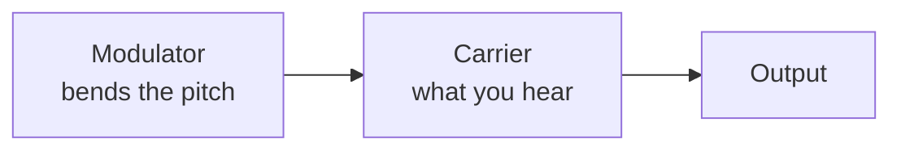

# Chapter 3 — Meet the Three Sound Chips

*Before this chapter: [Chapters 1](01_two_computers.md) and [2](02_tour_of_the_board.md).*

Stand in front of a Gauntlet II cabinet with your eyes shut and you can sort the
noises into families without knowing anything about the hardware. The arrow has
a dry electronic *pfft* to it. The theme song is warm and slightly metallic, like
a cheap organ played through a guitar amp. The voice is unmistakable: flat,
buzzy, and a bit adenoidal, produced by a close relative of the chip inside a
Speak &amp; Spell. Three families, three chips. This chapter is about what makes
each one sound the way it does.

## POKEY: counting down to a square wave

POKEY is an Atari house chip from 1978, originally designed to read paddles and
keyboards, with sound as one of several side jobs. Its sound section is about as
simple as a tone generator can be.

Take a clock. Load a number into a counter. On every clock tick, subtract one.
When the counter reaches zero, flip the output between high and low and reload
the counter. That is the whole tone generator.

The clock feeding those counters is selectable. POKEY divides its 1,789,772 Hz
input down to a 64 kHz or 15 kHz base rate, and two of the four channels can be
switched to run straight off the full 1.79 MHz instead. Each of Gauntlet II's
seven POKEY effects asks for the fast clock, which buys finer pitch steps; the
effects chip test asks for nothing and runs off the 64 kHz default.
[Chapter 11](11_driving_the_pokey.md) has the details, including the reason the
request is not quite as useful as it looks.

The counting arrangement explains the chip's whole personality. A *smaller*
number in the counter means the output flips more often, which means a *higher*
pitch. Roughly speaking, pitch is the reciprocal of the number you write, and
doubling the number drops the tone by an octave.

POKEY has four of these, and each one has two registers:

| Register | What it holds |
|---|---|
| AUDF | The countdown number: 8 bits, so 256 possible pitches |
| AUDC | Volume in the low four bits, waveform selection in the top three |

Volume gets four bits, so sixteen levels including silence. That is the entire
dynamic range available on a POKEY channel, and [Chapter 10](10_shaping_the_sound.md)
is largely about what a clever programmer can do with sixteen steps.

The top three bits of AUDC select what Atari's documentation calls
**distortion**, and this is where POKEY stops sounding like a beeper. On its way
to the speaker, the counter's output can be gated through one or more
**polynomial counters**. These are shift registers wired to produce a long,
repeating, random-looking sequence of bits, and POKEY has several:

| Width | Repeats after |
|---:|---:|
| 4 bits | 15 steps |
| 5 bits | 31 steps |
| 17 bits | 131,071 steps |

Run the tone through the 4-bit polynomial and you get a short, gritty buzz with
an audible periodicity. Run it through the 17-bit polynomial and it sounds like
white noise. Turn the polynomials off and you get a clean square wave. That
handful of settings covers everything from a musical bass note to an explosion,
which is why POKEY-driven Atari games have such a recognizable sonic vocabulary.

Two extras matter for Gauntlet II. The first is that adjacent channels can be
**joined** into a single 16-bit counter. Eight bits of pitch resolution is coarse,
badly so in the low register where consecutive counter values are far apart in
frequency; sixteen bits fixes that at the cost of a channel.
[Chapter 11](11_driving_the_pokey.md) shows the ROM choosing joined mode
automatically.

The second extra has nothing to do with sound. Reading address `$180A` returns
eight bits pulled off the top of the 17-bit polynomial counter, which gives the
program a free hardware random number generator.
[Chapter 9](09_sequence_language_opcodes.md) shows the sound engine reading it to
decide which of sixteen variations of a noise to play.

## YM2151: one wave bending another

The YM2151 is a Yamaha FM synthesis chip, and FM works on a completely different
principle from POKEY's counters. It is worth getting the intuition right,
because half of [Chapter 12](12_driving_the_ym2151.md) depends on it.

Start with two oscillators. Both produce sine waves. Feed the output of the first
one into the pitch control of the second. Now the second oscillator's pitch is
being pushed up and down by the first.

If the first oscillator is slow, say five times a second, you hear exactly what
you would expect: vibrato, a wobble in pitch. Now speed the first oscillator up
until it is running at an audio rate, hundreds of times a second. Your ear stops
being able to track the individual wobbles. What you hear instead is a change in
*timbre*: the tone sprouts harmonics and turns bright, hollow, buzzy, or bell-like
depending on the wobbling oscillator's frequency and how hard it pushes.

That is frequency modulation. The oscillator doing the pushing is the
**modulator**; the one being pushed and heard is the **carrier**. Two numbers, the
modulator's frequency ratio and its strength, give you a huge range of timbres,
and both are cheap to compute in hardware. That is why FM took over arcade and
home music hardware in the mid 1980s.



*The smallest useful FM patch. The modulator is never heard directly; it is heard
as the harmonic colour of the carrier.*

The YM2151 gives you four oscillators per voice, called **operators**, and eight
prewired ways of connecting them, called **algorithms**. Algorithm 0 stacks all
four in a chain, so operator 1 bends operator 2, which bends operator 3, which
bends operator 4, and the result is dense and aggressive. Algorithm 7 runs all
four side by side as carriers, turning the chip into a four-oscillator organ.
The six in between are assorted trees and branches, some with two carriers, some
with three.

Each operator has its own **envelope**: a rate at which it rises when the note
starts, a rate at which it falls, a level it holds at, and a rate at which it
dies away when the note is released. Each operator also has its own **total
level**, which is an attenuation, so larger numbers are quieter. Setting the
total level of a carrier changes how loud the voice is. Setting the total level
of a modulator changes how *bright* it is. That single fact causes most of the
complexity in [Chapter 12](12_driving_the_ym2151.md).

The chip has eight independent voices, and the complete personality of one voice
is a block of 42 bytes in ROM. Twenty-eight of those go straight into chip
registers, four describing the channel and six describing each of the four
operators; the remaining fourteen tell the sound engine how to scale the voice's
levels as it plays. Gauntlet II's ROM contains 55 such blocks. Load a different
one and the same eight channels become a different instrument.

## TMS5220: speech by describing a throat

The third chip solves a problem that in 1986 looked impossible. A second of
digitized audio at even modest quality is several kilobytes. Gauntlet II says
141 different things. Storing those as recordings would need a bigger ROM than
the whole game has.

The TMS5220 stores a description of how to *make* each sound, and rebuilds it on
the fly. The technique is called **linear predictive coding**, and the idea
behind it is that human speech comes out of a fairly simple machine.

When you speak, your vocal folds either buzz at some pitch (for vowels and sounds
like *m* and *z*) or stay open and let air hiss through (for *s*, *f*, *sh*).
That buzz or hiss is then coloured by the shape of your throat, tongue, and lips,
which act as a tube with resonances. Change the shape of the tube and the same
buzz becomes *ah*, or *ee*, or *oo*.

The chip models exactly that. It contains a buzz generator, a hiss generator, and
a ten-stage filter that stands in for the tube. Then speech is stored as a
sequence of **frames**, each one a compact snapshot:

| Field | Meaning |
|---|---|
| Energy | How loud this frame is |
| Voiced/unvoiced | Buzz or hiss |
| Pitch | How fast the buzz is, when voiced |
| K1 through K10 | Ten numbers that set the shape of the filter |

Each field is a small index into a lookup table, and frames come in several
sizes. A silent frame is four bits. A repeat frame keeps the previous filter
settings and supplies only a new pitch and volume. A full voiced frame, with all
ten filter coefficients, is the one that costs real space, and connected speech
needs surprisingly few of them. The chip generates 200 samples from each frame
and smoothly interpolates the filter settings eight times along the way so that
transitions do not click.

The result is compression by a factor of dozens, and it is why 30 KB of ROM can
hold 141 phrases. It also explains the voice. What comes out of the speaker is a
ten-parameter cartoon of a throat, updated forty times a second, and the ear
notices.

The chip has a 16-byte input queue and a pin that says whether it can take
another byte. The sound CPU has to keep that queue fed, on the chip's schedule
rather than its own. [Chapter 13](13_speaking.md) is about the byte pump that
does it.

## Who does what

Now the promise from [Chapter 1](01_two_computers.md).

The sound ROM describes each playable sound as one or more **records**, and each
record names the chip voice it wants. There are 182 records in the ROM. Here is
how they divide:

| Chip | Records | Commands |
|---|---:|---:|
| YM2151 | 171 | 54 |
| POKEY | 11 | 8 |

The eight POKEY commands are the complete list, so they are worth printing:

| Command | Sound |
|---|---|
| `$05` | Effects chip test (self-test only) |
| `$43` | Unable to Join In |
| `$44` | No Potions |
| `$45` | Axe |
| `$46` | Fireball |
| `$47` | Sword |
| `$48` | Arrow |
| `$49` | Lobber Throwing Rock |

Five projectile noises, two rejection buzzes, and a diagnostic. Everything else
in the game runs on the YM2151: the theme song, the treasure room music, the
level-opening fanfare, and also the food blip, the potion, the exit sound, the
death of every player character, and the player joining in. The chip the board
documentation calls the music synthesizer plays almost all of the sound effects
too.

The POKEY's remaining specialities are worth naming. Its polynomial-based noise
is harsher and dirtier than anything the YM2151 produces from four sine waves,
which suits a projectile. Every one of the ROM's thirteen pitch-sweep envelopes
runs on a POKEY channel, because sweeping a divider across a wide range costs
nothing. And its random number generator is read by sequences playing on the
YM2151, so the POKEY takes part in three YM sound effects while making no sound
of its own.

## Why these three

Each chip was picked for something it does cheaply. POKEY makes noise and grit
with four registers and no arithmetic. The YM2151 turns a 42-byte description
into a complex, evolving timbre without the CPU touching it again. The TMS5220
turns 200 bytes into a spoken sentence.

<!-- TODO: Narrow "without the CPU touching it again" to the YM2151's internal
     operator-envelope evolution. Chapter 12 shows continuing CPU pitch, level,
     key, and refresh writes on every YM sweep. -->

The common thread is that none of them plays back audio. There is no sampler on
this board and nowhere to put samples if there were. Every sound Gauntlet II
makes is generated at the moment you hear it, from a description small enough to
fit in a ROM that also has to hold the program.

> **Try it yourself**
>
> ```bash
> uv run gauntlet_disasm.py soundrom.bin --sfx-wav 0x46 --csv hw_docs/soundcmds.csv
> uv run gauntlet_disasm.py soundrom.bin --music-wav 0x0D --csv hw_docs/soundcmds.csv
> uv run gauntlet_disasm.py soundrom.bin --speech-wav 0x5A --csv hw_docs/soundcmds.csv
> ```
>
> Three files land in the current directory: `sfx_0x46.wav` (Fireball, 1.672
> seconds, built from 741 POKEY register writes), `music_0x0D.wav` (Food Eaten,
> 1.484 seconds, 463 YM2151 register writes), and `speech_0x5A.wav`
> (`NEEDS FOOD, BADLY.`, 1.52 seconds, decoded from 324 bytes of LPC data).
> Listen to them back to back and the three textures are unmistakable. Two
> details are worth noticing in the printed output. The food blip, a sound effect
> by any reasonable definition, comes out of the `--music-wav` path, because it
> plays on the YM2151. And 324 bytes of ROM produced a second and a half of
> intelligible English, which is what the compression in this chapter buys. The
> second command compiles the bundled YM2151 emulator the first time you run it,
> so it needs a C++ compiler and takes a few seconds longer than the other two.

## What you now know

- POKEY makes pitch by counting a fast clock down, so smaller numbers mean higher
  notes, and it colours the result by gating it through shift-register noise.
- The YM2151 makes timbre by having one oscillator bend another thousands of
  times a second; four operators and eight wiring patterns per voice.
- Lowering a YM2151 carrier's level makes it quieter and lowering a modulator's
  level makes it duller.
- The TMS5220 stores a frame-by-frame description of a buzz or hiss plus a
  ten-stage filter, which is why 30 KB holds 141 phrases and why it sounds
  synthetic.
- 171 of the ROM's 182 sound records go to the YM2151. The POKEY plays eight
  specific things, and also supplies a random number generator that the rest of
  the engine uses.

## Where this leads

[Chapter 4](04_heartbeat.md) introduces the clock that drives all of this: an
interrupt borrowed from the video circuitry, and the eight-millisecond tick that
every later chapter measures time in.

## Going deeper

- [`hw_docs/POKEY.md`](../hw_docs/POKEY.md) — full POKEY register reference.
- [`hw_docs/YM2151.md`](../hw_docs/YM2151.md) — full YM2151 register reference.
- [`mame_refs/tms5220.txt`](../mame_refs/tms5220.txt) — the LPC frame formats.
- [`docs/01_hardware.md`](../docs/01_hardware.md) — how each chip is wired to this
  particular board.
- [`docs/04_subsystems.md`](../docs/04_subsystems.md) — the POKEY and YM2151
  output pipelines.
- [`docs/generated/type7_chain_catalog.csv`](../docs/generated/type7_chain_catalog.csv)
  — every record and the chip it targets.
