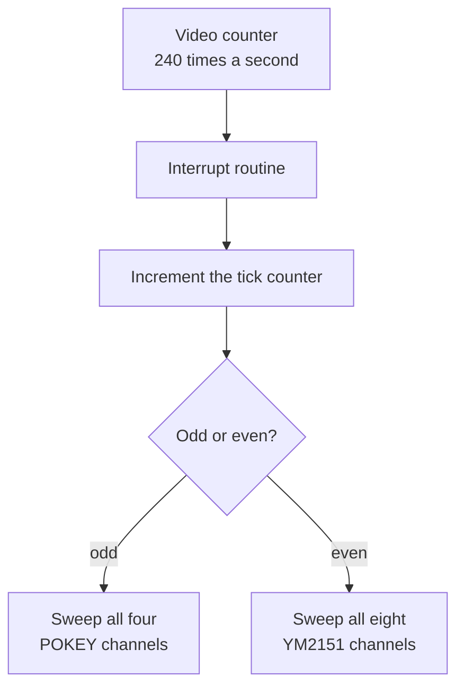

# Chapter 4 — The Heartbeat: Interrupts and the Eight-Millisecond Tick

*Before this chapter: [Chapters 1](01_two_computers.md) to
[3](03_three_sound_chips.md).*

Play the Gauntlet II theme and listen to the bass line. It is perfectly steady.
It stays steady while four players run around, while a horde spawns, while the
game slows down under load. It stays steady because nothing in the game program
has anything to do with keeping it steady. The sound board has its own clock,
and that clock is the subject of this chapter. Every statement about time in the
remaining chapters is measured in the unit defined here.

## What an interrupt is

A processor executing a program does one thing at a time, in order. An
**interrupt** is a wire that overrides that. When a signal arrives on the wire,
the CPU finishes whatever instruction it is in the middle of, notes down where it
had got to, and jumps to a fixed routine somewhere else. When that routine
finishes, the CPU picks up exactly where it left off. The interrupted code has no
way of knowing anything happened; not a single register or flag is different.

The bookkeeping is mostly automatic. On a 6502 the hardware pushes the return
address and the status flags onto the stack, then reads the handler's address
from a fixed pair of bytes near the top of memory, the same kind of vector that
[Chapter 5](05_waking_up.md) describes for reset. The handler saves any working
registers it plans to use, does its job, restores them, and executes a single
instruction called RTI that undoes the whole thing.

Two properties follow, and both matter later. The interrupted code can be
anywhere, including halfway through updating a data structure, so the handler
must not assume anything about what it interrupted. And the handler runs on
borrowed time: whatever it does, it has to be finished before the next signal
arrives.

The 6502 has two such wires, and the sound board uses both for different
purposes. Keeping them straight is worth doing once, now.

| Signal | Comes from | Means |
|---|---|---|
| **IRQ** | The video circuitry | It is time to service the sound chips again |
| **NMI** | The main CPU | A command byte has just arrived |

IRQ is the metronome: regular, predictable, and the engine of everything.
[Chapter 6](06_taking_orders.md) is about NMI. This chapter is about IRQ.

The IRQ can also be switched off temporarily. The 6502 has a flag that says
"hold interrupts pending," and code that is halfway through rearranging a data
structure the interrupt also uses will set that flag first. That idea comes back
in [Chapter 7](07_command_to_channel.md), which needs it.

The N in NMI stands for non-maskable, and it means what it says: that flag has
no effect on NMI at all. A command from the main CPU gets through no matter what
the sound board is in the middle of. That is a strong guarantee and it comes
with a matching obligation, which is that the NMI handler has to be safe to run
at literally any instruction boundary in the program. Chapter 6 shows how the
ROM discharges that obligation, and the answer is to make the NMI handler do
almost nothing.

## The metronome comes from the picture

The sound board does not have its own oscillator for timing. It borrows one from
the video hardware.

A CRT draws the screen one horizontal line at a time. Somewhere in the game
hardware is a counter that tracks which scanline is being drawn right now, and
one of the bits of that counter is wired to the sound board's IRQ pin. That bit
changes state four times per frame, at scanlines 32, 96, 160, and 224.

Gauntlet's video timing produces 59.9227476 frames per second, so the sound
board gets interrupted 239.6909904 times a second, once every 4.172 ms.

In prose this book will say **about 240 times a second**. The nine-digit figure
earns its keep only when you want to check an arithmetic result against a
rendered waveform, which the exercise at the end of this chapter does.

The consequence of borrowing the video's clock is that Gauntlet II's music is
locked to its picture. The tempo of the theme song is a fixed multiple of the
frame rate. Run the board with different video timing and the music plays at a
different speed.

## Alternating sweeps, and where 8.3 ms comes from

Here is the part that everything later depends on. Each interrupt services one
sound chip, and the two chips take turns.



*Each interrupt refreshes one chip. Each chip therefore gets refreshed 120 times
a second, and that interval is the fundamental grain of every sound in the game.*

The interrupt routine keeps a counter in RAM and adds one to it on every entry.
If the result is odd it does a complete pass over the four POKEY channels; if it
is even it does a complete pass over the eight YM2151 channels. This book calls
one such pass a **sweep**.

Since interrupts arrive at 239.69 Hz and each chip gets every second one, each
chip is fully refreshed 119.8454952 times a second, which is once every
**8.344077 ms**. That interval is the **tick**, and it is the unit the rest of
this book counts in.

The tick is a hard floor on musical resolution. No note can start, stop, change
pitch, or change volume at any moment other than a tick boundary. A sequence that
wants a note to last exactly one second gets 120 ticks and no finer control than
that. Every duration in [Chapter 8](08_sequence_language_time.md), every envelope
step in [Chapter 10](10_shaping_the_sound.md), and every key-on in
[Chapter 12](12_driving_the_ym2151.md) is quantized to this grid.

For a sense of scale: the fast sixteenth-note run near the end of the Gauntlet II
theme moves at about eleven ticks per note, so the engine gets eleven chances to
shape each one while it sounds. That is enough for a convincing attack and decay
and nowhere near enough for anything subtle, which is why the short effects in
this ROM tend to sweep and chirp rather than breathe.

Why alternate at all? Work out the alternatives and the reason falls out of the
arithmetic. Sweeping both chips on every interrupt would refresh each of them 240
times a second, which the ear does not need, at double the cost per second.
Sweeping both chips on every *other* interrupt would give the same 120 Hz refresh
this ROM uses, but every one of those interrupts would carry twelve voices' worth
of work instead of four or eight. The alternation buys a 120 Hz refresh rate
where the busiest single interrupt only ever has to handle one chip.

One side effect is that the two chips are never updated at the same instant;
their sweeps are permanently 4.2 ms out of phase. Nothing in Gauntlet II ever
notices, because no single sound in the ROM spans both chips.

Twelve voices refreshed 120 times a second is 1,440 voice updates per second,
and each update runs a small interpreter, steps whatever envelopes are active,
and compares priorities against every other voice competing for the same chip
channel. On a 1.79 MHz 6502. Hence the last section of this chapter.

## Speech gets four chances per interrupt

The speech chip is on a different schedule from everything else, because it
consumes its input on its own terms. The TMS5220 holds 16 bytes internally and
raises a flag when it wants more. How fast it wants more depends on what it is
saying, since the frame types described in
[Chapter 3](03_three_sound_chips.md) are different sizes and the chip works
through each one in the same amount of time.

The interrupt routine therefore calls the speech service four times per entry,
spread around the chip sweep. That works out to at most 958.76 opportunities per
second to hand over a byte.

The word "opportunities" is doing real work in that sentence. Each call reads the
chip's ready flag first. If the chip's queue is full the call does nothing at all
and returns immediately, which is the common case during a long syllable.
[Chapter 13](13_speaking.md) walks the whole state machine.

## What else rides on the interrupt

The interrupt is the only reliably scheduled thing on the board, so several jobs
that have nothing to do with sound have been attached to it.

**The coin switches.** A mechanical switch does not close cleanly. It bounces,
making and breaking contact several times over a few milliseconds, and code that
simply looked at the input each pass would credit one coin as five. The
interrupt routine gives each of the four
coin inputs an accumulator that climbs while the input reads one way and falls
while it reads the other. The software only believes the switch has changed when
the accumulator runs all the way off the end of its range. That is a digital
low-pass filter, and it costs a few instructions per interrupt.

**The coin counters.** The two mechanical counters behind the coin door are
solenoids. A solenoid needs current for long enough to physically move an
armature and step a wheel, so flicking the output on and off for one interrupt
would do nothing but click. Instead, a coin sets a small state machine going: the
state starts at `$F0` and steps down by `$10` on every other interrupt, through
`$E0`, `$D0`, and so on to zero. The counter solenoid is driven by the top bit of
that state. The top bit stays set for the first eight steps and clear for the
remaining seven, so each coin produces an energized pulse of about 67 ms followed
by a guaranteed 58 ms of rest before the next pulse can start. The mechanism gets
a push long enough to respond to, and two pushes can never run together into one.

**The watchdog.** The main CPU has no direct way to see whether the sound board
is alive. What it has is command `$07`, which asks the sound board to report its
error flags. Answering that command also *arms* two bits in the flag byte. The
main loop clears one of them and the interrupt routine clears the other. If the
sound board is healthy, both bits are back to zero long before the game asks
again. If the main loop has crashed, or if interrupts have somehow been left
disabled, the next `$07` comes back with the corresponding bit still set and the
game knows precisely which half has died. [Chapter 5](05_waking_up.md) has the
full flag byte.

This is why the coin counting lives on the sound board rather than with the game
code. Debouncing a switch and stretching a solenoid pulse both need a steady,
known interval to count in. The sound board already had one.

## The budget question

At 1,789,772 cycles per second and 239.69 interrupts per second, one interrupt
interval is 7,467 CPU cycles. That is the entire budget, and the interrupt has to
fit inside it or the next one arrives while it is still working.

A 6502 instruction takes two to seven cycles, so call it two thousand
instructions per interval if nothing else were competing. It is not a lot. The
main loop, which does all the work of starting and stopping sounds, gets
whatever is left over.

| Situation | Cycles used | Share of the interval |
|---|---:|---:|
| Silent board | about 1,570 | 21% |
| One POKEY channel playing a steady note | about 2,920 | 39% |
| First tick of the four-channel POKEY chip test | about 7,550 | 101% |

The silent-board figure is the floor: interrupt entry, the four speech calls
finding nothing to do, an empty sweep over one chip's channel lists, the coin
filters, and exit. It never gets cheaper than that, whatever else is happening.

The bottom row is the interesting one. Command `$05` allocates four POKEY
channels at once, and on the very next sweep the engine has to decode all four
of their setup instructions before any of them can make a sound. That single
pass overruns the interval by roughly a hundred cycles. Once the four channels
have settled into playing notes rather than configuring themselves, the cost
drops: over the following thousand sweeps the heaviest interrupt comes in at
about 4,840 cycles, comfortably inside the budget.

The overrun is survivable, and the mechanism that saves it lives in the
hardware. The IRQ line is held asserted rather than pulsed, so an interrupt that
becomes due while the previous one is still running stays pending behind the
CPU's interrupt-disable flag. The moment the current handler returns, the CPU
takes the waiting one. The board borrows about a hundred cycles of slack for one
tick and pays them back on the next, and no line of code in the ROM had to be
written to make that work.

> **Try it yourself**
>
> ```bash
> uv run gauntlet_disasm.py soundrom.bin --sfx-wav 0x46 --csv hw_docs/soundcmds.csv
> ```
>
> The tool executes the real 6502 code and counts interrupts as it goes. It
> reports `IRQ services: 161` and `Samples: 73722` at 44,100 Hz. That is 1.6717
> seconds of audio, of which the last 1.0 second is a tail added so the sound can
> ring out. Take it off and you have 0.6717 seconds spread over 161 interrupts,
> which is 4.172 ms each: the IRQ period, recovered from a WAV file. Double it and
> you have the 8.344 ms tick. For a musical view of the same grid, run
> `--score 0x3B`; the tool reports the theme as 185 notes over about 24.4
> seconds, which is roughly 2,920 ticks of the POKEY and YM2151 sweep.

## What you now know

- An interrupt makes the CPU drop what it is doing, run a fixed routine, and
  resume with nothing disturbed.
- The sound board's IRQ comes from the video scanline counter and fires about 240
  times a second.
- Each interrupt sweeps one chip, alternating, so each chip is refreshed about
  120 times a second: one **tick**, 8.344 ms.
- Nothing in any sound can change faster than one tick.
  <!-- TODO: Scope this to sequence-driven POKEY/YM control changes. Speech is
       serviced four times per IRQ, and all three chips evolve autonomously
       between CPU writes. -->
- The speech chip gets four service attempts per interrupt, most of which the
  chip refuses.
- The same interrupt filters the coin switches, stretches the coin-counter
  pulses, and clears the two watchdog bits that prove the board is alive.
- One interrupt interval is 7,467 cycles; a silent board uses about a fifth of
  them, and the single worst case in the ROM slightly overruns and is caught up
  on the following tick.

## Where this leads

[Chapter 5](05_waking_up.md) goes back further, to the moment power is applied,
and follows the board from its first instruction through the RAM and ROM
diagnostics to the point where it is ready to accept a command.

## Going deeper

- [`docs/01_hardware.md`](../docs/01_hardware.md) — the clock tree, the video
  derivation of the IRQ, and the pending-interrupt behaviour.
- [`docs/04_subsystems.md`](../docs/04_subsystems.md) — the IRQ audio service, the
  cycle budgets quoted above, and the board/coin control routine.
- [`docs/06_sequence_engine.md`](../docs/06_sequence_engine.md) — how the tick
  becomes musical time.
- [`docs/generated/timing_clock_catalog.csv`](../docs/generated/timing_clock_catalog.csv)
  — every rate on the board with its derivation.
- [`docs/generated/timing_cycle_catalog.csv`](../docs/generated/timing_cycle_catalog.csv)
  — measured cycle counts for representative paths.
