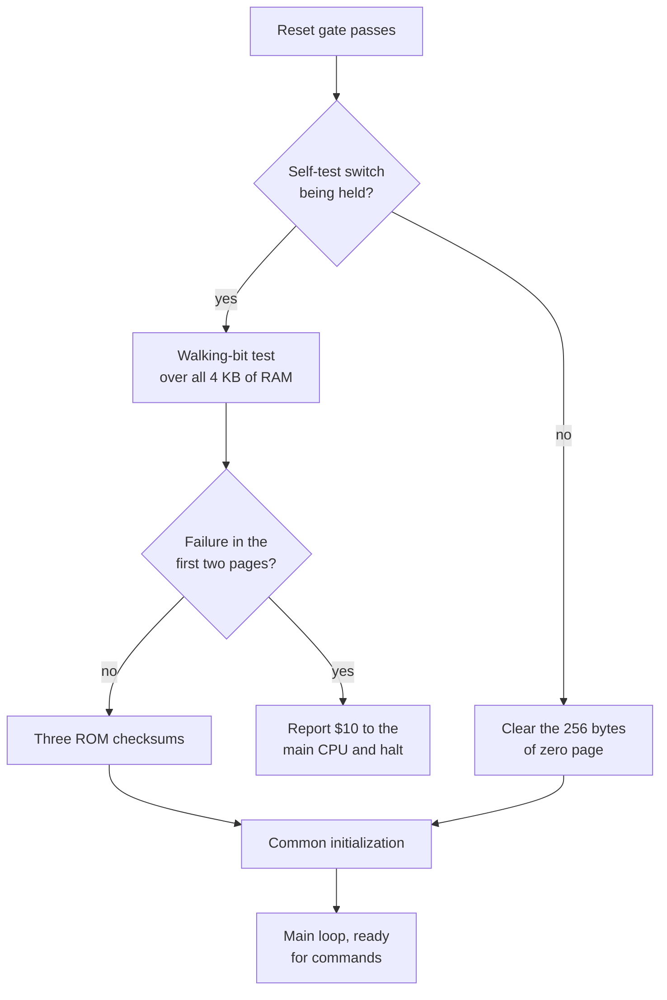

# Chapter 5 — Waking Up: Reset and Self-Test

*Before this chapter: [Chapters 1](01_two_computers.md) to
[4](04_heartbeat.md).*

Hold the self-test switch inside the coin door and power the cabinet on. Instead
of the attract mode you get a diagnostic screen, and the sound board offers a
technician three noises on request: a rising staircase of eight notes from the
music chip, a four-part electronic churn from the effects chip, and a spoken
phrase. Those exist so that a fault can be *heard*. Before any of them can play,
the board has to test its own memory, verify its own program, and build every
data structure the rest of this book relies on. This chapter is the first moment
of the machine's life.

## The first instruction is a refusal

When a 6502 comes out of reset, its first act is to look up where to begin. It
reads a fixed *pair* of addresses, `$FFFC` and `$FFFD`, treats those two bytes as
a 16-bit address, and starts executing there. Those two bytes are called the
**reset vector**, and putting
them at the very top of the address space means the ROM chip that holds them can
also hold the program. The 6502 has three such vectors in its last six bytes: one
for reset, one for IRQ, and one for NMI. All three of Gauntlet II's live in the
final bytes of the sound ROM.

The sound ROM's reset vector points at `$5A25`, and the code there is five
instructions long:

```asm
$5A25:  lda $1030      ; read the board status byte
$5A28:  and #$c0       ; keep only bits 7 and 6
$5A2A:  cmp #$80       ; bit 7 set, bit 6 clear?
$5A2C:  bne $5a2c      ; no: branch to this very instruction, forever
$5A2E:  jmp $4002      ; yes: begin initialization
```

Look at the address on the fourth line and the address it branches to. They are
the same. A 6502 branch is relative to the instruction after it, and this one
carries the offset that lands it back on itself, so once taken it can never be
untaken. There is no loop back to the `lda`, so the status byte is never read a
second time.

So the very first thing the sound board does is check that the two mailbox flags
from [Chapter 2](02_tour_of_the_board.md) read exactly as expected, and if they
do not, it stops dead and stays stopped. A board that fails this check is silent
and gives no diagnostic. Everything that follows in this chapter happens only
after that one comparison has passed.

## Two very different boot paths

`$4002` is the real start. Its first few instructions are housekeeping that
every 6502 program does: disable interrupts, clear the decimal-arithmetic mode
flag, and point the stack pointer at the top of the stack page. Then it pulses
the YM2151's reset line by writing to `$1030` three times, which leaves the
music chip in a known state.

Then it reads the status byte again and looks at bit 4, the self-test switch.
From here the two paths diverge sharply.



*The self-test switch chooses between a boot that is over almost immediately and
one that reads and writes every byte of RAM sixteen times over before checking
the ROM as well.*

Normal boot is fast because it has to be. The game is waiting. The board clears
zero page, skips every diagnostic, and goes straight to initialization. The
diagnostics only run when a technician has asked for them.

## The RAM test: walking a single one

The self-test path checks all 4 KB of RAM one byte at a time, using a technique
called a **walking-bit** test.

For each byte of RAM, in order:

```
pattern = 00000001
repeat 8 times:
    write pattern; read it back; a mismatch is a failure
    write NOT pattern; read it back; a mismatch is a failure
    shift pattern left by one
write 0 and move on
```

Sixteen writes and sixteen reads per byte, and every one of the eight bit
positions gets tested holding a one while its seven neighbours hold zeros, and
then holding a zero while its neighbours hold ones.

The reason for all that ceremony is that memory fails in specific ways. A bit can
be stuck high or stuck low, which a single write-and-read-back of zero would miss
half the time. Two data lines can be shorted together, in which case writing a
one to either always sets both; that fault is invisible unless the test writes a
pattern where those two lines disagree, which is exactly what a walking one does
for every possible pair. Sixteen patterns per byte catches every single-bit
fault and every pairwise one, which is why the test is worth its cost.

The pass over memory has a useful side effect. Every byte it finishes with is
left at zero, so when the diagnostics complete, all 4 KB of RAM is already
cleared for the initialization that follows.

Failures come in two severities.

A failure in the first two pages, addresses `$0000` through `$01FF`, is fatal and
the board gives up immediately: it writes the value `$10` to the main CPU as an
error report and then enters an infinite loop. It has to give up, because those
two pages are the zero page and the stack. Without a working stack the CPU cannot
call a subroutine or take an interrupt, so there is no way to run any more
diagnostic code, let alone play a sound describing the problem.

A failure anywhere in pages 2 through 15 sets a bit in the error-flag byte and
the test carries on. The board will boot, it will make noise, and the next time
the game asks for status it will find out that something is wrong.

## The ROM test: three checksums that must come out to `$FF`

Next the board checks its own program. The 48 KB of ROM is treated as three 16 KB
regions, and each is checked with the cheapest integrity test there is: add up
every byte, keep only the low eight bits of the running total, and require the
answer to be exactly `$FF`.

That works because the image was built to make it work: each of the three
regions was arranged so that its byte sum lands on `$FF`. Each region also has
its own bit in the error-flag byte, so a failure names the region rather than
just reporting that something somewhere is wrong.

A modulo-256 sum is worth understanding for what it does and does not catch. A
missing or unprogrammed chip fails immediately, since 16,384 copies of `$FF` do
not sum to `$FF`. A single flipped bit anywhere fails. Two errors that happen to
cancel out pass, and any rearrangement of the same bytes passes, because addition
does not care about order. On a 1986 board running this test at every power-up,
16,384 add instructions per region is cheap insurance against the failure modes
that occur in the field.

## The error-flag byte

Everything the diagnostics learn ends up in one byte of RAM, at address `$02`.
Eight independent bits:

| Bit | Set when |
|---:|---|
| 7 | ROM checksum failed for `$4000`–`$7FFF` |
| 6 | ROM checksum failed for `$8000`–`$BFFF` |
| 5 | ROM checksum failed for `$C000`–`$FFFF` |
| 4 | Walking-bit RAM failure in pages 2 through 7 |
| 3 | Walking-bit RAM failure in page 8 or above |
| 2 | Interrupt heartbeat: armed by command `$07`, cleared by the IRQ |
| 1 | The YM2151 stopped answering |
| 0 | Main-loop heartbeat: armed by command `$07`, cleared by the main loop |

The top five bits are set once at boot and stay set. Bit 1 is set at runtime if
the YM2151 fails to signal readiness after 255 attempts, which
[Chapter 12](12_driving_the_ym2151.md) explains.

Bits 0 and 2 are the interesting pair. Together with one command, they form a
watchdog.

When the main CPU sends command `$07`, the sound board immediately replies with
the current contents of this byte, and then sets bits 0 and 2. From that moment
two independent pieces of code are racing to clear them: the main loop clears
bit 0 at the top of every pass, and the interrupt routine clears bit 2 on every
entry. Both run hundreds of times a second, so if the board is healthy the two
bits are back to zero within milliseconds.

The next time the game sends `$07`, the reply tells it exactly what survived. Both
bits clear means the whole board is running. Bit 0 still set means the main loop
has hung while interrupts continue. Bit 2 still set means interrupts have stopped
while the main loop runs. The game learns which half of the sound program has
died, and the whole mechanism costs two bits of a byte that already existed.

## Setting the table

Both boot paths converge on the same initialization sequence, which builds
everything the rest of this book takes for granted.

Between the diagnostics and that sequence there is one short pause. The board
enables interrupts and waits for the first one to arrive, so that it enters the
main loop at a known point in the tick cycle rather than at a random offset. If
no interrupt shows up before a counter runs out, the board sets the interrupt
heartbeat bit and carries on regardless.

Then, in order:

| Step | What it does |
|---|---|
| Board handshake | Writes five fixed values to five board registers, the last of which hands the main CPU the byte `$0F` |
| Command mode | Switches the incoming-command path into the mode it uses from now on |
| Queues | Clears the read and write positions of the incoming command ring and the outgoing reply buffer |
| Filter | Clears the global loudness threshold, so nothing is suppressed |
| Stale command | Reads and discards whatever happens to be sitting in the command mailbox |
| First reply | Sends `$FF` to the main CPU |
| Speech | Points the speech chip at a 32-byte dummy stream and resets its state machine |
| Mixer | Writes the three volume fields to `$1020` |
| Audio reset | Rebuilds every sound structure, described below |

The audio reset is the substantial one, and the game can ask for it again at any
time by sending command `$00`. It does four things.

It rebuilds a pool of 197 small records. These are four-byte scratch blocks that
sequences borrow when they need to remember something, such as where to return
after a repeated phrase. Rather than searching for a spare block when one is
wanted, the ROM uses a **free list**: at boot, every record is written to point
at the next one, and a single variable points at the first.

```
take a record:            give one back:
    id = free_head            record[id].next = free_head
    free_head = record[id]    free_head = id
    return id
```

Both operations are a handful of instructions and neither one searches for
anything, which matters because they happen while a sound is playing.
[Chapter 7](07_command_to_channel.md) puts the pool to work.

It clears the thirty logical channel records and the twelve physical channel
lists, so no sound is playing and no chip voice is claimed.

It resets the POKEY with twelve register writes: the mode register AUDCTL is
zeroed, two writes to the chip's serial control register put it into a known
state, AUDCTL is zeroed a second time, and then all eight audio registers are
cleared. Four silent channels. The count matters later — [Chapter 11](11_driving_the_pokey.md)
uses it to account for every register write a rendered POKEY sound performs.

It resets the YM2151: wait for the chip to report itself ready, then walk
channels 7 down to 0 releasing every note on each. Eight silent voices, and the
busy-timeout error bit cleared in case a previous run had set it.

Being able to reach that routine from a command turns out to matter. Both chip
tests loop forever, and the ROM's three stop commands each name a different
sound. Command `$00` is the only thing in the command set that will silence a
running chip test, which is why the sound command list describes it as the
self-test stop.

Then interrupts are enabled and the main loop begins. From this point the board
is doing exactly two things forever: taking one interrupt about every four
milliseconds, and going round a loop looking for work.

That loop is short enough to describe here in full:

```
forever:
    clear the main-loop heartbeat bit
    if the main CPU has collected the last reply and we have one waiting:
        send one byte back to the main CPU
    if a command is waiting in the ring buffer:
        take exactly one and dispatch it
```

One reply out and one command in per pass, and nothing else. The main loop
decides what ought to be playing; the interrupt does the playing.
[Chapter 6](06_taking_orders.md) follows a command through the first half of
that split.

> **Try it yourself**
>
> ```bash
> python -c "
> rom = open('soundrom.bin','rb').read()
> for third in range(3):
>     chunk = rom[third*16384:(third+1)*16384]
>     print(hex(0x4000 + third*0x4000), hex(sum(chunk) % 256))
> "
> ```
>
> Three lines come out: `0x4000 0xff`, `0x8000 0xff`, `0xc000 0xff`. You have
> just run the same test the sound board runs on every self-test boot, forty
> years later, on a different machine, in a different language. If any of the
> three prints something other than `0xff`, your ROM image is not the one this
> book describes, and the SHA-1 check from Chapter 1 will tell you where it went
> wrong.

## What you now know

- A 6502 starts by reading a two-byte reset vector from the top of the address
  space.
- The sound board checks two status bits once, and stops permanently if they are
  wrong.
- Normal boot skips every diagnostic; holding the self-test switch runs all of
  them.
- The walking-bit RAM test writes each of eight bit positions and its complement,
  which catches stuck bits and shorted lines that a simple write-and-read-back
  misses, and it leaves RAM cleared as a side effect.
- A RAM failure in the first two pages is fatal because the stack lives there.
- Each 16 KB third of the ROM sums to exactly `$FF` modulo 256.
- One byte at `$02` carries three ROM flags, two RAM flags, a YM2151 flag, and
  two heartbeat bits that let the game tell which half of the sound program has
  died.

## Where this leads

[Chapter 6](06_taking_orders.md) picks up where initialization stops: the board
is idle, the main loop is spinning, and a byte is about to arrive.

## Going deeper

- [`docs/04_subsystems.md`](../docs/04_subsystems.md) — boot flow, main loop, and
  the audio reset.
- [`docs/02_memory_map.md`](../docs/02_memory_map.md) — the error-flag bits and
  every RAM structure initialization builds.
- [`docs/07_function_index.md`](../docs/07_function_index.md) — the boot and
  initialization entry points by address.
- [`docs/generated/initialization_main_catalog.csv`](../docs/generated/initialization_main_catalog.csv)
  — block-by-block contracts for every stage described here.
- [`docs/generated/control_plane_catalog.csv`](../docs/generated/control_plane_catalog.csv)
  — the reset, pool, and dispatch blocks in detail.
