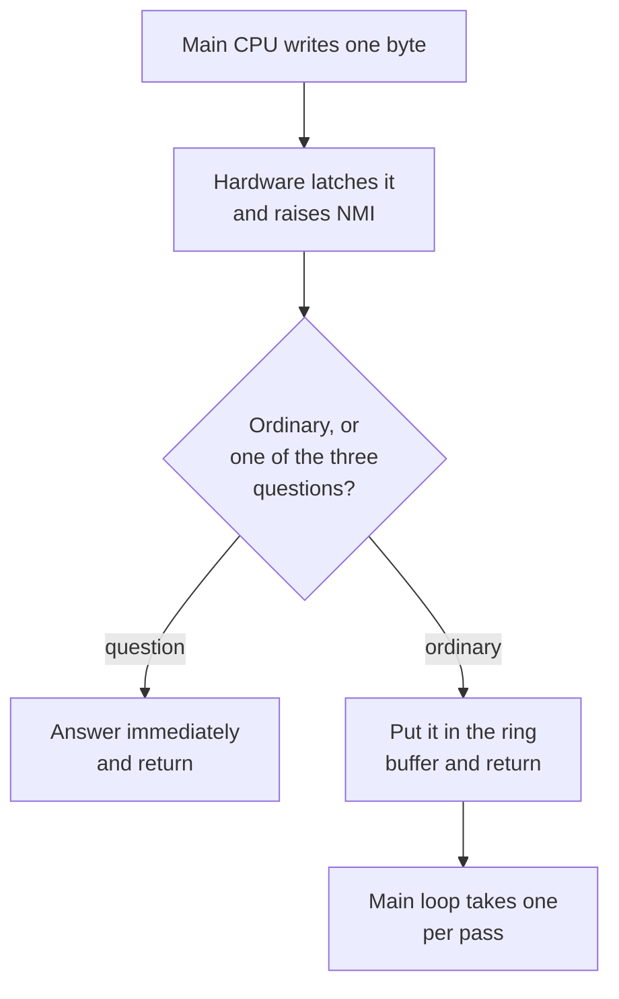
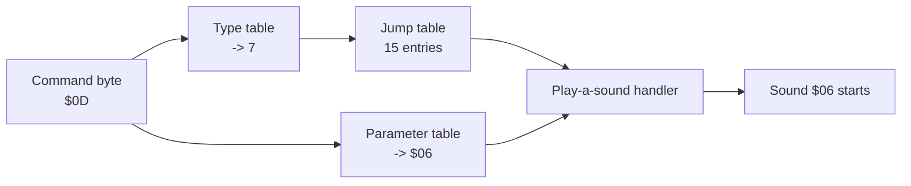

# Chapter 6 — Taking Orders: Commands from the Main CPU

*Before this chapter: [Chapters 1](01_two_computers.md) to
[5](05_waking_up.md).*

The game program's entire contribution to the food blip is one store
instruction. It writes `$0D` to a hardware address and carries on moving
monsters. Somewhere in the next few microseconds the sound board has to notice
the byte, work out that it names a sound rather than a question, and get it into
a queue, all without disturbing the note it is already in the middle of playing.
This chapter follows one byte from the moment it lands to the moment the right
routine picks it up.

## How a command arrives

The main CPU writes to a single address. The sound board's hardware does two
things with that write, at the same instant: it captures the byte in a latch that
the sound CPU can read at `$1010`, and it pulls the sound CPU's NMI line.

That pairing is the whole protocol. The byte is already safe in the latch before
the sound CPU has even begun to react, so there is no window in which the signal
arrives and the data has not. There is no acknowledgement to send, no length to
agree on, and no retry. The main CPU stores and forgets.

The word non-maskable from [Chapter 4](04_heartbeat.md) matters here. The sound
CPU cannot defer an NMI, so the handler can begin at any instruction boundary in
the program: in the middle of the sequence interpreter, in the middle of the
allocator's linked-list surgery, in the middle of the IRQ. Anything the handler
touches, it might be touching underneath code that was halfway through changing
it.

The ROM's answer to that hazard is to make the handler do almost nothing. It
saves the registers it uses, reads the latch, decides between two possible
fates for the byte, and returns. For the great majority of commands, "decides"
means putting the byte in a queue.

## Answer now, or queue for later

Three of the 219 commands are questions rather than sounds, and a question is
useless if the answer takes a few milliseconds to arrive. The NMI handler
therefore consults a 219-byte table, one entry per command number, which says
only whether this command is ordinary or special.

| Command | Question | Answer |
|---|---|---|
| `$03` | What is the coin door doing? | The four cached switch fields |
| `$06` | Are you the ROM I think you are? | The number `$DB` |
| `$07` | Are you healthy? | The error-flag byte, and both heartbeat bits get armed |

`$06` is worth a second look. `$DB` is 219, the number of commands this ROM
understands, so the sound board identifies itself by stating the size of its own
vocabulary. A different sound ROM with a different command set would answer with
a different number.

The other 216 commands take the ordinary path. The handler drops the byte into a
queue and returns immediately. Every decision about what the byte means, which
chip it belongs to, and what has to be stopped to make room for it happens later,
in the main loop, where taking a few hundred microseconds costs nothing.



*The interrupt's only job is to get the byte off the latch and out of the way.
Real work happens in the main loop.*

## What a ring buffer is

The queue is sixteen bytes of RAM plus two positions: one saying where the next
arriving byte goes, one saying where the next byte to be handled comes from.
Both positions count upward and wrap around to zero when they run off the end,
which is why the arrangement is called a **ring buffer**.

Its virtue is that the producer and the consumer never have to agree on timing.
The interrupt writes at whatever moment the game happens to speak. The main loop
reads whenever it gets round to it. Neither one waits for the other, and neither
one needs to know how far behind or ahead the other has got, because the two
positions carry that information between them. When they are equal, the queue is
empty.

Sixteen is a generous depth for this application. A burst of four players all
firing at once is four commands, and the main loop drains one command per pass
while running hundreds of passes per second.

## Two lookups turn a byte into an action

Here is the part of the design that explains why one program can drive every
noise in the game.

The main loop takes one byte from the ring and reads it as an index into two
parallel 219-byte tables. The first table gives a **handler type**, a number from
0 to 14 saying what kind of job this is. The second gives a **parameter**, a
single byte whose meaning depends entirely on which handler type came out of the
first table. The type then selects one of fifteen routines from a jump table, and
that routine runs with the parameter in hand.



*Two table reads and one indexed jump. Command `$0D` is nothing more than row 13
of two arrays.*

Both lookups are guarded. A command value of `$DB` or higher is rejected before
either table is touched, and a handler type of 15 or higher is rejected before
the jump. Neither rejection can happen with this ROM's tables, which is the
point: the guard exists so that a garbled byte on the latch cannot send the CPU
to an address made of whatever bytes happened to follow the table.

The payoff of the arrangement is worth stating plainly. Adding a new sound to
Gauntlet II means writing an entry in each of two tables and adding a description
of the sound to the data further along in the ROM. The 6502 code is not touched.
Every one of the 216 queued commands runs the same nine routines.

## The nine kinds of job

Fifteen slots exist in the jump table. Nine of them have commands pointing at
them.

| Type | What it does | Commands |
|---:|---|---:|
| 7 | Play a sound: effects and music alike | 62 |
| 11 | Speak a phrase | 141 |
| 5 | Stop a named sound | 3 |
| 9 | Fade a named sound | 1 |
| 10 | Fade everything of a given kind | 1 |
| 13 | Set the mixer levels | 4 |
| 0 | Set the global priority threshold | 2 |
| 8 | Queue a byte back to the main CPU | 1 |
| 3 | Reinitialize all audio state | 1 |

Two of those rows account for 203 of the 216 queued commands. Type 7 is
[Chapter 7](07_command_to_channel.md) through
[Chapter 12](12_driving_the_ym2151.md); type 11 is
[Chapter 13](13_speaking.md). The remaining seven rows are the whole of the
board's control surface, and this chapter finishes them off.

The other six slots in the jump table hold real, finished routines that no
command in the table selects. They can apply a bytecode instruction to every
live channel matching a description, silence channels by category, and set
workspace variables from a small table of records that is entirely zeros in this
ROM. [Chapter 17](17_open_questions.md) says what is known about them.

## Stopping and fading

A stop command does not carry a channel number or a voice number, because the
main CPU does not know any. It carries the number of another command.

Command `$21` has parameter `$20`. The handler reads command `$20` out of the
same two tables the dispatcher just used, checks that it is a type-7 sound, and
extracts its parameter. Then it walks all thirty logical channels and marks every
one that is currently playing that sound as finished. Command `$20` is "Death
Touches Player", so `$21` is the instruction to stop it.

| Command | Stops | Sound |
|---|---|---|
| `$21` | `$20` | Death Touches Player |
| `$2F` | `$2E` | Player Touches Force Field |
| `$39` | `$37` | Slow Motion |

The three sounds with a stop command are exactly the three that run until told
otherwise. Everything else in the ROM ends on its own.

Fading is the same idea with a gentler ending. Command `$3C` names command `$3B`,
the theme song, and instead of marking its channels finished it marks them
*fading* and hands each one a downward volume ramp.
[Chapter 10](10_shaping_the_sound.md) is about what happens next. Command `$41`
works from a category rather than a name: it fades every logical channel whose
status field carries a particular value, which is how the treasure-room music
stops without the game having to know which of its four variants is playing.

One command sits outside all of this. `$00` reruns the whole audio reset from
[Chapter 5](05_waking_up.md), clearing every channel and resetting both chips.
It is the only thing in the command set that will silence a chip test, because
the chip tests loop forever and no stop command names them.

## Talking back

Replies use a second queue, sixteen bytes of RAM with its own position
counters. A handler that wants to say something puts a byte in the buffer and
returns. The main loop, on each pass, checks the status bit that says whether the
main CPU has collected the previous reply; if it has, and something is waiting,
the main loop writes one byte to `$1000`. That write latches the byte and
interrupts the 68010, so the reply gets picked up promptly.

Only one command uses this path. `$DA` queues the value `$55`, which the game
can then read back as proof that a command travelled all the way through the ring
buffer, the dispatcher, and the reply queue. The three direct questions bypass
the buffer entirely and write to `$1000` from inside the interrupt.

The sound language described in [Chapter 9](09_sequence_language_opcodes.md) has
an instruction that queues a byte the same way, so a piece of music could in
principle signal the game when it reached a particular bar. No sound in this ROM
uses it.

## The mixer and the mute switch

Four commands set the three analog volume levels from
[Chapter 2](02_tour_of_the_board.md). The handler splits the parameter into the
three fields and keeps them in separate bytes of RAM before combining them into
the byte written to `$1020`, so a later change to one field does not disturb the
others. It also defers the write while the speech chip's state machine is in the
middle of something, since the speech level and the speech stream have to change
together.

The four parameters are more specific than "presets" suggests:

| Command | Parameter | Speech | Effects | Music |
|---|---|---:|---:|---:|
| `$D6` | `$E7` | 7 | 0 | 7 |
| `$D7` | `$EF` | 7 | 1 | 7 |
| `$D8` | `$F7` | 7 | 2 | 7 |
| `$D9` | `$FF` | 7 | 3 | 7 |

Speech and music stay at full level in all four. The only thing these commands
change is the effects level, across its whole range from off to full. An
operator adjusting the cabinet is turning a physical trimmer; these four commands
are the board's own control over how loud the sound effects sit against the
music, though nothing records the game ever sending one.

The last pair of control commands does something more drastic. Commands `$01` and
`$02` set a single global threshold, computed as the parameter times four.

| Command | Parameter | Threshold |
|---|---:|---:|
| `$01` | `$3C` | 240 |
| `$02` | `$00` | 0 |

That threshold is compared against **priority**, the number every sound carries
that [Chapter 7](07_command_to_channel.md) is about. When a chip voice picks its
winner, a winner whose priority falls below the threshold is silenced rather than
played. When a speech command arrives, a phrase whose priority falls below the
threshold is dropped rather than queued.

The highest priority anywhere in this ROM is 63, and the highest speech priority
is 64. A threshold of 240 is above all of them, so command `$01` mutes the entire
board through a mechanism that already existed for arbitrating between sounds.
Command `$02` puts the threshold back to zero and everything passes again. Two
commands, one byte of RAM, and no new machinery.

> **Try it yourself**
>
> ```bash
> uv run gauntlet_disasm.py soundrom.bin --cmd 0x03 --csv hw_docs/soundcmds.csv
> uv run gauntlet_disasm.py soundrom.bin --cmd 0x0D --csv hw_docs/soundcmds.csv
> uv run gauntlet_disasm.py soundrom.bin --cmd 0x5A --csv hw_docs/soundcmds.csv
> ```
>
> Three commands, three different fates. `$03` reports `Type 255
> (Invalid/Unused)` with no data at all, because it never reaches the main
> dispatcher; the interrupt answered it and the type table was free to say
> nothing. `$0D` reports `Type 7`, parameter `$06`, and two channels of decoded
> music. `$5A` reports `Type 11`, parameter `$11`, and 324 bytes of speech data
> from an entirely different part of the ROM. Notice that the tool prints the
> parameter for all three: it is the same byte from the same table each time, and
> only the handler type decides what it means.

## What you now know

- A command byte is latched and signalled by the same hardware event, so it can
  never be missed or overwritten between the two.
- The interrupt answers three questions on the spot and queues everything else in
  a sixteen-entry ring buffer.
- Two parallel 219-byte tables turn a command into a handler type and a
  parameter; the type selects one of fifteen routines.
- Nine handler types are used; type 7 covers 62 sounds and type 11 covers 141
  spoken phrases.
- Stop and fade commands name another command rather than a channel, and the
  handler resolves it through the same tables.
- Commands `$01` and `$02` mute and unmute the board by setting a priority
  threshold above or below everything the ROM can produce.

## Where this leads

[Chapter 7](07_command_to_channel.md) picks up the moment the type-7 handler
starts work. One parameter has to become up to eight simultaneous voices, spread
across a chip that only has eight, while whatever was already playing keeps
playing or gets thrown off.

## Going deeper

- [`docs/08_command_reference.md`](../docs/08_command_reference.md) — the command
  space, handler distribution, and every control command.
- [`docs/04_subsystems.md`](../docs/04_subsystems.md) — the main loop, the NMI
  input path, and the output queue.
- [`docs/05_data_reference.md`](../docs/05_data_reference.md) — the validation,
  type, parameter, and handler-target tables with their exact extents.
- [`docs/generated/command_catalog.csv`](../docs/generated/command_catalog.csv)
  — all 219 commands as rows.
- [`docs/generated/nmi_protocol_catalog.csv`](../docs/generated/nmi_protocol_catalog.csv)
  — the NMI paths block by block.
- [`docs/generated/control_plane_catalog.csv`](../docs/generated/control_plane_catalog.csv)
  — every handler's exact reads and writes.
