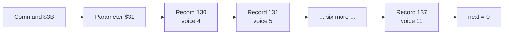
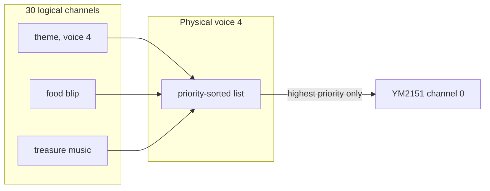

# Chapter 7 — From Command to Channel

*Before this chapter: [Chapters 1](01_two_computers.md) to
[6](06_taking_orders.md).*

The theme song is playing. All eight of the YM2151's voices are busy with it.
Now a player walks over food, and the game sends `$0D`, which also wants a
YM2151 voice. There is no free one. What happens to the blip, and what happens to
the note the theme was in the middle of, are decided by a layer of bookkeeping
that sits between the command and the chip, and it has to decide without leaving
a note stuck on or a linked list half rewritten while the interrupt is walking
it. This chapter is that layer.

## A sound is a chain of records

The type-7 handler receives one parameter byte. That byte selects a row in a
table of 62 entries, and the row holds a **record** number.

A record is one row of a four-column table stored in ROM. The columns are stored
as separate arrays, for the reason [Chapter 2](02_tour_of_the_board.md)
gave, but they read as a table:

| Column | Meaning |
|---|---|
| Priority | How important this sound is when two want the same voice |
| Channel | Which of the twelve chip voices it wants: 0–3 POKEY, 4–11 YM2151 |
| Sequence | Where in ROM its "sheet music" begins |
| Next | The record that continues this sound, or zero to stop |

There are 182 records. Following the "next" column from a starting record gives
a **chain**, and the chain is the whole sound. Each record in it becomes one
**part**: its own sequence, playing on its own chip voice, starting at the same
instant as its siblings. Three words are about to do a lot of work in this book,
so it is worth fixing them now. A **sound** is what one command plays. A **part**
is one strand of it. A **voice** is a chip channel, of which there are twelve and
no more.



*The theme song is eight records long, one per YM2151 voice. The game asked for
one sound and got an eight-part arrangement.*

The distribution of chain lengths says a lot about what this ROM contains:

| Records in the chain | Commands |
|---:|---:|
| 1 | 22 |
| 2 | 24 |
| 3 | 1 |
| 4 | 2 |
| 5 | 1 |
| 8 | 12 |

Forty-six of the 62 sounds are one or two parts. The twelve eight-record chains
are the theme, the four treasure-room variants, the music chip test, and six
elaborate effects such as the transporter and the doors opening. Eight is the
ceiling because eight is what the YM2151 has.

A detail worth noticing: 182 records share only 153 distinct sequence pointers.
Several records within one chain point at the same music. Four of the eight
records for "Wizard Joins In" name the same sequence, and the eight records for
"Doors Open" alternate between two sequences, four parts each. One piece of
written music, played simultaneously on several voices, is a thicker sound for no
extra ROM.

## Thirty logical channels for twelve physical ones

The chips have twelve voices between them: four POKEY channels and eight YM2151
channels. This book calls those the **physical channels**, and the number is
fixed by the hardware.

RAM holds room for thirty parts in progress. This book calls those the
**logical channels**, and the number was a choice. Thirty parallel arrays,
thirty entries each, hold everything about a part that is currently playing:
where it has got to in its sequence, its tempo, its volume, its two timers, its
envelope positions, its priority.

Thirty is not thirty *sounds*. The theme alone is eight parts and therefore eats
eight logical channels; a one-part effect eats one. In the worst case the board
could be tracking four eight-part sounds at once and have room for nothing else.

Reconciling thirty with twelve is the central idea of the whole ROM.

Every physical channel owns a list of the logical channels that want it. The
list is sorted by priority. On the matching sweep, the engine walks the entire
list and runs the sequence interpreter for every member. All of them advance.
All of them decode their next note, step their envelopes, and count down their
timers. Then the highest-priority member of the list, and only that one, has its
result written to the chip.



*Three parts can be in progress on one chip voice. All three keep running; one
is heard.*

## What a logical channel holds

A logical channel is a row across those thirty parallel arrays. Spelling out what
is in it makes the rest of the book easier to follow, because every later chapter
changes one of these fields:

| Field | What it is for |
|---|---|
| Active sound | Which sound owns this slot, or a marker meaning free |
| Sequence pointer | How far through its music it has got |
| Primary timer | Sweeps until the next event |
| Secondary timer | Sweeps until the current note is released |
| Tempo | How fast those timers run down |
| Current note and base frequency | What is sounding right now |
| Volume, transpose, distortion | The channel's current settings |
| Two envelope pointers, plus cursors | Where it is in each stored curve |
| Repeat and return links | Which pool records this channel has borrowed |
| Status bits | Which chip it belongs to, and whether it is live |
| Next link | The next logical channel on this voice's list |

The last row is the one to notice. The voice's list is not a separate
data structure. It is threaded through the channels themselves, one byte each,
which is why a list insertion is two byte writes and why those two writes have to
be protected.

## Why update sounds nobody can hear

Running the interpreter for a channel that will not reach the chip looks like
pure waste. It is the design's cleverest decision.

Consider the treasure room. The music is playing on all eight YM voices. A
player picks up a potion, and the potion sound takes one of those voices for a
second. When the potion sound ends, the music has to come back. If the losing
channel had been frozen, it would resume a second behind everything else, on the
wrong note, out of time with the seven parts that kept going. Instead it has
been advancing all along, silently, and the moment the potion sound releases the
voice the music is exactly where it should be. The listener hears one bar of a
seven-part arrangement and then an eight-part one.

The cost is real: twelve voices at 120 sweeps a second, with every logical
channel on every list updated, on a 1.79 MHz processor.
[Chapter 4](04_heartbeat.md)'s budget table is the answer to whether it fits.

## Priority, preemption, and running out

Every record carries a priority, and the ROM uses seventeen distinct values
between 2 and 63.

The priority belongs to the *record*, not to the command, so a chain several
records long can spread itself across several levels. Six of the 62 sounds do.
"Wizard Joins In" is the clearest: two of its eight parts sit at 15, two at 14,
and the remaining four at 13, so when something has to give, the arrangement
thins from the inside out instead of disappearing all at once.

| Priority | Records | Sounds |
|---:|---:|---|
| 63 | 8 | The four coin slots |
| 61 | 8 | The Gauntlet II theme |
| 51 | 2 | "Unable to Join In", "No Potions" |
| 32 | 8 | The four player deaths |
| 31 | 5 | Level-opening music |
| 30 | 8 | The four player heartbeats |
| 20 | 2 | "Death Touches Player" |
| 15 | 8 | The lead parts of the four "Joins In" sounds |
| 14 | 5 | Inner parts of the Warrior, Valkyrie, and Wizard joining |
| 13 | 4 | The Wizard's four remaining parts |
| 10 | 8 | "Thief Warning" and "Mugger Warning" |
| 9 | 2 | "End of Slow Motion", "Player Shoots Dragon" |
| 8 | 37 | Most one-shot effects, and both chip tests |
| 7 | 3 | The last part of the transporter and of the thief warning, plus "Medium Tone Stun Tile" |
| 6 | 1 | The last part of "Trap / Walls Turn to Exits" |
| 3 | 10 | The four player exits, "Message Appears on Screen" |
| 2 | 63 | Treasure-room music, food, keys, doors, monster hits, and five of the seven POKEY effects |

The coin sounds outrank everything, which is the correct commercial decision for
a coin-operated machine. The theme outranks the effects that play over it. The
treasure-room music sits at the same priority as ordinary effects, so effects cut
straight through it rather than waiting. Two levels carry most of the ROM: 100 of
the 182 records are at 8 or 2, and everything in between is a small number of
sounds that Atari wanted to survive a collision with an ordinary effect.

Allocation runs once per record in the chain, and goes like this:

```
for each record in the chain:
    find a free logical channel
    if none is free:
        look at the lowest-priority channel already on the
        requested voice
        if this record's priority is at least as high:
            evict it
        else:
            give up
    fill in the logical channel from the record
    insert it into the voice's list, in priority order
```

Two details in that sketch have audible consequences.

The eviction rule only ever looks at the voice this record wants. A
low-priority sound sitting on POKEY channel 2 is safe from a YM2151 sound that
has run out of slots, however important that YM sound is. The thirty slots are
shared, but the competition is per voice.

Insertion at *equal* priority replaces rather than stacking. Trigger the sword
twice in quick succession and the second one does not layer over the first; it
takes its place and starts again from the beginning. That is why rapid fire in
Gauntlet II sounds like a restarting effect rather than a thickening one.

There is also a feature the ROM has and does not use. Before allocating
anything, the handler can check whether this exact sound is already playing and
refuse to start a second copy. Whether it checks is controlled by a 62-byte
table of flags, and every entry in that table is `$FF`, which switches the check
off. Every sound in Gauntlet II is retriggerable.

## Back to the collision

The chapter opened with the theme playing and a player eating food. Now the
question can be answered exactly.

The theme is eight records at priority 61, one on each YM2151 voice. The food
blip is two records at priority 2, wanting voices 8 and 9. Thirty logical
channels exist and the theme is using eight, so twenty-two are free: nothing gets
evicted, and the blip is admitted without difficulty. Both of its records are
inserted into the lists for voices 8 and 9, sorted below the theme's records.

Then the next sweep arrives, walks each list, updates the blip and the theme
alike, and sends the higher priority of the two to the chip. The theme wins on
both voices.

So eating food while the theme plays makes no sound at all. The blip is
allocated, interpreted, envelope-stepped, and discarded, twice a tick, for half a
second, and nobody hears it. A priority of 2 against a priority of 61 means
exactly that. The alternative would be the theme dropping a note every time
somebody picked up a chicken.

## The little pool of four-byte records

Two of the sequence language's instructions need somewhere to remember
something: where to come back to after a repeated phrase, and how many
repetitions are left. That storage cannot live in the thirty parallel arrays,
because a channel can nest such things.

The ROM keeps a pool of four-byte blocks and hands them out on demand. The
technique is the **free list** from [Chapter 5](05_waking_up.md): every unused
block points at the next unused one, and a single variable points at the first.
Taking one and giving one back are each a handful of instructions with no
searching, which matters because both happen inside the interrupt.

The pool is 198 records long, but the free list reaches only 134 nodes because
the routine that terminates the list writes its zero in the wrong place. Node
134 is the sentinel, leaving 133 records that can actually be allocated.
[Appendix D](D_reference_tables.md) has the arithmetic. It costs nothing: the
most this ROM ever needs at once is a handful.

Each logical channel owns two such chains, one for subroutine returns and one for
repeat counters. When a channel ends, whether because its music finished or
because something evicted it, both chains go back to the pool in one operation.
Nothing leaks.

## Doing it without tearing

The allocator runs in the main loop. The interrupt walks the same physical lists
120 times a second. If an interrupt arrived in the middle of a list insertion, it
would find a list with a pointer pointing at a channel that is not yet filled in.

The 6502 has a flag that holds interrupts pending, and the allocator sets it
around every list operation. The pattern is: save the current flag state, disable
interrupts, do the surgery, restore the flag state. Restoring rather than simply
re-enabling matters, because the code might be running with interrupts already
off for some other reason.

The ordering is careful too. A new logical channel's state is fully initialized
*before* it is linked into any list, and its status byte stays zero until then,
so an interrupt that arrives between those two steps sees nothing. Eviction
unlinks the old channel before initializing the new one. All 182 record
insertions in the ROM go through this pattern.

This is the general hazard in every system where an interrupt and ordinary code
share a data structure, and it has exactly two remedies: make the update a single
indivisible operation, or make the interrupt unable to observe the middle of it.
The ROM uses the second.

## Where the sound goes next

At the end of allocation, each record in the chain has become one logical
channel, sitting in the priority-sorted list of one voice, with its
tempo set to a default of 16, its timers at zero, and its sequence pointer aimed
at an address in ROM.

Nothing has made a sound yet. On the next sweep for that chip, the engine will
follow that pointer and start reading. What it finds there is a program, written
in a language Atari invented for the purpose, and that language is the subject of
the next two chapters.

> **Try it yourself**
>
> ```bash
> uv run gauntlet_disasm.py soundrom.bin --cmd 0x3B --csv hw_docs/soundcmds.csv
> uv run gauntlet_disasm.py soundrom.bin --cmd 0x2A --csv hw_docs/soundcmds.csv
> ```
>
> The theme prints eight blocks headed `Channel 1/8` through `Channel 8/8`, with
> hardware channels `0x04` to `0x0B` and priority 61 on every one: the eight
> records of one chain, one per YM2151 voice. "Treasure Chest Opens" prints a
> single sequence on hardware channel `0x04` at priority 8, so if the two ever
> collide the chest loses. For the whole picture at once, open
> [`docs/generated/type7_chain_catalog.csv`](../docs/generated/type7_chain_catalog.csv):
> 182 rows, one per record, with the command, the priority, the voice, and the
> next link.

## What you now know

- A type-7 command's parameter selects the first of up to eight linked records,
  and each record becomes one part.
- A record carries a priority, a physical channel, a sequence pointer, and a
  link to the next record.
- Thirty logical channels, one per part in progress, compete for twelve voices,
  and every voice keeps a priority-sorted list of the logical channels that want it.
- Every member of every list is updated on every sweep; only the highest-priority
  member reaches the chip, so a sound that loses its voice keeps its place in the
  music.
- Eviction only considers the requested voice, and equal priority replaces, which
  is why retriggering an effect restarts it.
- A low-priority effect asked for during the theme is admitted, tracked, and
  never heard.
- A free list of four-byte blocks supplies the scratch storage that repeats and
  subroutine returns need; 198 are built, 134 nodes are reachable, and 133 can
  be allocated.
- Every list change happens with interrupts held off, and new channels are fully
  built before they become visible.

## Where this leads

[Chapter 8](08_sequence_language_time.md) follows the sequence pointer into ROM
and finds a small programming language, starting with the half of it that
describes notes and time.

## Going deeper

- [`docs/04_subsystems.md`](../docs/04_subsystems.md) — the type-7 subsystem,
  admission, allocation, and the interrupt-exclusion argument.
- [`docs/05_data_reference.md`](../docs/05_data_reference.md) — the six type-7
  tables with their exact addresses and formats.
- [`docs/02_memory_map.md`](../docs/02_memory_map.md) — every logical-channel
  array and the physical-list heads.
- [`docs/generated/type7_chain_catalog.csv`](../docs/generated/type7_chain_catalog.csv)
  — all 182 records and all 62 chains.
- [`docs/generated/control_plane_catalog.csv`](../docs/generated/control_plane_catalog.csv)
  — the allocator's four stages and the context pool.
