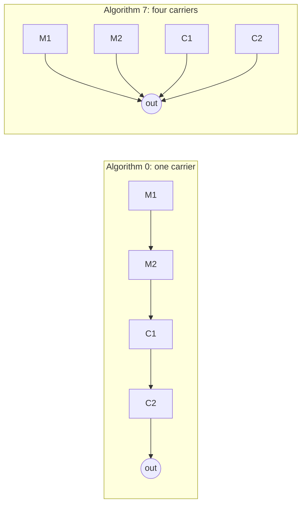

# Chapter 12 — Driving the YM2151

*Before this chapter: [Chapters 1](01_two_computers.md) to
[11](11_driving_the_pokey.md).*

Walk into the treasure room and eight voices start at once: a bright lead, a
bass, and six inner parts that between them make the shimmer. That is the
YM2151 doing what it was bought to do. It is also doing the food blip, the
door's grinding, the elf's death, the transporter, and about fifty other
things that sound nothing like music. Almost every noise in Gauntlet II comes
out of this chip, and this chapter is the path they take.

## The sweep, and the busy problem

On even ticks the dispatcher builds a pointer to `$1810` and hands control to the
YM2151 routine, which visits all eight physical channels in turn. For each one it
runs the sequence engine down that channel's list, exactly as
[Chapter 11](11_driving_the_pokey.md) described, and then writes the winner's
state to the chip.

The writing is where the two chips part company. A POKEY register accepts a byte
the instant you store it. The YM2151 does not. It has an internal state machine
running at its own pace, and while that machine is mid-update the chip ignores
anything you send it. So it publishes a busy flag in the top bit of its data
port, and the software has to look before every single write.

The ROM's answer is a small routine that every register write goes through:

```
if we have already given up on this chip:
    return immediately

count = 0
while the busy bit is set:
    count = count + 1
    if count reaches 255:
        remember that this chip is not answering
        set bit 1 of the error-flag byte
        return
```

Two things about that are worth stopping on.

The loop is **bounded**. It runs inside an interrupt, and an interrupt that spins
forever takes the whole board with it: no more sound, no more coin counting, no
more heartbeat for the main CPU to check. A limit of 255 polls turns a dead chip
from a lockup into a diagnosis. [Chapter 5](05_waking_up.md) introduced the
error-flag byte the main CPU reads with command `$07`; this is the bit that gets
set.

The giving up is **sticky**. Once the routine has timed out, every later call
returns straight away without looking. The engine keeps writing, the chip keeps
ignoring, and the board keeps running with a flag raised saying why it is
silent. There is no retry and no recovery. This is a diagnostic posture rather
than a robustness one, and for an arcade board with a technician and a self-test
switch that is the right call.

A fully active channel, with a new note to strike and all four operator levels to
refresh, makes fourteen of these checks in one tick and costs about 1,350 cycles
when the chip answers immediately. Eight of those would not fit in one interrupt
interval. What keeps the total inside the budget is that most channels, most
ticks, are only refreshing a couple of values, and the flag bits described at the
end of this chapter decide which work happens.

## An instrument is 42 bytes

[Chapter 3](03_three_sound_chips.md) described FM synthesis in the abstract: four
operators, each a sine oscillator with its own envelope, wired together in one of
eight arrangements. Turning that into sound means filling in about thirty
numbers, and the ROM stores each set as a fixed-size **voice** record.

There are 55 of them, laid out end to end from `$69D6`, 42 bytes each. Here is a
real one, the lead voice of the treasure-room music, read out field by field:

| Offset | Field | Value | Meaning |
|---:|---|---:|---|
| 0 | Feedback and algorithm | `$E1` | Algorithm 1, feedback level 4 |
| 1 | Key code base | `$00` | No fixed pitch offset |
| 2 | Key fraction base | `$00` | No fine-tuning offset |
| 3 | Modulation sensitivity | `$11` | Slight pitch and amplitude wobble from the LFO |
| 4–9 | Operator M1 | `32 27 DF 07 04 F7` | Detune/multiple, level, attack, decay, sustain, release |
| 10–15 | Operator M2 | `33 29 DF 04 04 FB` | The same six fields again |
| 16–21 | Operator C1 | `33 21 DF 04 04 FB` | And again |
| 22–27 | Operator C2 | `31 00 9F 8A 03 0B` | And again |
| 28 | Unused | `$00` | No code reads this byte |
| 29–35 | Level transform | `47 00 67 00 87 00 06` | How each operator's level is corrected |
| 36–41 | Auxiliary blocks | `C8 82 02 02 00 00` | LFO and noise settings, loaded separately |

The first four bytes describe the channel. Offset 0 is the important one: its
low three bits choose which of the eight algorithms wires the operators
together, and the next three set how much of operator M1's output is fed back
into its own input, which is where the chip's rougher timbres come from.

Then four blocks of six, one per operator, in the order M1, M2, C1, C2. The six
fields are always the same:

| Byte | What it sets |
|---:|---|
| 0 | Detune and frequency multiple |
| 1 | Total level, this operator's own attenuation |
| 2 | Key scaling and attack rate |
| 3 | Amplitude-modulation enable and first decay rate |
| 4 | Second detune and second decay rate |
| 5 | Sustain level and release rate |

Read the treasure-room voice with that key and it tells you something. All three
of M1, M2 and C1 have an attack byte of `$DF`, which is the fastest attack with
the strongest key scaling. C2, the operator you actually hear, has `$9F`: same
fast attack, less key scaling. The three modulators have their levels set to
`$27`, `$29` and `$21`, well down from full, and the carrier sits at `$00`, wide
open. That is the shape of a plucked, bright, slightly metallic tone, which is
what the treasure room sounds like.

Twenty-eight of the 42 bytes go straight to the chip. The other fourteen are
scaffolding the ROM keeps for itself, and the level-transform group is the
subject of a later section.

Of the 55 records, 39 are named by a sequence somewhere in the ROM and one more
is reached only through the auxiliary-block instruction. The busiest is the
treasure room's second voice, loaded 24 times across the game; the remaining
fifteen are never named at all.

## Loading a voice

One instruction does the whole thing. `SET_VOICE` takes a 16-bit address, copies
the first 28 bytes of that record into the chip's registers, and initializes the
channel's bookkeeping from the rest.

Three bytes of sequence completely redefine what a voice sounds like. That is why
`SET_VOICE` is the most common instruction in the entire ROM, appearing 147
times: nearly every sequence starts by choosing an instrument, and several change
instrument partway through.

The copy is not a straight block move, because the YM2151's registers are laid
out by field rather than by channel. Every operator's total level lives in one
bank, every operator's attack rate in another. So the loader walks the record
with two counters, one stepping through the record and one stepping through the
register banks, and every one of the 28 stores waits for the busy flag first.

## Volume on an FM chip is not a volume knob

Here is the part of this chapter that surprises people.

An operator's total level is an attenuation: 0 is loudest, 127 is silent, and
the range covers about 96 decibels, so one step is roughly three quarters of a
decibel. To make a channel quieter you raise the total level of its operators.

But raising *all* of them does not make the sound quieter. In a serial
arrangement, M1's level controls how hard M1 pushes M2, and pushing less hard
does not lower the volume of what comes out, it lowers the amount of harmonic
content. Attenuating a modulator changes the timbre. Only the operators whose
output actually leaves the chip control loudness, and those are the **carriers**.

Which operators are carriers depends on the algorithm:



*The same four operators, wired two different ways. In algorithm 0 only C2
reaches the output and the other three shape it. In algorithm 7 all four are
heard and none of them modulates anything.*

The ROM keeps an eight-byte table, one row per algorithm, saying which operators
to touch:

| Algorithm | Carriers | Voices using it |
|---:|---|---:|
| 0 | C2 | 3 |
| 1 | C2 | 4 |
| 2 | C2 | 3 |
| 3 | C2 | 7 |
| 4 | C1, C2 | 11 |
| 5 | M2, C1, C2 | 4 |
| 6 | M2, C1, C2 | 2 |
| 7 | M1, M2, C1, C2 | 5 |

Every volume change on a YM channel looks up that row first. The instruction
takes a signed amount, negates it, and adds it to the base level of each carrier
with saturation at both ends, leaving the modulators alone. Seventeen of the 39
voices this game uses have exactly one carrier, so for those the whole operation
touches one number.

The sequence language reaches this through two instructions.
`YM_CARRIER_TL_DELTA` hands the routine a signed byte directly, and the treasure
room's opening uses it with an operand of `$F1`, which is minus fifteen, which
becomes fifteen steps of extra attenuation on the carriers, which is about eleven
decibels down.

`SET_VOLUME` goes the long way around. It reloads all four operator levels fresh
from the instrument record, then looks up its low nibble in a sixteen-step
curve, then applies that as a carrier delta:

| Volume operand | Curve value | Added to carrier level | Roughly |
|---:|---:|---:|---|
| `$0F` | 0 | 0 | Full |
| `$0E` | −2 | +2 | 1.5 dB down |
| `$0C` | −6 | +6 | 4.5 dB down |
| `$0A` | −10 | +10 | 7.5 dB down |
| `$08` | −14 | +14 | 10.5 dB down |
| `$04` | −23 | +23 | 17 dB down |
| `$02` | −31 | +31 | 23 dB down |
| `$01` | −36 | +36 | 27 dB down |
| `$00` | −64 | +64 | 48 dB down |

The top fourteen steps are evenly spaced two units apart, which is a gentle,
musical fade of a decibel and a half per step. Then the bottom two fall off a
cliff. Somebody built this curve so that a sequence counting its volume down
would fade smoothly through the useful range and then vanish rather than trailing
away at the threshold of hearing.

The reload matters as much as the curve. Because `SET_VOLUME` starts from the
instrument's own levels every time, a sequence can raise and lower its volume
repeatedly without the deltas accumulating into nonsense.

## The transform chain

Between the carrier levels the engine has computed and the bytes the chip
receives sits one more stage, and it uses the tail of the instrument record.

Offsets 29 through 35 hold a descriptor for each operator plus a chaining byte
between them. Each operator's descriptor splits into two nibbles, which index
two 256-byte lookup tables in ROM. The result becomes that operator's correction
and also seeds the index for the next operator, so the four corrections are
computed as a chain rather than independently.

The reason to do this at all is that FM does not respond linearly. Lowering a
carrier by ten steps lowers the output by ten steps' worth of decibels, but
lowering a modulator by ten steps changes the sound in a way that depends on the
carrier's level, the feedback, and the algorithm. A single global fade applied
naively to a rich patch makes it dull before it makes it quiet. The chain lets
each instrument carry its own correction curve, so that a fade sounds like the
same instrument getting further away.

There is one more input, and it settles a debt from
[Chapter 8](08_sequence_language_time.md). Bits 5 and 4 of a note's control
byte, the division field, do a second job on the YM2151: they index a four-entry
table of bias values, `0`, `0`, `36`, and `88`, which is folded into the operator
levels for that note before the chain runs. So the same instrument can be struck
with a different weight without loading a different instrument.

Almost nothing uses it. Of the ROM's 1,124 note and rest events, 1,097 select one
of the two zero entries. Ten of the remainder are on POKEY channels, which ignore
the field entirely. Sixteen are the low grinding D that four voices hold when a
door opens, and one is a single note in the food blip.

## Pitch: key code and key fraction

The YM2151 does not want a frequency. It wants a note name.

Register `$28` for a channel holds its **key code**: three bits of octave and
four bits of semitone. Four bits is sixteen values and there are twelve
semitones, so four codes in every block are illegal, and they are not the top
four. The valid codes are 0, 1, 2, then 4, 5, 6, then 8, 9, 10, then 12, 13, 14,
with every fourth code skipped. The chip's internal frequency table is organized
in groups of three, and the layout is the tables' shape showing through the
register.

The ROM does not compute this. It has a 128-byte table indexed by note number
that hands back the key code directly:

| ROM note | Note name | Key code | Octave field | Semitone field |
|---:|---|---:|---:|---:|
| 49 | C4 | `$3E` | 3 | 14 |
| 51 | D4 | `$41` | 4 | 1 |
| 53 | E4 | `$44` | 4 | 4 |
| 56 | G4 | `$48` | 4 | 8 |
| 58 | A4 | `$4A` | 4 | 10 |
| 61 | C5 | `$4E` | 4 | 14 |

Reading that table shows where the block boundary falls. C4 is the *last* entry
of octave block 3 and D4 is near the start of block 4, so the chip's octaves run
from C-sharp to C rather than from C to B.

Register `$30` holds the **key fraction**, six bits that divide one semitone into
sixty-four parts. Every voice record carries a base fraction, and although all 55
in this ROM leave it at zero, the engine adds an offset of its own on top, which
is how two voices playing the same note can be detuned slightly against each
other to thicken the sound.

The result is a chip that plays in tune. Running the ROM's own key codes through
a reference implementation of the YM2151 and comparing against equal temperament,
the eight notes of the music chip test come out between half a cent flat and a
fifth of a cent sharp. Across the whole chromatic range the ROM's sequences use,
the worst note is a cent and a half off. Compare that with the POKEY's top octave
from [Chapter 11](11_driving_the_pokey.md), where the best available divider left
notes nearly four cents out. The YM2151 was designed for music and the difference
shows in a single table lookup.

## Keying on and off

An FM channel has a key that gets struck and released, and the two are separate
events. Striking restarts every operator's envelope from its attack phase.
Releasing lets them run down at their release rates. Between the two the note
sustains.

The engine decides what to do with a small set of flag bits, prepared while the
sequence engine runs and consumed in order during the write pass:

| Flag | Effect |
|---|---|
| Key off | Release the note that is currently sounding |
| Refresh | Rewrite the key code and the operator levels |
| Key on | Strike a new note |

A tick can set any combination. A channel holding a long note sets none of them
and gets no writes at all beyond its three channel registers. A channel starting
a note sets key off, refresh, and key on, and gets the full fourteen busy-checked
writes.

The key-off flag is where [Chapter 8](08_sequence_language_time.md)'s second
timer arrives. That timer was derived from the note's duration by subtracting
twice the tempo, so it expires a couple of ticks before the next event is due.
When it expires, this flag is set, the note is released, and the voice spends
those couple of ticks decaying instead of sounding. That is the whole mechanism
behind articulation. Sixteen milliseconds of release before every attack is the
difference between a line of separate notes and one continuous slide, and it
costs one comparison per channel per tick.

The sustain bit at the top of the note's control byte loads the second timer with
a value so large it never expires, so the key-off flag never gets set and the
note runs until the sequence says otherwise. The theme song's held bass notes are
written that way, and so is the last note of the music chip test, which sustains
and loops forever so a technician can leave it running.

> **Try it yourself**
>
> Rendering YM2151 audio compiles the bundled YMFM chip model, so this box needs
> a C++ compiler installed. Everything else in the book runs without one.
>
> ```bash
> uv run gauntlet_disasm.py soundrom.bin --cmd 0x3D --csv hw_docs/soundcmds.csv
> uv run gauntlet_disasm.py soundrom.bin --music-wav 0x3D --csv hw_docs/soundcmds.csv
> ```
>
> The first prints eight channels. Every one begins with `SET_VOICE`, and five of
> them name the same instrument at `$6DC6`; the lead at `$6D72` and the two upper
> voices at `$6F40` and `$6AD2` are the exceptions. Every one of the eight sets
> `SET_TEMPO $4F`, so the whole arrangement runs off one tempo. Six of them play
> `YM_CARRIER_TL_DELTA $F1`, the eleven-decibel step down described above. The
> staggered rests near the top of channels 2 through 6 are what make those voices
> enter one after another instead of together.
>
> The second reports `87723 register writes` across `6704 IRQ services` and
> writes 28.969 seconds of audio. Thirteen writes per interrupt on average, for
> half a minute, to keep eight voices going.

## What you now know

- On alternate ticks the engine visits all eight YM2151 channels and writes each
  winner's state to the chip.
- Every register write waits for the chip's busy flag, gives up after 255 polls,
  sets an error bit, and then stops waiting at all.
- An instrument is a 42-byte record: four channel bytes, four blocks of six
  operator bytes, one byte nothing reads, a seven-byte level-transform tail, and
  six auxiliary bytes. Twenty-eight of the 42 go straight to the chip.
- One three-byte instruction loads a whole instrument, which is why it is the
  most-used instruction in the ROM.
- Making an FM channel quieter means attenuating its carriers only, and which
  operators are carriers comes from an eight-entry table indexed by the
  instrument's algorithm.
- Volume steps run through a sixteen-entry curve that is evenly spaced at the top
  and falls off a cliff at the bottom.
- Each instrument carries its own correction descriptors so that a fade keeps the
  timbre rather than dulling it.
- Pitch is a key code from a lookup table plus a six-bit fraction, and the result
  is within about a cent of equal temperament across the range the game uses.
- Three flag bits per tick decide whether a note is released, refreshed, or
  struck, and the key-off flag is driven by the articulation timer from
  Chapter 8.

## Where this leads

[Chapter 13](13_speaking.md) leaves all of this behind. Speech uses no sequence
engine, no logical channels, no envelopes, and no priorities in the sense used
here. It is a queue and a byte pump, and it takes up two thirds of the ROM.

## Going deeper

- [`docs/04_subsystems.md`](../docs/04_subsystems.md) — the YM pipeline, the busy
  wait, winner staging, and measured cycle costs.
- [`docs/05_data_reference.md`](../docs/05_data_reference.md) — the algorithm mask
  table, the attenuation curve, the key-code view, and the transform tables.
- [`docs/06_sequence_engine.md`](../docs/06_sequence_engine.md) — the voice and
  auxiliary loaders, and the mode-overloaded channel arrays.
- [`hw_docs/YM2151.md`](../hw_docs/YM2151.md) — the chip's own register map.
- [`docs/generated/ym_voice_field_catalog.csv`](../docs/generated/ym_voice_field_catalog.csv)
  — every offset in the 42-byte record with its register and observed values.
- [`docs/generated/ym_voice_record_catalog.csv`](../docs/generated/ym_voice_record_catalog.csv)
  — all 55 instruments.
- [`docs/generated/ym_pitch_validation_catalog.csv`](../docs/generated/ym_pitch_validation_catalog.csv)
  — the eight test notes checked against equal temperament.
