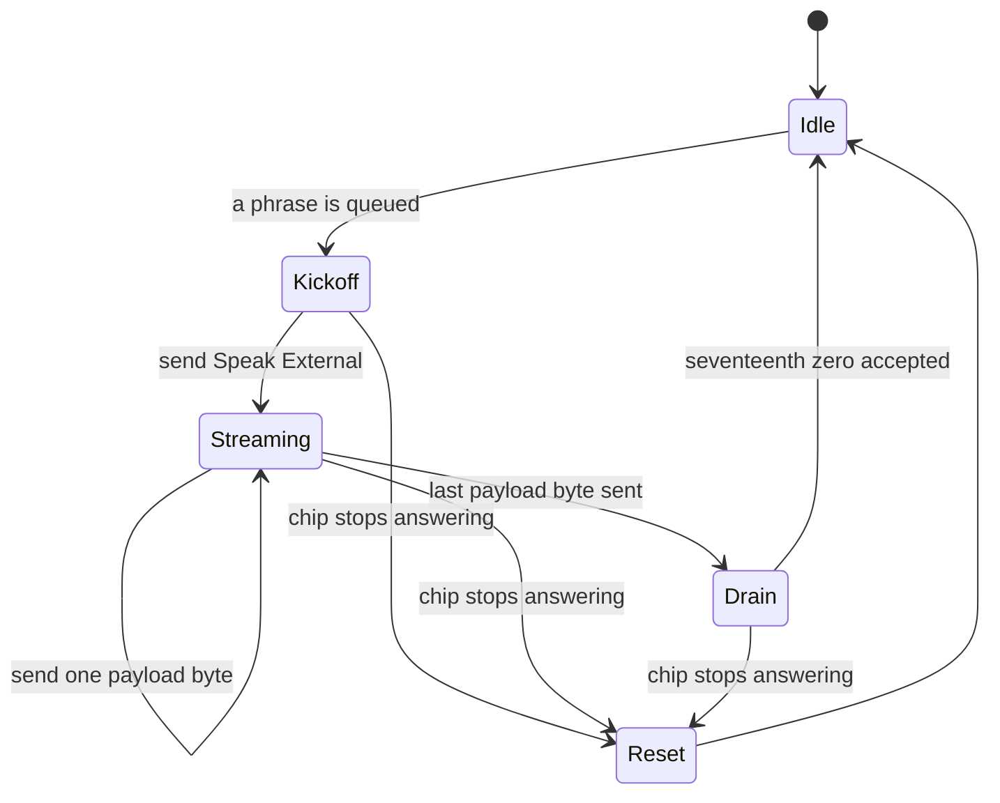

# Chapter 13 — Speaking: The TMS5220 Path

*Before this chapter: [Chapters 1](01_two_computers.md) to
[12](12_driving_the_ym2151.md).*

"Elf needs food, badly." Nobody who put a quarter in a Gauntlet II cabinet has
forgotten that voice. It is also, structurally, the least Gauntlet-like thing on
the board. No sequence, no logical channel, no envelope, no tempo, no priority
list. A speech command resolves to a pointer and a length, and after that the
sound subsystem's only job is to hand the chip one byte at a time until it runs out.

## Speech skips everything

Chapters 7 through 12 built one machine: allocation, thirty logical channels, a
bytecode interpreter, envelopes, arbitration, register writes. Type-11 speech
uses none of it.

What it uses instead is three parallel tables of 141 entries each, indexed by the
command's parameter:

| Table | Holds |
|---|---|
| Index | Which of the 189 stored streams this phrase is |
| Clock flag | Whether to run the chip's oscillator fast |
| Priority | How this phrase competes with other phrases |

The index then selects from two more tables of 189 entries, one of pointers and
one of lengths, and at that point the phrase is a start address and a byte count.
Everything after this is a queue and a byte pump.

141 of the 219 commands the main CPU can send are speech. That is nearly two
thirds of the vocabulary between the two computers, against 62 for every sound
effect and piece of music in the game. There is also a back door: one instruction
in the sequence language triggers a speech command from inside a piece of music,
so a tune could talk. Nothing in this ROM uses it.

## The corpus

189 streams occupy `$873D` to `$FECC`: 30,608 bytes, laid out end to end with no
gaps and no padding. The ROM is 49,152 bytes. Almost two thirds of Gauntlet II's
sound ROM is recorded speech, and the remaining third holds the code, the
instruments, the music, and every sound effect in the game.

141 of the streams are real phrases, adding up to 30,560 bytes. The other 48 are
a single byte each, and they are stop commands: selecting one of those tells the
chip to shut up immediately.

The 141 phrases decode to 5,415 frames between them. The shortest, an Elf saying
"UH", is 46 bytes and eight frames. The longest are 496 bytes and around ninety.
The average phrase is 217 bytes long, which is the size of a small function.

What is in them divides roughly into three groups. There is the narrator, who
announces what is happening and who says the food line. There are the four
characters' grunts and yelps, one set each for the Warrior, the Valkyrie, the
Wizard, and the Elf. And there is the Dungeon Master, who taunts.

The character sets are large. The Elf has eleven consecutive vocalizations
at commands `$76` through `$80`, among them "EEH EEH EEH EEH", "ARGH", "YEOW",
and two different lengths of "OOH", with two more sitting further down the table
at `$B9` and `$BC`. Thirteen more sit under the Valkyrie's name at `$A9` through
`$B5`. A dozen distinct ways of being hurt, per character, is a lot of ROM to
spend on a detail nobody would have complained about.

## Speech by describing a throat

[Chapter 3](03_three_sound_chips.md) introduced linear predictive coding as
compression by simulation. It is worth restating here with numbers, because the
numbers are the reason this chapter exists.

The chip does not store sound. It stores, for each 25-millisecond frame, a
description of a vocal tract: whether the source is a buzz or a hiss, how loud it
is, what pitch the buzz has, and ten reflection coefficients describing a tube
that the source is pushed through. The chip rebuilds the sound from that
description at 8,000 samples a second.

A frame is a handful of bits rather than a fixed size. A silent frame is four
bits. An unvoiced frame, a hiss, needs no pitch and fewer coefficients. A fully
voiced frame is around fifty bits. "NEEDS FOOD, BADLY." is 61 frames, of which 47
are voiced, seven are unvoiced, six are silence, and the last is the stop frame
that tells the chip it has finished. The whole thing packs into 2,581 bits.

That is where the arithmetic gets satisfying. Sixty-one frames at 25 milliseconds
each is 1.525 seconds of speech, from 324 bytes. Storing the same waveform
uncompressed at the same 8 kHz sample rate would take 12,200 bytes, so the ROM is
carrying its speech at about one fortieth of the cost. Thirty kilobytes of ROM
becomes just over two minutes of talking.

It also explains the sound. The model has no room for anything except a buzz, a
hiss, and a ten-stage filter, so every voice that comes out of it has the same
underlying character: a synthetic throat, doing an impression of whoever was in
the recording booth.

## Priority and the queue

A phrase can arrive while another is speaking, and the rule is worth stating
precisely because it is easy to guess wrong.

The queue occupies eight physical bytes, but it can hold only seven waiting
phrases. Its read and write positions have no separate full flag, so equality
has to mean empty and one slot must remain unused. When a new command arrives
and the chip is idle, it starts at once. When the chip is busy, the queue first
checks whether all seven usable places are occupied. A full queue rejects the
new phrase immediately, before looking at its priority. If there is room, the
new phrase's priority is compared against the priority of the phrase
**currently speaking**:

| New phrase's priority | What happens |
|---|---|
| Lower | Rejected outright |
| Equal | Appended to the queue |
| Higher | Everything waiting in the queue is discarded, then the new phrase is appended |

The important word is *waiting*. Provided the ring was not already full, a
higher-priority phrase throws away the backlog and puts itself at the front of
it. It does not cut off the phrase in progress. Whatever is being said finishes
being said, and the new phrase follows it. The full-before-priority ordering
means that even a higher-priority arrival is dropped when seven phrases are
already waiting; it does not get the chance to flush them.

That behaviour is what makes the game sound coherent rather than frantic. Nearly
everything the ROM says is priority zero, so phrases queue up in the order the
game asked for them. Seven commands are exceptions:

| Commands | Priority | Phrases |
|---|---:|---|
| `$A1`–`$A6` | 64 | "BETTER HURRY!", "TIME IS RUNNING OUT!", "TIME'S ON MY SIDE.", "CAN YOU MAKE IT?", "JUST KIDDING.", "FOOLED YOU!" |
| `$BC` | 4 | An Elf's "AHHH" |

The Dungeon Master's six time-pressure lines outrank everything. When the level
timer starts running down, whatever queue of grunts and announcements has piled
up gets thrown away and the taunt goes next. The design decision is that the
warning matters more than the backlog, and that interrupting somebody mid-word
sounds broken.

## The streaming state machine

The chip is fed from inside the interrupt. [Chapter 4](04_heartbeat.md)
established the rate: the speech service routine is called four times per
interrupt, which is up to about 960 opportunities a second. Those are attempts.
The chip has a ready line, and most of the time the answer is no.

Each call looks at one state byte and does one small thing:



*Four working states and an escape hatch. Every transition happens inside one of
the four service calls per interrupt, and only when the chip says it is ready.*

**Idle** takes the next phrase off the queue, if there is one. Taking it loads
the pointer, the length, the priority, and the clock flag, and writes the mixer
byte, all with interrupts held off so a command arriving mid-load cannot see half
a phrase. The same moment also selects the chip's oscillator divisor and rewrites
the mixer byte, so a phrase's clock setting and its volume are both in place
before its first byte goes in. This is the other half of the arrangement
[Chapter 6](06_taking_orders.md) described, where a mixer command arriving
mid-phrase waits rather than writing.

**Kickoff** sends the chip the byte `$60`, which is its Speak External command.
That tells the chip to expect a stream rather than to look up a stored word in
its own vocabulary ROM, which Gauntlet's board does not have.

**Streaming** writes one payload byte per ready service, advances the pointer,
and decrements the length. "NEEDS FOOD, BADLY." takes 324 of these over about a
second and a half, which is roughly one accepted write in every four attempts.
The rest of the attempts find the chip's input buffer full and do nothing, which
is exactly the intended arrangement: the chip's own appetite sets the pace and
the software just offers.

Every write goes to the data address and is then followed by a strobe pulse on a
separate address, because the latch between the CPU and the chip needs a clock
edge rather than just a value.

The headroom in that arrangement is the reason speech and music coexist without
either noticing the other. A phrase needs about 210 bytes a second. The interrupt
offers roughly 960 opportunities a second, and a call that finds nothing to do
costs 76 cycles, a shade over 40 microseconds. Four of those per interrupt is
about four percent of the interval. Speech is nearly free when it is
idle and cheap when it is running, which is what lets it sit alongside eight
voices of FM without a scheduler ever having to think about it.

## The seventeen zeroes

When the length reaches zero, the code does not go idle. It writes seventeen zero
bytes first, one per ready service, and then goes idle.

The reason is a hardware quirk, and it is a good example of software shaped to
fit silicon.

The chip has a sixteen-byte input buffer. It starts talking once nine bytes have
arrived, and from then on it consumes bits from that buffer at whatever rate the
speech needs. If the buffer ever runs empty before the chip reaches the stream's
encoded stop frame, it treats that as an error and cuts the utterance off.

At the moment the last real byte is handed over, up to sixteen bytes are still
sitting in the buffer unspoken, and the stop frame is somewhere among them.
Writing seventeen zeroes pushes exactly enough filler in behind them to keep the
buffer non-empty until the stop frame comes out the other end. Sixteen to fill,
one to spare.

Get this wrong and every phrase in the game loses its last syllable.

## When the chip stops answering

The ready line can stay stuck, and the code watches for it. Every service that
finds the chip not ready advances a counter, and when that counter reaches its
limit the routine resets the speech chip and reinitializes it from scratch,
abandoning whatever was being said.

The limit works out to 32 or 33 interrupt intervals depending on where in the
cycle it started, which is a seventh of a second. A phrase that stalls for that
long is not coming back, and the alternative to resetting is a board that never
speaks again until somebody power-cycles it.

Reinitialization primes the chip with a dummy stream: 32 bytes of `$FF` sitting
in ROM for exactly this purpose, addressed like any other phrase. Feeding it a
known stream and then stopping leaves the chip in a defined state.
[Chapter 5](05_waking_up.md) mentioned this happening at boot. It is the same
routine.

## The clock flag

One bit in the metadata changes the chip's oscillator. Normally the TMS5220 runs
from a divide-by-eleven of the board's clock. Setting the flag switches it to
divide-by-nine, so the chip runs about 22 percent faster and everything comes out
correspondingly higher and quicker. The schematics call it *squeak*.

Twenty-seven of the 141 phrases set it, and they form a very clean pattern:

| Commands | Who | Count |
|---|---|---:|
| `$76`–`$80` | The Elf's grunts and yelps | 11 |
| `$89`–`$8A` | The Valkyrie's "OH" and "GULP" | 2 |
| `$A9`–`$B5` | The Valkyrie's grunts and yelps | 13 |
| `$BC` | The Elf's "AHHH" | 1 |

Every flagged phrase belongs to the Elf or the Valkyrie, the two small
characters, and no narrator line or Dungeon Master taunt is flagged at all.
Somebody recorded a set of grunts, decided the small characters should sound
higher, and got it for one bit per phrase and a divider on the board rather than
by recording a second set. Thirty kilobytes was expensive.

> **Try it yourself**
>
> ```bash
> uv run gauntlet_disasm.py --speech-wav 0x5A
> uv run gauntlet_disasm.py --speech-wav 0xA2
> uv run gauntlet_disasm.py --speech-wav 0x7F
> ```
>
> The first reports `324 bytes` and writes 1.52 seconds of audio. Check the
> arithmetic from this chapter against it:
> [`docs/generated/type11_speech_catalog.csv`](../docs/generated/type11_speech_catalog.csv)
> gives command `$5A` 61 frames, and 61 frames at 25 ms each is 1.525 seconds.
> The second, "TIME IS RUNNING OUT!", is 298 bytes and 50 frames, and comes out at
> 1.25 seconds. Fewer bytes, fewer frames, less time, and the ratio holds.
>
> The third is the Elf's "YEOW", one of the 27 phrases with the clock flag set.
> The renderer writes it at the normal rate, so what you hear is the recording
> before the board's divider gets at it. On the real machine it is a fifth higher
> and a fifth quicker.

## What you now know

- A speech command resolves through three 141-entry tables to a stream index, a
  clock flag, and a priority, and then through two 189-entry tables to a pointer
  and a length.
- 189 streams fill 30,608 bytes, nearly two thirds of the ROM; 141 are phrases and
  48 are one-byte stop commands.
- LPC stores a description of a vocal tract per 25 ms frame rather than a
  waveform, which buys about a fortyfold saving and gives every character the same
  synthetic throat.
- Eight physical queue bytes hold at most seven waiting phrases. Full is tested
  before priority; otherwise higher priority discards the backlog, and nothing
  interrupts the phrase already being spoken.
- Four states drive the streaming, advanced by four service calls per interrupt,
  each acting only when the chip says it is ready.
- Seventeen zero bytes at the end of every phrase keep the chip's sixteen-byte
  buffer non-empty long enough for the encoded stop frame to be spoken.
- A stuck ready line for about a seventh of a second triggers a full chip reset
  and reinitialization from a dummy stream in ROM.
- One flag bit switches the chip's clock divider from eleven to nine, and all 27
  phrases that use it belong to the Elf and the Valkyrie.

## Where this leads

Three complete pipelines are now on the table. [Chapter 14](14_chip_tests.md)
walks one example of each, start to finish, using the three commands Atari wrote
to prove the hardware works.

## Going deeper

- [`docs/04_subsystems.md`](../docs/04_subsystems.md) — the type-11 subsystem,
  the lifecycle state machine, and the queue transaction.
- [`docs/05_data_reference.md`](../docs/05_data_reference.md) — the speech
  metadata tables and the corpus layout.
- [`docs/01_hardware.md`](../docs/01_hardware.md) — the chip's addresses, the
  strobe, and the two oscillator divisors.
- [`mame_refs/tms5220.txt`](../mame_refs/tms5220.txt) — the buffer, the ready
  line, and the abort behaviour that the seventeen zeroes work around.
- [`docs/generated/type11_speech_catalog.csv`](../docs/generated/type11_speech_catalog.csv)
  — all 141 phrases with pointer, length, frame counts, flag, and priority.
- [`docs/generated/speech_lifecycle_catalog.csv`](../docs/generated/speech_lifecycle_catalog.csv)
  — every block of the service routine with its reads and writes.
