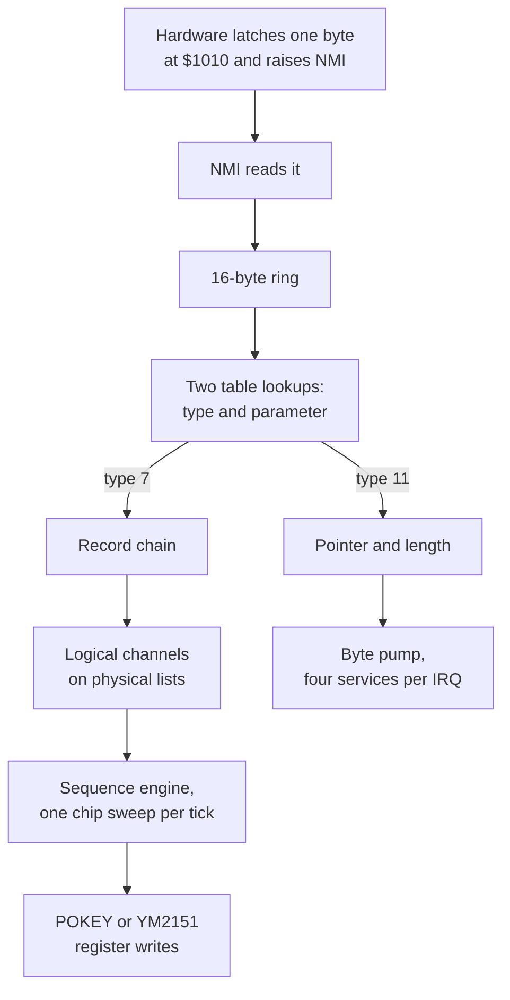

# Chapter 14 — The Chip Tests: Three Guided Walkthroughs

*Before this chapter: [Chapters 1](01_two_computers.md) to
[13](13_speaking.md).*

Inside the cabinet, next to the coin door, there is a switch. Hold it and the
board stops being a game and starts being a diagnostic instrument. Among other
things it will play you three sounds, one per chip, designed so that a technician
with no equipment beyond their ears can tell which part of the board has died.

Those three sounds are the best teaching material in the ROM, because they were
written to be obvious. Everything the previous seven chapters described is in
them, at half scale, with nothing hidden. This chapter walks all three from the
byte the main CPU sends to the air.

## Command `$04`, the music chip test

### Getting there

The main CPU writes `$04`. The hardware latches the byte and raises the NMI. The
NMI routine reads it, checks it against the validation table, finds an ordinary
command rather than one of the three direct queries, drops it into the sixteen
entry ring, and returns.

The main loop picks it up. Two table lookups turn `$04` into handler type 7 and
parameter `$00`. The type-7 handler reads the parameter's starting record, and
that record is number zero. Zero means two different things in these tables
depending on which column it appears in: as a starting offset it names record
zero, and only as a "next" link does it end a chain. Command `$04` is the one
sound in the ROM that starts at record zero.

### The chain

Following the "next" links gives eight records:

| Record | Priority | Physical channel | Sequence | Next |
|---:|---:|---:|---|---:|
| 0 | 8 | 4 | `$690C` | 1 |
| 1 | 8 | 5 | `$691F` | 2 |
| 2 | 8 | 6 | `$692E` | 3 |
| 3 | 8 | 7 | `$693F` | 4 |
| 4 | 8 | 8 | `$6952` | 5 |
| 5 | 8 | 9 | `$6961` | 6 |
| 6 | 8 | 10 | `$6972` | 7 |
| 7 | 8 | 11 | `$6985` | 0 |

Eight records, all eight YM2151 voices, one each, and a next link of zero on the
last one to stop. Every priority is the same, which is deliberate: none of these
eight voices should ever preempt another.

The allocator runs eight times. Each pass finds a free logical channel, fills it
in from the record, and links it into that voice's list under an
interrupt mask. Tempo starts at the default 16, both timers start at zero, and
the sequence pointer aims at the address in the table.

### One channel's sequence

Channel 1's stream is eight instructions long:

```
SET_VOICE     $6F94   load a 28-byte register image into YM channel 0
YM_LOAD_ENV   $6F94   load the auxiliary LFO block from the same record
YM_LOAD_REG   $6F94   load the noise register from the same record
YM_FREQ_OFFSET $01    a small pitch offset
NOTE C4, eighth       strike C4, hold it for an eighth note
YM_FREQ_OFFSET $02    change the offset
NOTE C4, eighth       strike C4 again
CHAIN                 stop this channel
```

The other seven are the same shape with three differences. None of them performs
the two auxiliary loads. Their pitch goes up one scale step each time. And each
carries enough rests at the top to hold it back exactly one second longer than
the channel before it, so they enter one after another rather than together:
quarter rests up to channel 4, then a whole rest followed by quarters from
channel 5 on.

The instrument at `$6F94` is algorithm 4 with feedback 3, which is two
two-operator stacks running in parallel, so it has two carriers. Like every
instrument in this ROM its key-code base and key-fraction base are zero, and the
sequence sets no transpose, so the note number reaches the chip's tuning tables
with nothing between the two. A frequency counter on the output measures the
ROM's own pitch conversion and very little else.

### What comes out

Eight channels, each holding for exactly 120 sweeps longer than the one before
it:

| Channel | Note | Key code | Starts | Ends | Sweeps to its end |
|---:|---|---:|---:|---:|---:|
| 1 | C4 | `$3E` | 0.0 s | 1.0 s | 120 |
| 2 | D4 | `$41` | 1.0 s | 2.0 s | 240 |
| 3 | E4 | `$44` | 2.0 s | 3.0 s | 360 |
| 4 | F4 | `$45` | 3.0 s | 4.0 s | 480 |
| 5 | G4 | `$48` | 4.0 s | 5.0 s | 600 |
| 6 | A4 | `$4A` | 5.0 s | 6.0 s | 720 |
| 7 | B4 | `$4D` | 6.0 s | 7.0 s | 840 |
| 8 | C5 | `$4E` | 7.0 s | forever | — |

A rising major scale, one note per second, each note on a different chip voice.
That is the whole design. If YM2151 channel 5 has failed, the fifth step of the
scale is missing, and the technician knows which of the eight voices to blame
without opening a manual. A staircase is a diagnostic that reports its own
position.

Every one of those seven finite channels finishes with its timer holding exactly
the residue it started with, which is the neatest possible demonstration that the
carried-remainder arithmetic from
[Chapter 8](08_sequence_language_time.md) closes exactly.

Look closer at one step and the articulation from Chapters 8 and 12 is visible.
Channel 1's first note is scheduled for 60 sweeps, and its second timer is set to
58. At 58 sweeps the key-off flag is raised and the note is released; at 60 the
next event starts and the key goes down again. Two sweeps of silence, sixteen
milliseconds, between two notes on the same pitch. Without it the two eighth
notes would be one quarter note and half the test would be inaudible.

The key codes in that table are the ones the chip actually receives. Running them
through a reference implementation of the YM2151 gives frequencies between half a
cent flat and a fifth of a cent sharp of equal temperament. The scale is in tune,
and it was written to be checkable.

### The eighth channel

Channel 8 does not stop. After its two C5s it plays an eighth rest, loads a
*different* instrument, sets its volume to 9, and then plays a whole note marked
sustained, followed by a jump back onto that same note.

The sustain bit means the key-off timer never expires, so the note is never
released. The whole note is 480 sweeps, four seconds, and the jump target is the
note itself, so every four seconds the sequence arrives back at the same
instruction and re-arms the same timer. The test reaches that back edge after
12.5 seconds and keeps going round.

Watch the chip's key register while this happens and it receives one key-on, at
8.5 seconds, and then nothing ever again. The loop costs a few instructions per
four seconds and produces one unbroken tone.

That is a technician's convenience. Play the scale, confirm all eight steps, and
then walk away and leave a tone sounding while you probe the board with a scope.

## Command `$05`, the effects chip test

### Four records, four channels

The same machinery, a much smaller chain:

| Record | Priority | Physical channel | Sequence | Next |
|---:|---:|---:|---|---:|
| 8 | 8 | 0 | `$6838` | 9 |
| 9 | 8 | 1 | `$686D` | 10 |
| 10 | 8 | 2 | `$68A2` | 11 |
| 11 | 8 | 3 | `$68C2` | 0 |

Four records, the POKEY's four channels, one each, all at priority 8. Allocation
puts them in logical slots 29, 28, 27, and 26, and threads them into the four
POKEY physical lists.

This chain is also the ROM's heaviest single moment, and
[Chapter 4](04_heartbeat.md) promised to come back to it. On the first POKEY
sweep after allocation, all four logical channels have never run before, so all
four decode their entire setup block in one tick: five instructions each, two
envelope initializations each, and a rest. That first sweep costs about 6,900
cycles, and the whole interrupt around it comes to roughly 7,550, against a
nominal interval of 7,467.

It overruns by about a hundred cycles, and nothing bad happens. The interrupt
line is held rather than pulsed, so the next one is still waiting when this one
returns and is serviced immediately afterwards. The board runs sixty
microseconds behind for one tick and then catches up. No later tick of the same
test costs more than about two thirds of the interval.

Every one of the four opens with the same five instructions:

```
SET_VOL_ENV    a volume curve
SET_FREQ_ENV   a pitch curve
SWITCH_POKEY   this channel drives the POKEY
SET_VOLUME  $00   start from silence
SET_DISTORTION $A0   clean square wave, no polynomial
```

Notice what is missing. The seven POKEY sound effects from
[Chapter 11](11_driving_the_pokey.md) all begin by requesting the fast clock, and
all of them choose a polynomial distortion. The chip test does neither. It leaves
the control masks at their reset values and picks the one distortion setting that
produces a clean tone. A technician needs to hear whether the channel works, not
whether it can hiss convincingly.

### Two of them stop and two of them do not

Channels 3 and 4 play one rest each and end. Channels 1 and 2 keep going: after
an opening phase they reach a two-instruction loop and stay in it.

Chapter 9's table gave the numbers. Both looping channels reach their backward
jump after 692 sweeps and repeat every 250 sweeps after that, which is 5.8
seconds to the first jump and 2.1 seconds per cycle. Those come straight from
the POKEY duration rule of [Chapter 8](08_sequence_language_time.md): the
opening `REST $60` is 96 × 32 units, or 192 sweeps at the default tempo, and
each `REST $7D` is 125 × 32 units, or 250 sweeps. Nothing in the command set stops
them. The three named stop commands in the ROM target other sounds, and the only
way out is the global reset that command `$00` performs. That is fine for a test
you leave running while you work.

### The loop control record

This is the chapter's best chance to see a
[Chapter 10](10_shaping_the_sound.md) idea in its natural habitat. Channel 2's
frequency envelope is nine bytes at `$68F3`:

| Bytes | Record | Meaning |
|---|---|---|
| `02 10 05` | 1 | For 2 sweeps, add 1,296 to the pitch accumulator |
| `FC 00 00` | 2 | For 252 sweeps, add nothing |
| `FF FF 06` | control | Take this loop 255 times, rewinding 6 bytes |

The rewind of six goes back exactly two three-byte records, but the cycle is not
endless. After 255 repetitions the envelope reader steps past this nine-byte
object and starts consuming bytes that also belong to sequences and instrument
records, just as [Chapter 16](16_how_this_was_figured_out.md) describes. Direct
modeling shows this `$68F3` reader first crosses the inferred object boundary
after 65,440 envelope updates and eventually reaches a zero terminator after
71,171. Channel 1's `$68D6` envelope has the same structural problem with a
different step size; it crosses after 2,458 updates and terminates after 12,583.

The two channel *sequences* remain endless because their `SET_SEQ_PTR`
instructions keep jumping backward every 250 sweeps. The finite envelope loop
control and the infinite sequence loop are separate mechanisms.

### What comes out

Once the opening settles, the register trace shows a steady state that is easy to
check against Chapter 11:

| Register | Value | Meaning |
|---|---|---|
| AUDF1 | 121 | Divider for channel 1 |
| AUDC1 | `$AF` | Clean tone, volume 15 |
| AUDF2 | 81 | Divider for channel 2 |
| AUDC2 | `$AF` | Clean tone, volume 15 |
| AUDC3, AUDC4 | `$00` | Silent |

Two pure tones at full volume. Working the divider arithmetic from Chapter 11
backwards, a divider of 121 at the 64 kHz base clock gives 262 Hz and a divider of
81 gives 390 Hz. That is C4 and G4, a perfect fifth apart, held indefinitely.

The pitch came entirely from the frequency envelopes, exactly as
[Chapter 10](10_shaping_the_sound.md) said it must: neither channel plays a note,
both play rests, and the two envelopes push the accumulator up to a resting value
in two sweeps and then hold it there for the rest of time.

## Command `$08`, the speech chip test

The third test uses none of the machinery in the other two.

`$08` dispatches to handler type 11, which reads its parameter, `$00`, and looks
it up in the three speech tables. Index zero. Clock flag clear. Priority zero.
Index zero then selects the first pointer and length in the corpus: address
`$873D`, 247 bytes. That is the very first byte of the 30 KB speech region, which
is a pleasing thing for the diagnostic to be.

From there it is [Chapter 13](13_speaking.md)'s state machine, once:

1. **Queue.** Nothing is speaking, so the phrase starts immediately. The pointer,
   length, priority, and clock flag load atomically, and the state byte moves to
   kickoff.
2. **Kickoff.** The next service call that finds the chip ready sends `$60`,
   Speak External, and the state moves to streaming.
3. **Streaming.** 247 bytes go over, one per ready service. The stream decodes to
   55 frames, of which 27 are voiced, 20 are unvoiced, seven are silence, and one
   is the stop frame. At 25 milliseconds per frame that is 1.375 seconds of
   speech, and the renderer produces exactly 11,000 samples at 8 kHz, which is
   1.375 seconds.
4. **Drain.** Seventeen zero bytes, one per ready service, pushing the stop frame
   through the chip's sixteen-byte buffer.
5. **Idle.** The queue is empty and nothing more happens.

Roughly 250 accepted writes and about a thousand declined offers, over a second
and a third, and the board says its piece.

## What the tests reveal about the design

Three commands, three routes, and almost nothing in common between them.



*Every sound in Gauntlet II enters at the top of this diagram. The three chip
tests are the shortest complete path down each branch.*

Command `$04` goes through allocation, the bytecode interpreter, envelopes,
priority arbitration, key codes, and the busy wait. Command `$05` goes through the
same allocation and the same interpreter and then arrives at a completely
different arbitration and nine unconditional writes. Command `$08` skips all of
it and turns into a pointer, a length, and a state machine.

What they share is the first three boxes. One byte, one latch, one ring, two
lookups. Everything below that is specialization, and everything above it is a
single main-CPU store instruction that does not know or care which of the three
it just triggered.

There is one more thing the tests give away. The two synthesis tests are built
to persist: the music test holds a note forever and the effects test cycles two
tones forever. The speech test is deliberately different. It stops normally
because a phrase has a length. Whoever wrote these was thinking about a person
standing in front of an open cabinet with a meter in one hand, and that is a
different design brief from anything else in the ROM.

> **Try it yourself**
>
> ```bash
> uv run gauntlet_disasm.py soundrom.bin --cmd 0x04 --csv hw_docs/soundcmds.csv
> uv run gauntlet_disasm.py soundrom.bin --score 0x04 --csv hw_docs/soundcmds.csv
> uv run gauntlet_disasm.py soundrom.bin --music-wav 0x04 --csv hw_docs/soundcmds.csv
> ```
>
> The score view is the clearest picture in the whole tool. Eight columns, one per
> chip voice, with each note starting exactly one second after the one to its
> left, and the eighth column carrying a sustained C5 from 8.51 seconds onward.
> The render reports `21334 register writes` and `7190 IRQ services` and stops at
> the tool's 30-second ceiling, because channel 8 never finishes.
>
> ```bash
> uv run gauntlet_disasm.py soundrom.bin --cmd 0x05 --csv hw_docs/soundcmds.csv
> uv run gauntlet_disasm.py soundrom.bin --sfx-wav 0x05 --csv hw_docs/soundcmds.csv
> ```
>
> Look for `SET_SEQ_PTR` at the end of channels 1 and 2 and notice that both jump
> backwards by four bytes, onto the instruction just above. The render reports
> `32367 register writes` and also runs to the ceiling.
>
> ```bash
> uv run gauntlet_disasm.py soundrom.bin --speech-wav 0x08 --csv hw_docs/soundcmds.csv
> ```
>
> `LPC data: $873D (247 bytes)` and `1.38s`. Compare that address with the speech
> corpus bounds in
> [`docs/03_rom_structure.md`](../docs/03_rom_structure.md): the diagnostic phrase
> is the first thing in the corpus.

## What you now know

- The music chip test is an eight-record chain, one record per YM2151 voice, all
  at the same priority, playing a rising scale one note per second so that a dead
  voice shows up as a missing step.
- Its instrument has zero key-code and key-fraction bases, which makes it a clean
  measurement of the ROM's tuning tables.
- Its eighth channel sustains and loops forever so the test can be left running.
- The effects chip test is a four-record chain across the POKEY's four channels,
  using the one distortion setting that produces a clean tone.
- Two of its four channel sequences loop indefinitely, settling into two pure
  tones a fifth apart. Their frequency envelopes use finite 255-repeat controls
  and eventually read onward into overlapping ROM data before terminating.
- The speech chip test is the first stream in the corpus, 247 bytes and 55 frames,
  and runs once through the queue, kickoff, streaming, drain, and idle states.
- All three enter through the same one-byte mailbox, the same NMI, the same ring
  buffer, and the same two table lookups, and share nothing below that point.

## Where this leads

[Chapter 15](15_case_studies.md) does the same thing with three sounds from the
actual game, and then puts all three on the board at once to watch the priority
system decide what a player hears.

## Going deeper

- [`docs/08_command_reference.md`](../docs/08_command_reference.md) — the
  diagnostic commands and their dispatch paths.
- [`docs/06_sequence_engine.md`](../docs/06_sequence_engine.md) — the traced
  timings for both type-7 tests, including the residue results.
- [`docs/04_subsystems.md`](../docs/04_subsystems.md) — the executed cycle
  trajectories for command `$05` and the articulation trace for command `$04`.
- [`docs/03_rom_structure.md`](../docs/03_rom_structure.md) — the speech corpus
  boundaries.
- [`docs/generated/type7_chain_catalog.csv`](../docs/generated/type7_chain_catalog.csv)
  — both chains, record by record.
- [`docs/generated/ym_pitch_validation_catalog.csv`](../docs/generated/ym_pitch_validation_catalog.csv)
  — the eight key codes and their measured frequencies.
