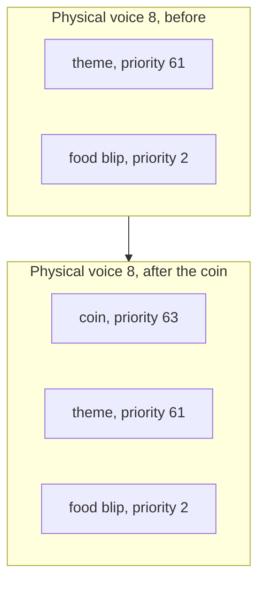

# Chapter 15 — Case Studies: Three Sounds, End to End

*Before this chapter: [Chapters 1](01_two_computers.md) to
[14](14_chip_tests.md).*

The chip tests were written by an engineer for an engineer. These three were
written for a player. A blip when you walk over a chicken, a voice telling you
what everybody in the room already knows, and the theme song. Each one starts as
a single byte in the same mailbox and ends up somewhere completely different, and
by now you should be able to predict most of what happens in between. The last
section puts all three on the board at once.

## "Food Eaten", command `$0D`

### One byte to two voices

The main CPU writes `$0D`. NMI, ring buffer, main loop, two lookups: handler type
7, parameter `$06`. The parameter's starting record is number 29, and following
its next link gives one more, record 30. Two records, both at priority 2, wanting
YM2151 voices 8 and 9.

Priority 2 is the floor. The only sounds in the ROM that sit down there are
treasure-room music, food, keys, doors, and monster hits, which is to say the
things that happen constantly and should never interrupt anything.

Allocation takes two free logical channels, fills them in, and links them into
the lists for voices 8 and 9 under an interrupt mask. Nothing has made a sound
yet.

### What the sequences say

Both channels are nine or ten instructions long, and both start the same way:

```
Channel 1                          Channel 2
SET_VOICE  $7234                   SET_VOICE  $7234
SET_TEMPO  $99   (tempo 38)        SET_TEMPO  $99   (tempo 38)
SET_VOLUME $0D                     YM_FREQ_OFFSET $02
REST  32nd                         NOTE F1,  32nd
NOTE  F#2, 16th                    REST      16th
REST  32nd                         NOTE F#1, 32nd
NOTE  F#1, dotted 16th             NOTE F#1, 32nd
REST  32nd                         REST      8th
NOTE  F#2, 32nd                    CHAIN
CHAIN
```

Both load the same instrument. `$7234` is algorithm 0, the fully serial one,
with feedback at 6 out of 7: a four-deep chain with the first operator feeding
back hard into itself. Reading its operator levels with the key from
[Chapter 12](12_driving_the_ym2151.md), the three modulators sit at `$19`, `$0A`,
and `$0D`, which is a lot of modulation to pile onto one carrier at `$00`. That
is the standard recipe for a metallic, bell-like attack, and it is what a blip
wants.

The two channels play interlocking figures a semitone or so apart, low in the
register, with the second channel offset in pitch by a small key-fraction nudge.
Two voices playing nearly the same thing slightly out of tune with each other is
how you make one short sound feel thick without spending anything.

### Time

Tempo 38 makes a sixteenth note 480 duration units divided by 38, which is 12.6
sweeps, about 105 milliseconds. A thirty-second is half that.

Add up channel 1: a thirty-second rest, a sixteenth, a thirty-second rest, a
dotted sixteenth, a thirty-second rest, a thirty-second. Fifty-seven sweeps in
total, which is 0.47 seconds. Channel 2 comes out at the same length by a
different route, which is not a coincidence, because a chain that ends raggedly
leaves one voice hanging.

Inside those 57 sweeps the articulation machinery from
[Chapter 8](08_sequence_language_time.md) is working. None of channel 1's three
notes is marked sustained, so each one's second timer is set two sweeps short of
the first, the key is released early, and the operators get a moment of release
before the next attack. At this tempo two sweeps is 17 milliseconds out of a 105
millisecond note. Take it away and the blip stops being three separate taps.

Channel 2's first note carries a division field of 3, which on a YM channel is
the weight selector from [Chapter 12](12_driving_the_ym2151.md). It is one of
only seventeen notes in the whole ROM that set that field on a YM channel, and
the other sixteen are all the doors opening. Whoever wrote the food blip reached
for a facility that nothing else in the game touches, for one note, at the very
start of a half-second effect.

### Ending

Each channel reaches its `xx 00` marker. There is no return context, so the
channel shuts down properly: status cleared, volume cleared, a key-off requested
so the chip actually goes quiet, both context chains returned to the free list,
and the channel unlinked from its physical voice's list. Two logical slots go
back to the pool.

Rendering this sound reports 463 register writes across 116 interrupt services.
Four writes per interrupt, for half a second, to make a noise most players never
consciously hear.

That entire walkthrough should have felt predictable. Noticing that is the point
of putting it first.

## "Needs food, badly.", command `$5A`

Same mailbox, same NMI, same ring, same two lookups, and then nothing in common
with the previous four pages.

### Resolution

`$5A` maps to handler type 11 and parameter `$11`. The parameter indexes three
speech tables:

| Table | Value |
|---|---|
| Speech index | 24 |
| Clock flag | `$00`, normal oscillator |
| Priority | 0 |

Index 24 selects a pointer of `$94AE` and a length of 324 from the two 189-entry
tables. That is the whole resolution. No records, no chain, no channel, no
priority list, no tempo.

### Admission

The chip is idle, so the phrase starts immediately. The pointer, length,
priority, and clock flag load into their working locations with interrupts held
off, the mixer byte is written, and the state moves to kickoff.

Had something been speaking, the priority comparison would have decided the
phrase's fate: at priority 0 against anything higher it would have been rejected
outright, and against anything equal it would have joined the eight-entry queue.
Since 134 of the 141 phrases are priority 0, joining the queue is what usually
happens.

### The pump

324 bytes, one per service call that finds the chip ready. The phrase decodes to
61 frames at 25 milliseconds each, so the whole thing lasts 1.525 seconds.

Work out the traffic. 1.525 seconds is 366 interrupts, and each interrupt calls
the speech routine four times, so the software offers the chip about 1,460
opportunities. It takes 342 of them: one for the Speak External command, 324 for
the payload, and seventeen for the zero drain. The other 1,120 calls look at the
ready line, see the chip's buffer is still full, and return in 76 cycles.

Sixty-one frames of a vocal tract, 47 of them voiced, seven hissed, six silent,
and one stop frame. Out comes a sentence that has outlived the cabinet it was
built for.

Those proportions carry information. Voiced frames are the ones with a pitch,
which means vowels and the consonants your vocal cords are involved in. Unvoiced
frames are the hisses. Silent frames are gaps. "Needs food, badly" is a line made
almost entirely of vowels with a couple of sibilants and two commas in it, and
the frame census says so: 47 voiced, seven unvoiced, six silent. Compare it with
the Dungeon Master's "TIME IS RUNNING OUT!", which is 50 frames with 45 voiced,
four unvoiced, and no silence at all, because it is shouted without a pause.

### What happens when the game talks too much

Gauntlet II announces a lot. Two players collecting things in a busy room can
easily produce three or four speech commands in a second, and each one takes a
second and a half to say.

The queue absorbs this. Eight entries, all at priority 0, appended in arrival
order, spoken one after another. A ninth arriving while eight are waiting is
rejected, which is the only place in this pipeline where anything is ever thrown
away. The board says one thing at a time, in order, and a full queue puts it
around ten seconds behind the game.

A narrator that comments on something that stopped being true a moment ago is an
eight-entry queue doing exactly what it was told. The alternative, cutting each
phrase off when the next arrives, would have made the machine unintelligible in
precisely the moments when it has the most to say.

### The contrast

Put the two case studies side by side and the shape of the board becomes clear:

| | Food Eaten | Needs Food, Badly |
|---|---|---|
| Handler type | 7 | 11 |
| Uses the sequence engine | Yes | No |
| Logical channels | 2 | 0 |
| ROM bytes of content | 40 in two sequences | 324 in one stream |
| Serviced | Every other tick | Four times per tick |
| Duration | 0.47 s | 1.53 s |
| Bytes handed to a chip | 463 | 342 |

Same one-byte command interface, two entirely separate machines behind it. The
main CPU cannot tell the difference, and does not need to.

## The Gauntlet II theme, command `$3B`

### Eight records

Parameter `$31`, starting record 130, and a chain that runs all the way to record
137. Eight records, priority 61 on every one, physical channels 4 through 11.
Every YM2151 voice on the board is claimed by one command.

Priority 61 is the second-highest number in the ROM. Only the four coin-slot
sounds outrank it, and the last section of this chapter is about what happens
when one of them arrives.

### The arrangement

Six of the eight channels load the same instrument, `$6F16`, which is algorithm
7: four operators, no modulation at all, four independent sine waves with heavy
feedback on the first. It is a bright, organ-like sound that layers well, which
is what an eight-part arrangement needs. Channels 1 and 8 load `$6BA4` instead, a
two-carrier patch with a harder attack.

Every one of the eight sets tempo `$90`, which the instruction shifts down to 36,
and every one of them later sets `$B0`, which is 44. The whole piece changes gear
at the same moment on all eight voices, because all eight were told to.

Here is what each voice is for:

| Channel | Notes | Range | Role |
|---:|---:|---|---|
| 1 | 24 | G2 to C5 | Opening melody, then bass, then a repeated C5 figure |
| 2 | 68 | B3 to E6 | The lead line for most of the piece |
| 3 | 17 | F#3 to C5 | Inner harmony |
| 4 | 17 | D3 to C#5 | Inner harmony |
| 5 | 6 | C#1 to E5 | Sparse accents |
| 6 | 2 | G5 | A single sustained note, twice |
| 7 | 14 | B3 to A#5 | Upper harmony |
| 8 | 17 | C2 to B2 | Bass, entirely within one octave |

Channel 1 is the interesting one. It opens with the eight-note fanfare everybody
remembers, changes instrument, becomes the bass for a while, changes instrument
again, and ends as a repeated high C5 ostinato. One logical channel, three
instruments, three completely different jobs.

Channel 8 is the most readable. Its bass line, once the tempo change lands, is
E2, A2, D2, G2, C2, F2, B2: a descending circle of fifths, one of the oldest
moves in Western harmony, written out in a table of note numbers in a 1986 arcade
ROM. Every one of those quarter notes has its division field set to 1, which
[Chapter 8](08_sequence_language_time.md) established halves the sounding time.
The bass is deliberately detached, and that is what makes it drive.

### Written-in rubato

The opening fanfare does something the format has no business being able to do.
Channel 1 plays eight notes and inserts `ADD_TEMPO $FE` between three of the
pairs. That instruction adds its operand as a raw eight-bit number, and `$FE` is
minus two, so the tempo goes 36, 34, 32, 30 across the phrase.

Each note is therefore slightly longer than the one before it. Here is the
opening as the tool lays it out, with the eighth notes of channel 1 running over
a held chord on the other seven:

```
    Time | Ch1         | Ch2         | Ch3         | Ch4         | Ch8         |
---------+-------------+-------------+-------------+-------------+-------------+
   0.00s | --- 8th     | B3  Hsus    | F#3 Hsus    | D3  Hsus    | B2  Hsus    |
   0.22s | B4  8th     |             |             |             |             |
   0.45s | A4  8th     |             |             |             |             |
   0.67s | B4  8th     |             |             |             |             |
   0.89s | G4  8th     | B3  Qsus    | F#3 Qsus    | D3  Qsus    | B2  Qsus    |
   1.13s | B4  8th     |             |             |             |             |
   1.36s | F#4 8th     | B3  Q       | F#3 Q       | D3  Q       | B2  Q       |
   1.61s | G4  8th     |             |             |             |             |
```

The gaps grow from 0.22 to 0.25 seconds across those seven notes. That is a
ritardando, written into the data, six bytes, and it is the difference between a
fanfare and a scale. Channel 8's held bass note carries the same three
instructions in parallel, so the bass slows down with the melody rather than
against it.

The chord underneath is B, D, and F#, a B minor triad, with the bass doubling the
root two octaves down and the melody circling B4 above it. Four of the eight
voices hold that chord and three more are resting, waiting for the section that
starts at 2.9 seconds. Spending half the chip on three sustained notes is a
choice, and it is why the opening sounds as thick as it does.

### Repeated phrases stored once

Five of the eight channels use a counted repeat block. Channel 8's is the
clearest:

```
PUSH_SEQ_EXT $06     open a block, repeat six times
NOTE E2, whole, sustained
POP_SEQ              close the block
CHAIN
```

Four bytes produce a run of sustained whole notes on E2, one every 1.46 seconds
at tempo 44, carrying the bass to the end of the piece. Channel 1's version wraps
a whole rest in a count of nine, which is how the melody voice sits out the
middle of the piece without nine copies of a rest in ROM.

The block borrows a four-byte record from the free list of
[Chapter 7](07_command_to_channel.md) when it opens and gives it back when the
count runs out, which is why blocks can nest and why nothing leaks when a channel
is preempted mid-block.

### How it ends

The theme is 185 notes long and runs for 24.4 seconds, and then it stops.

There is no loop. [Chapter 9](09_sequence_language_opcodes.md) listed the five
backward jumps in the entire ROM and none of them belongs to the theme. All eight
channels reach their end markers, shut down, and release their voices. If the
game wants the theme again it sends `$3B` again.

There is also a way to cut it short. Command `$3C` is handler type 9, "fade a
named sound", and its parameter is `$3B`. It walks the channel arrays looking for
anything playing the theme and hands each one a signed amount of −48 volume steps
and a rate that divides by 32, which is the fixed-point machinery from
[Chapter 10](10_shaping_the_sound.md). Every voice of the theme fades together
and stops. One byte, one handler, eight voices.

### A word on the MIDI export

The tool can write the theme out as a Standard MIDI File, and the result opens in
any sequencer as eight tracks with the parts described above. It is a good way to
look at the arrangement.

The timing is close rather than exact, and the reason is
[Chapter 8](08_sequence_language_time.md)'s phase accumulator. A note's real
length is not its duration divided by its tempo; it is however many sweeps it
takes for the accumulated remainder to cross zero, which varies by one sweep from
note to note and averages out over the phrase. MIDI has no way to express that,
so the export uses the average. Over 24 seconds the drift is small and the
arrangement is faithful, but a bar-by-bar comparison against the rendered audio
will not line up perfectly, and nothing is wrong when it does not.

## What happens when they collide

Now put all three on the board at once, plus a fourth for the sake of the
argument, and work out what a player actually hears.

The theme is playing. All eight YM2151 voices carry it at priority 61. Then, in
quick succession: a player eats food, the narrator announces it, and somebody
drops a coin into the yellow slot.

**The food blip** wants voices 8 and 9 at priority 2. Thirty logical channels
exist and eight are in use, so twenty-two are free and nothing gets evicted. Both
records are admitted and inserted into the lists for voices 8 and 9, below the
theme's records. On every sweep from now until it ends, the blip is decoded, its
envelopes are stepped, its timers are counted down, and its output is thrown away
because a priority of 2 loses to a priority of 61. Half a second later it ends
and unlinks itself. Nobody heard anything.

**The narrator** takes a completely different route. Speech has no logical
channel and competes with nothing except other speech. The theme does not slow
down and does not lose a voice. Two chips, two pipelines, one analog mixer at the
end, and the only place they meet is in the air.

**The coin** is the interesting one. Command `$24`, the yellow slot, is two
records at priority 63 wanting voices 8 and 9. That outranks the theme.



*Priority ordering is an insertion, not a replacement. All three sounds stay on
the list and all three keep running; the front of the list is what the chip
hears.*

The coin's records are inserted at the front of the lists for voices 8 and 9. For
the next second and a half, the chip plays the coin sound on those two voices,
and the theme's parts 5 and 6 are computed and discarded on every sweep. The
other six voices carry on untouched, so the arrangement thins rather than
stopping.

Then the coin sound reaches its end marker, unlinks, and the theme's records are
back at the front. And this is the payoff for
[Chapter 7](07_command_to_channel.md)'s least obvious decision: those two voices
did not freeze while they were losing. They kept decoding, kept counting, kept
stepping. When they come back they are exactly where the other six are, on the
right note, in the right bar. The listener hears a six-part texture become
eight-part again, without a seam.

The alternative designs are worse in ways you can hear. Refuse the coin sound and
the machine does not acknowledge money. Stop the theme entirely and every coin
kills the music. Freeze the losing voices and they resume a second and a half
behind, out of time with the rest of the arrangement, which is the worst outcome
of the three and also the cheapest to implement.

One more comparison makes the priority numbers legible as a design document
rather than a table. Sort the ROM's sounds by priority and you get a ranking of
what Atari thought mattered:

| Priority | Sounds |
|---:|---|
| 63 | The four coin slots |
| 61 | The theme |
| 51 | "Unable to Join In", "No Potions" |
| 32 | The four death sounds |
| 31 | The level-opening music |
| 30 | The four heartbeats |
| 8 | Most one-shot effects, and both chip tests |
| 2 | Treasure-room music, food, keys, doors, monster hits |

Money first. The theme second, above every effect in the game. Then the two
sounds that tell a player something they need to know and cannot see. Then dying,
then the level fanfare, then the heartbeat that warns you are about to die. The
treasure-room music sits at the bottom, at the same priority as picking up a key,
which means every effect cuts straight through it: in the treasure room the
effects are the point and the music is wallpaper.

That is the whole design, in one collision. Thirty logical channels so that
everything the game asks for is tracked. Twelve physical voices because that is
what the hardware has. A priority list per voice so the important thing is heard.
And every member of every list updated on every sweep, at 120 sweeps a second on
a 1.79 MHz processor, so that losing a voice costs you nothing but silence.

> **Try it yourself**
>
> ```bash
> uv run gauntlet_disasm.py soundrom.bin --midi 0x3B --midi-out theme.mid --csv hw_docs/soundcmds.csv
> ```
>
> That reports `Channels: 8 | Notes: 185 | Est. play time: 24.4s` and writes
> `theme.mid`. Open it in any sequencer or MIDI player and the eight tracks match
> the table above: track 2 carries the lead, track 8 stays inside one octave at
> the bottom, track 6 has two notes in the whole piece.
>
> ```bash
> uv run gauntlet_disasm.py soundrom.bin --score 0x3B --csv hw_docs/soundcmds.csv
> ```
>
> The score view shows the same thing as text, with time down the left. Look at the
> first eight rows and watch channel 1's note spacing grow from 0.22 to 0.25
> seconds while the other seven hold a chord: that is the six-byte ritardando.
>
> ```bash
> uv run gauntlet_disasm.py soundrom.bin --music-wav 0x3B --csv hw_docs/soundcmds.csv
> uv run gauntlet_disasm.py soundrom.bin --music-wav 0x0D --csv hw_docs/soundcmds.csv
> uv run gauntlet_disasm.py soundrom.bin --speech-wav 0x5A --csv hw_docs/soundcmds.csv
> ```
>
> Three renders, three backends. The theme reports `64753 register writes` over
> `5850 IRQ services`. The food blip reports `463` over `116`. The speech render
> does not report register writes at all, because there are none: it is a byte
> stream through an LPC decoder. Play the three back to back and you have heard
> the entire sound design of Gauntlet II in about half a minute.

## What you now know

- A two-record effect at priority 2 is admitted, tracked, interpreted, and
  discarded whenever anything louder holds its voices.
- A speech command shares the mailbox, the NMI, the ring buffer, and the
  dispatcher with everything else, and shares nothing below that.
- The theme is eight records at priority 61, one per YM2151 voice, 185 notes and
  24.4 seconds, with no loop; the game retriggers it and command `$3C` fades it.
- Its opening ritardando is three `ADD_TEMPO` instructions with an operand of
  minus two, six bytes in total.
- Its bass line is a descending circle of fifths with the articulation field set
  on every note, and its repeated phrases are stored once inside counted repeat
  blocks.
- Exported MIDI timing is an average because the engine's real timing carries a
  remainder from note to note that MIDI cannot express.
- When a higher-priority sound arrives it is inserted at the front of a voice's
  list rather than replacing what is there, so the displaced sound keeps running
  silently and returns in the right place.

## Where this leads

The machine is now fully described. [Chapter 16](16_how_this_was_figured_out.md)
changes the subject to how any of this was worked out from a 48 KB binary with no
labels, and [Chapter 17](17_open_questions.md) lists what is still missing.

## Going deeper

- [`docs/generated/type7_chain_catalog.csv`](../docs/generated/type7_chain_catalog.csv)
  — the chains for `$0D`, `$3B`, and the coin sounds.
- [`docs/generated/type7_sequence_catalog.csv`](../docs/generated/type7_sequence_catalog.csv)
  — every instruction of all three sequences.
- [`docs/generated/type11_speech_catalog.csv`](../docs/generated/type11_speech_catalog.csv)
  — command `$5A`'s pointer, length, and frame breakdown.
- [`docs/06_sequence_engine.md`](../docs/06_sequence_engine.md) — the timing
  model behind the MIDI caveat.
- [`docs/04_subsystems.md`](../docs/04_subsystems.md) — allocation, preemption,
  and the fade handler.
- [`hw_docs/soundcmds.csv`](../hw_docs/soundcmds.csv) — the in-game name of every
  command quoted here.
