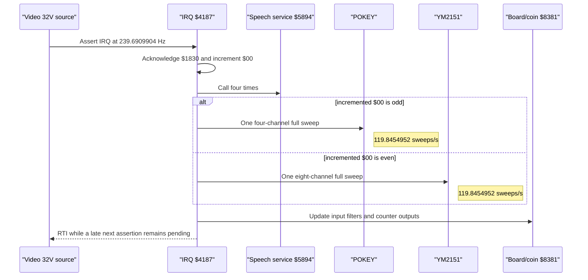

# 01 — Hardware

## Board-level components

| Component | Role | CPU mapping | Confidence |
|---|---|---|---|
| MOS 6502 | Sound coprocessor | — | Verified |
| 4 KiB RAM | State, queues, channel arrays | `$0000-$0FFF` | Verified |
| 48 KiB ROM | Code and all sound data | `$4000-$FFFF` | Verified |
| POKEY | Four hardware effect channels and RNG | `$1800-$180F` | Verified |
| YM2151 | Eight-channel FM synthesis | `$1810-$1811` | Verified |
| TMS5220 | LPC speech in Speak External mode | data at `$1820` | Verified |

The 6502 receives commands from the main 68010 and returns status bytes through
board-specific latches. IRQ is video-derived; NMI is generated by the main-CPU
command interface.

## Main-CPU communication and board controls

| Address | Direction | Meaning | Confidence |
|---|---|---|---|
| `$1000` | W | Latch a byte for the main CPU and trigger its interrupt | Verified |
| `$1002/$1003/$100B/$100C` | W | Boot-time handshake/configuration writes | Verified writes; purpose unknown |
| `$1010` | R | Command byte latched by the main CPU | Verified |
| `$1020` | R | Coin inputs, bits 3..0, active low | Verified from supplied board notes |
| `$1020` | W | Volume mixer: speech 7..5, effects 4..3, music 2..0 | Verified |
| `$1030` | R | Board status bits described below | Verified |
| `$1030` | W | YM2151 reset, bit 7 active low | Verified |
| `$1031` | R/M/W | TMS5220 write strobe, bit 7 active low | Verified |
| `$1032` | W | TMS5220 reset, bit 7 active low | Verified |
| `$1033` | W | TMS5220 oscillator/“squeak” clock selection | Verified |
| `$1034` | W | Right mechanical coin-counter solenoid | Verified |
| `$1035` | W | Left mechanical coin-counter solenoid | Verified |

`$1030` read bits:

| Bit | Meaning |
|---:|---|
| 7 | Command/data available at `$1010` |
| 6 | Sound-to-main output latch full |
| 5 | TMS5220 ready, active low |
| 4 | Self-test input, active low |
| 3..0 | Unused by the sound program |

Older descriptions assigning coin inputs to `$1030` or calling `$1034/$1035`
LED channel outputs are contradicted by the supplied hardware notes. Software
does pulse the counter outputs in a multi-state envelope-like pattern during
one control path; that does not change the physical devices into LEDs.

## Sound-device registers

### POKEY (`$1800-$180F`)

Even addresses `$1800,$1802,$1804,$1806` are AUDF1..4; odd addresses
`$1801,$1803,$1805,$1807` are AUDC1..4. `$1808` is AUDCTL, `$180A` is the
hardware RNG when read, and `$180F` is SKCTL. Initialization writes 0 then 3 to
SKCTL.

The supplied MAME POKEY implementation establishes the AUDCTL meanings used by
the ROM: `$40/$20` select the 1.79 MHz clock for channels 1/3, `$10/$08` join
channels 1/2 or 3/4 into 16-bit dividers, `$04/$02` enable the corresponding
high-pass filters, `$01` selects the 15.7 kHz base clock, and `$80` selects the
9-bit polynomial. Configured POKEY bytecode only directly ORs `$20`; pair
arbitration additionally forces `$50` or `$28` for joined 1/2 or 3/4 operation.

### YM2151 (`$1810-$1811`)

`$1810` selects a YM2151 register and `$1811` writes data / exposes busy status.
Every write must wait for status bit 7 to clear. A 255-iteration timeout sets
error flag bit 1.

The supplied YMFM implementation provides the register-level pitch model used
for validation. Key code is register `$28+channel` bits 6..0 and key fraction
is register `$30+channel` bits 7..2. For the 3,579,545.25 Hz implementation
clock, YMFM's prescale 2 and 32 operators give a 55,930.39453125 Hz synthesis
sample rate; its 10.10 phase step then gives
`frequency = phase_step * sample_rate / 2^20`. These chip equations are
Verified against the supplied implementation. The 14.318181 MHz master and
derived device clocks are also Verified by an independent calculation from the
board schematic (external confirmation provided 2026-07-12; schematic artifact
not present in this workspace).

### TMS5220 (`$1820`, `$1031-$1033`)

Speech bytes are written at `$1820`; `$1031` strobes the external data latch,
`$1032` resets the device, and `$1033` changes the oscillator clock. Byte `$60`
is sent to enter Speak External mode before an LPC stream.

`docs/operation.txt` has a stale introductory line naming `$1830` as TMS5220,
but its detailed text and ROM accesses establish the corrected mapping:
`$1820` is speech data and `$1830` is IRQ acknowledge.

## Interrupt sources

- **IRQ:** acknowledged by writing any value to `$1830`. Strong evidence says
  it is generated when video scanline-counter bit 5 rises. The upstream MAME
  configuration uses a 14.318181 MHz master, a master/2 pixel clock, and raw
  timing of 456 by 262. Its 32V callback asserts IRQ at scanlines 32, 96, 160,
  and 224. Those values imply 59.9227476 frames/s and 239.6909904 IRQ/s, with a 
  4.172038 ms period. (240 Hz is the accurate engineering approximation; these
  exact values are **Verified** by an independent schematic calculation).
- The current MAME Gauntlet driver models this as a level assertion, not a
  pulse: each selected 32V callback calls `ASSERT_LINE`, while any `$1830`
  read or write calls `CLEAR_LINE`. The ROM acknowledges near the start of
  `$4187`. Therefore, if one handler crosses the next 32V assertion, that IRQ
  remains pending behind the 6502 I flag and is serviced immediately after
  RTI rather than being lost (**Strong inference** from the implementation;
  [driver source](https://github.com/mamedev/mame/blob/master/src/mame/atari/gauntlet.cpp)).
- **NMI:** generated when the main CPU writes a command. The same hardware event
  latches the byte at `$1010`, providing atomic command delivery. Before normal
  mode is installed, an NMI during the self-test first-IRQ synchronization
  window drives the Verified indirect RAM-write path; sender intent still
  requires main-CPU evidence.

## Clock tree and service cadence

The implementation configuration and independently calculated schematic clock
tree agree on the following rates. ROM-side parity and call-count relationships
are independently Verified.

| Clock or event | Derivation | Rate |
|---|---:|---:|
| 6502 | master / 8 | 1,789,772.625 Hz |
| POKEY | master / 8 | 1,789,772.625 Hz |
| YM2151 | master / 4 | 3,579,545.25 Hz |
| TMS5220 normal | master / 2 / 11 | 650,826.409 Hz |
| TMS5220 squeak | master / 2 / 9 | 795,454.5 Hz |
| POKEY full sweep | IRQ / 2 | 119.8454952 Hz |
| YM2151 full sweep | IRQ / 2 | 119.8454952 Hz |
| Speech service attempts | IRQ × 4 | 958.7639614 Hz maximum |

`$1033` selects the TMS divisor by changing the divider control from 11 to 9.
Speech data writes remain READY-limited, so 958.76/s is a service-attempt
ceiling, not a guaranteed FIFO byte rate. Row-level derivations are generated
in `generated/timing_clock_catalog.csv`; representative 6502 paths are in
`generated/timing_cycle_catalog.csv`.

The clock configuration sources are the upstream
[MAME Gauntlet driver](https://github.com/mamedev/mame/blob/master/src/mame/atari/gauntlet.cpp)
and a user-reported independent calculation from the board schematic. The
schematic itself is not stored in this workspace, so that external calculation
cannot be reproduced solely from the repository.
Representative configured paths and arithmetic stress bounds are catalogued.
Observed path frequencies and hardware-stall composition require the external
runtime evidence classified in [Known issues](10_known_issues.md).
