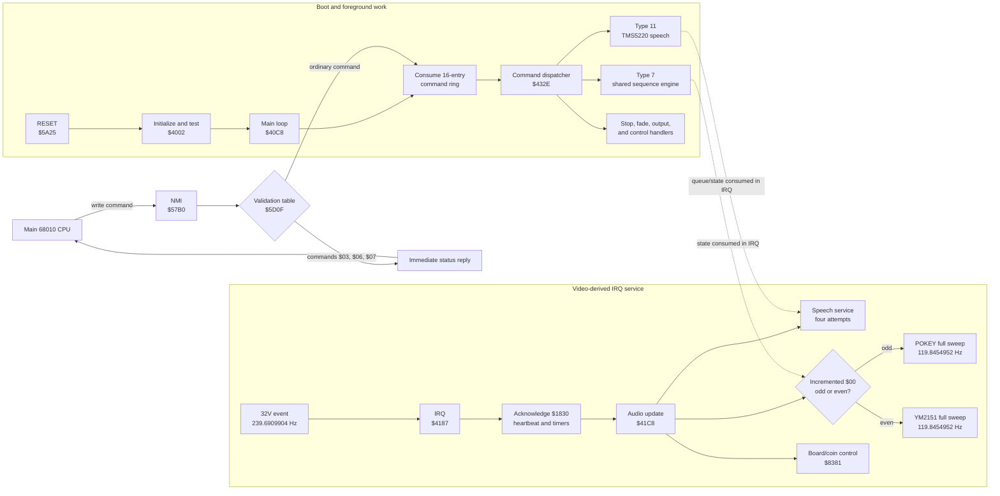
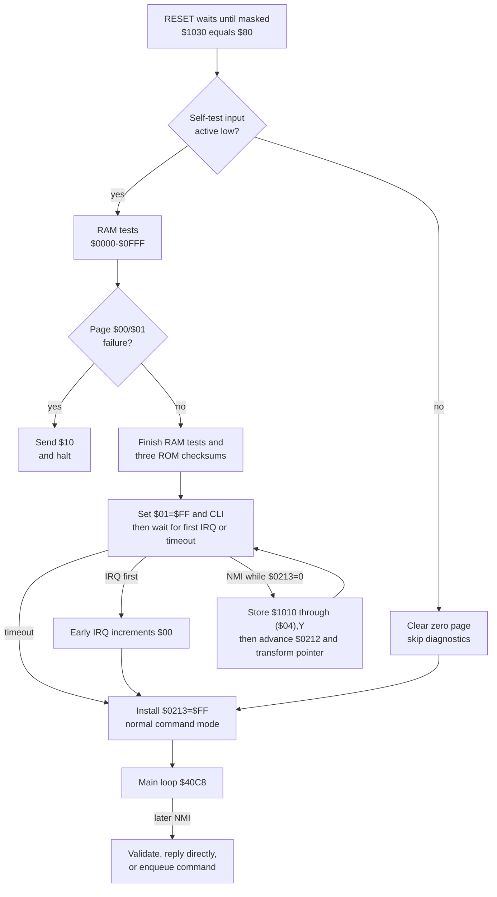
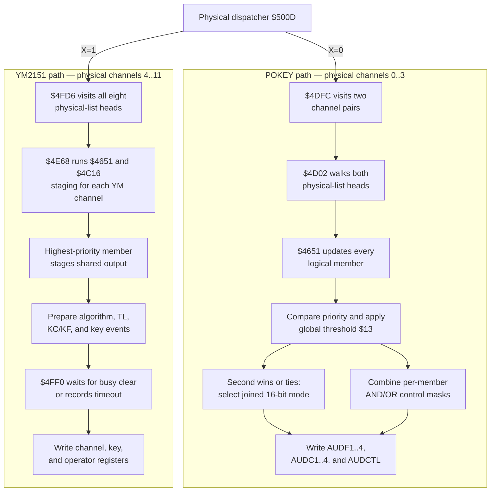
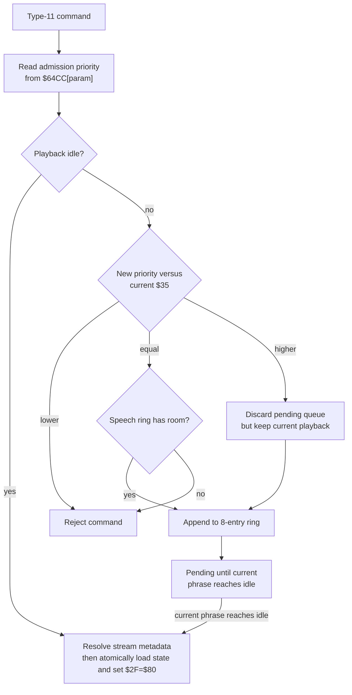
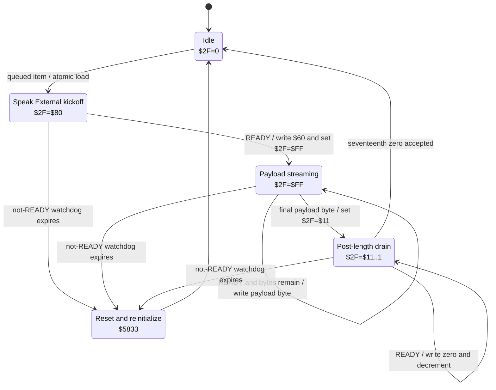
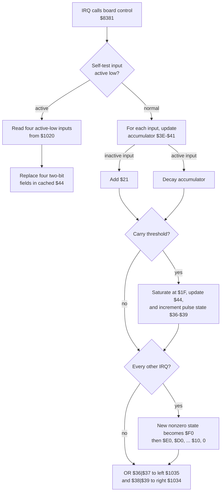

# 04 — Subsystems and Control Flow

## System overview

## Boot and initialization

RESET waits until `$1030 & $C0 == $80`, then jumps to `$4002`. Initialization
sets the stack and decimal state. With self-test inactive/high it clears zero
page and skips diagnostics. With self-test active/low it performs walking-one
and complement RAM tests over `$0000-$0FFF`, leaving every tested byte zero,
then verifies three 16-KiB modulo-256 ROM checksums, each exactly `$FF`. Page
`$00/$01` failure sends `$10` and halts; later RAM pages and ROM thirds set
error bits and continue. Exact contracts and side effects for 14 blocks,
including the boot handshake and RESET-vector gate, are generated in
`initialization_main_catalog.csv`.

The boot-only writes are `$FF,$33,$00,$22,$0F` to
`$1003,$1002,$100B,$100C,$1000` — five addresses the board decodes as one, the
sound→main latch (the low four bits of `$1000`–`$100F` are not decoded; confirmed
by the schematic and by MAME's `map(0x1000,0x100f).mirror(0x27c0).w(m_mainlatch)`).
So they are five overwriting writes to the mailbox, not five register settings,
and the main CPU reads none of them (only the later `$FF` boot acknowledgement
matters). The distinct addresses and values indicate a five-register init
inherited from other hardware; see [`10_known_issues.md`](10_known_issues.md).

The boot-only diagnostic window and the normal command mode are related as
follows. The diagram shows verified mechanics; it does not assign a purpose to
the indirect-write protocol.

## Main loop and command dispatch

The main loop clears its heartbeat bit and consumes the 16-entry ring at
`$0200-$020F`. Commands `$00-$DA` use parallel 219-byte type and parameter
tables. Handler types 0..14 dispatch through a 15-entry target table.

Active types in this ROM are 0, 3, 5, 7, 8, 9, 10, 11, and 13. Types
1, 2, 4, 6, 12, and 14 contain code but no command-table entry selects them.

## NMI command input

NMI waits for output-latch availability, reads `$1010`, bounds it against
`$DB`, and consults the validation table at `$5D0F`.

- Validation `$FF`: enqueue as a normal command.
- Validation 0..2: dispatch immediately through `$5FA2`.

Special queries:

| Command | Direct result |
|---:|---|
| `$03` | Send cached coin/control byte `$44` to main CPU |
| `$06` | Send `$DB`, the command-count/sentinel value |
| `$07` | Send error flags `$02`, then arm main-loop and IRQ heartbeat bits |

The alternate indirect-write path is statically reachable. When `$1030` bit 4 is clear,
the full RAM-test branch finishes by zeroing all of `$0000-$0FFF`, including
`$04/$05` and `$0212/$0213`. Initialization sets `$01=$FF`, executes CLI at
`$40B2`, and waits for `$00` or a 16-bit `$0E/$0F` timeout. The early IRQ path
at `$4194` increments `$00`, so this is primarily first-IRQ synchronization.
An NMI arriving first while `$0213=0` instead makes `$57BD` store
each `$1010` byte through `($04),Y`, advances `$0212`, and applies its verified
negative-half pointer transform. `$40D2` installs normal `$0213=$FF` mode before
the ordinary main loop. The only direct ROM writes to `$0213` are `$40D2` and
`$44C3`, both writing `$FF`; the `$1030` bit-4-set fast path clears zero page
and skips directly to that normal-mode install. Modes `$01-$FE` merely acknowledge/drop input and
have no direct selector. The exact mechanics and conditional reachability are
**Verified**; the indirect protocol's original purpose is **Unknown** pending
the main-CPU sender. See `generated/nmi_protocol_catalog.csv`.

## IRQ audio service

The IRQ vector is `$4187`. Verified instructions acknowledge `$1830`, clear
error/heartbeat bit 2, increment the frame counter, handle early initialization,
and on the normal path call `$41C8` and `$8381`.

Bounded instructions verify that `$41C8` calls the speech status routine four
times and alternates one physical-device update per IRQ using incremented byte
`$00`:

- odd `$00` selects X=0 and updates POKEY;
- even `$00` selects X=1 and updates all eight YM2151 channels.

With the independently schematic-confirmed 239.6909904 Hz IRQ cadence, each device is
serviced at 119.8454952 Hz, once per 8.344077 ms. Speech receives four service
attempts per IRQ, at most 958.7639614 attempts/s; actual writes depend on READY.
These clock-derived rates, the ROM parity, and the four-call structure are
**Verified**. The schematic calculation was externally confirmed on 2026-07-12;
the schematic artifact is not present in this workspace.

## Reset, dispatch, and allocation control plane

`generated/control_plane_catalog.csv` decomposes `$4187-$4650` into 32 blocks
backed by 27 anchors. It records the IRQ/BRK split, atomic global reset, POKEY
and YM key-off initialization, a four-byte context-record pool, command
target-minus-one dispatch, every active handler, dormant-handler ranges, and
type-7 admission/allocation.

The context pool occupies `$093D-$0C54`. `$4295` builds IDs 1..`$C6` and is
written to leave `$C6` as the terminal sentinel, which would offer 197
allocatable records. The unbalanced `DEC $16` at `$42B8` moves the sentinel to
ID `$86`, so `$42C6` in fact offers 133 (see `02_memory_map.md`). `$42D7` maps ID A to `$093D+4*(A-1)`, and `$42F9` returns both
channel-owned context chains to the free list (**Verified**).

The 15-entry handler table at `$4633-$4650` exactly targets types 0..14. Only
types 0, 3, 5, 7, 8, 9, 10, 11, and 13 have configured commands. The active
stop/fade/output/speech/control semantics and their exact RAM effects are now
generated rather than inferred from names.

## Type-7 shared sequence subsystem

Type 7 is not a POKEY-only handler. A command parameter selects a starting
record; each record supplies priority, physical channel, sequence pointer, and
next-record link.

Verified topology:

- 62 commands and 62 parameters;
- all 182 records are reachable;
- 153 distinct sequence entry pointers;
- 8 POKEY-only commands (`$05`, `$43-$49`);
- 54 YM2151-only commands;
- no command mixes POKEY and YM2151 records;
- chain lengths range from one to eight.

Offset zero is a valid initial record. Command `$04` uses
`0→1→2→3→4→5→6→7→0` to test all eight YM2151 channels. Zero is a terminator
only when read as a record's next link.

The sequence engine manages 30 logical channels, priorities, preemption, linked
chains, timers, envelopes, and chip-specific output conversion.

The complete Type-7 path crosses foreground allocation and IRQ-time playback.
No configured command chain mixes POKEY and YM2151 records.

```mermaid
flowchart LR
    Command["Type-7 command"] --> Tables["Command parameter and<br/>start-offset tables"]
    Tables --> Records["Linked record chain<br/>1 to 8 records"]
    Records --> Record["For each record<br/>priority, physical channel,<br/>sequence pointer, next link"]
    Record --> Admit{"Admission and<br/>allocation result"}
    Admit -->|"rejected"| Drop["Leave existing playback"]
    Admit -->|"accepted"| InitSlot["Initialize one of<br/>30 logical slots"]
    InitSlot --> Atomic["Atomically insert into<br/>one physical-channel list"]
    Atomic --> Lists["12 physical lists<br/>4 POKEY + 8 YM2151"]

    Lists -->|"matching IRQ sweep"| Walk["Walk every logical member<br/>for the physical channel"]
    Walk --> Engine["Channel engine $4651<br/>timers, bytecode, envelopes"]
    Engine --> Winner["Priority arbitration and<br/>prepared output state"]
    Winner -->|"channels 0..3"| Pokey["POKEY pair arbitration<br/>and register writes"]
    Winner -->|"channels 4..11"| YM["YM winner staging<br/>and register writes"]
```

Fresh bounded listings establish `$4651-$4B6A` as one callable logical-channel
consumer with callers at `$4D36`, `$4D84`, and `$4E7A`. Each caller loads a
one-based logical-channel link from a physical list, decrements it into X, and
stores the list-head index in `$081C`. The shared suffix at `$4B5D` tail-loops
through further links; `$4B6A` is the sole ordinary return.

Its internal phases cover timers/sequence dispatch, note and duration decode,
frequency- and volume-envelope initialization and stepping, prepared physical
output state, and list advance. They are internal blocks/shared suffixes, not
independent functions. Row-level effects are in
`generated/channel_engine_catalog.csv`. The consumer directly verifies 16-bit
duration entries, three-byte frequency-envelope records, two-byte volume-
envelope records, and `$FF` loop controls. `$5C8F-$5D0E` is now proven as an
8×16 signed POKEY volume-shape table; the row/phase index at `$03AE` is consumed
only at `$4B0D-$4B11` (`LDY $03AE,X` / `ADC $5C8F,Y`) and phase saturates at 15.

The selector is written on both arms of the `$4844` duration branch, and only
one of those writes can ever be read (**Verified**):

- Duration-table arm, `$48DF-$48E4`: `LDA $11 / AND #$38 / ASL A / STA $03AE,X`
  derives the row from control bits 3..5. This arm is taken by YM2151-mode
  channels, whose volume path never reads `$03AE`, so the derived row is dead.
- POKEY arm, `$48EF`: `STA $03AE,X` with A already zero, because A was loaded
  from `$0813` at `$484C` and the branch was not taken. Every POKEY-mode note or
  rest therefore selects row 0.

Since `SWITCH_POKEY` precedes the first event in all eleven POKEY records, no
configured sound reaches a nonzero row, and the neutral row 0 means the table
contributes nothing to any audible output. An earlier revision of
`support_staging_audit.py` applied the bits 3..5 derivation to POKEY events and
reported rows 0, 1, 4, 5, and 7 as reachable; that reading is **Contradicted**.
`generated/volume_shape_catalog.csv` retains the discarded derivation in its
`dead_ym_arm_selections` column.

The engine is reached from IRQ-time physical-device consumers and therefore
runs with the 6502 IRQ mask already set. Main-loop type-7 allocation keeps a
new slot's status zero until state initialization is complete, then performs
physical-list insertion under PHP/SEI/PLP. Reclamation unlinks the old head
before initialization; equal-priority replacement frees contexts and relinks
inside the same atomic section. Thus IRQ-visible partial insertion/removal is
**Contradicted** as a configured hazard. NMI only queues commands or runs direct
query handlers, none of which mutate these lists.

## Fade/ramp and YM winner staging

`generated/support_staging_catalog.csv` closes `$4B6B-$4D01` with six
contiguous blocks and 12 anchors. `$4B6B` services the signed fade/ramp state:
it selects a shift/control byte from `$5C7F-$5C8E`, saturates the 16-bit
remaining amount, arithmetic-shifts the signed ramp, accumulates the fractional
remainder in `$078C`, and applies any integer delta to POKEY volume or YM TL.
The detailed 16-row rate catalog proves `$FF` is the special countdown control;
the other entries select divisions by 2 through 256.

Logical arrays `$0426/$0444/$0462/$0480` are mode-overloaded. POKEY treats the
first pair and second pair as volume/frequency-envelope pointers. YM treats all
four bytes as M1/M2/C1/C2 base total levels, loaded from voice offsets
5/11/17/23 and staged to registers `$60/$68/$70/$78+channel` by `$4C16`.

`$17=0` identifies the final, highest-priority physical-list member. Only that
winner stages shared TL-transform bytes and KC/KF output. The dormant vibrato
block still advances per-channel state for suppressed members, but no configured
`$8C` can make its depth nonzero. Winner KC/KF staging splits the signed
`$069C:$067E` delta across base KF and note index; configured delta remains zero.

`$4EBB` consumes `$082F` bit 0 for key-off, `$4ED5` consumes bit 1 for KC/TL
refresh, and `$4FBD` later consumes original bit 2 for key-on. Between those
sites `$4F0E` shifts the already-twice-shifted byte two more times, so `$4F14`
indexes original bits 5..4. Configured values cover indices 0..3 of the exact
four-byte total-level event/control-bias table `$5C5B-$5C5E`. The old detune
role is Contradicted, but its four-byte extent is reaffirmed.

## POKEY pipeline

The two physical-output paths share the logical-channel engine, then diverge
in their arbitration and hardware-write rules.

Physical channels 0..3 select POKEY behavior. The pipeline interprets notes and
envelopes, chooses outputs by priority, applies the global filter threshold
`$13`, and writes AUDF/AUDC/AUDCTL through the indirect hardware pointer.

Only 11 of 182 type-7 records target POKEY, belonging to commands `$05` and
`$43-$49`. This is far smaller than older “POKEY SFX” descriptions imply.

The physical dispatcher `$500D` selects POKEY for X=0, constructs indirect
base `$1800`, and tail-enters `$4DFC`. That routine calls `$4D02` twice to
consume four list heads as two channel pairs. `$4D02` invokes `$4651` for both
members, arbitrates their status against global threshold `$13`, combines
AND/OR control masks, and returns prepared AUDF/AUDC values. `$4DFC` writes
offsets 0..7 and AUDCTL at offset 8 through `($08),Y` (**Verified**).

The supplied POKEY implementation resolves the AUDCTL masks. For configured
POKEY-mode bytecode, every `$8B` operand is `$20` (CH3 high clock), and no `$9B`
clear operation is reachable. Chip-test command `$05` retains the initialized
OR/AND masks 0/`$FF`. `$4D02` compares the two member priorities; if the second
member wins or ties, it returns carry set. `$4DFC` converts that carry to `$28`
(CH3 high clock + joined 3/4) for the upper pair or `$50` (CH1 high clock +
joined 1/2) for the lower pair. Thus ties deliberately select 16-bit joined
mode. The final AUDCTL byte is the accumulated OR masks filtered by accumulated
AND masks (**Verified**).

The post-channel-engine arbitration suffix takes 73 cycles for an active tie
that selects joined mode and 100 cycles when the first member wins. If the
maximum priority is below global threshold `$13`, the corresponding paths take
100 and 127 cycles because candidate AUDC/control values are cleared first.
These local suffix counts intentionally exclude `$4651`; configured composed
paths are recorded in the timing catalogs.

## YM2151 pipeline

Physical channels 4..11 select YM2151 behavior. The shared sequence language
adds FM-specific voice, envelope, register, true instrument detune, total-level,
and algorithm operations.
The update path writes channel/operator registers only after busy-status waits.

Most type-7 records (171 of 182) target YM2151. This path carries music and
many effects, not merely background music.

`$5715` is specifically a total-level consumer, not a pitch-detune routine. It
negates its signed input, selects carriers with `$57A0[FB/CON&7]`, and
saturating-adds the delta to the four mode-overloaded base-TL arrays. `$5755`
reloads those bases from voice offsets 5/11/17/23 and uses `$5790-$579F` as a
16-step signed carrier-attenuation curve. Opcode `$A1` and the YM path of
ADD_VOLUME share this suffix (**Verified**).

For X=1, `$500D` constructs base `$1810`, records type 2, and tail-enters
`$4FD6`. That loop visits physical-list heads `$080B-$0804` and calls `$4E68`
once per YM channel. `$4E68` consumes the state prepared by `$4651/$4C16`,
writes channel registers `$20/$30/$38`, conditionally writes key register `$08`,
and updates four operator registers. Every hardware write is preceded by
`$4FF0`; a 255-poll busy timeout makes `$0D` sticky negative and sets error
flag `$02` bit 1 (**Verified**).

YM pitch uses a direct 128-byte note-to-KC view at `$5AF9-$5B78`; `$4C16`
prepares KF at register `$30+channel` and adjusts the note index before `$4EEC`
writes KC at `$28+channel`. Indices 98..127 deliberately alias the first 30
bytes of `$5B5B-$5C5A`. The later `$72DC/$5B5B` path writes registers
`$60-$7F`, proving it is operator total-level correction rather than pitch.

For the stable command `$04` chip-test voice, byte +2 at `$6F96` supplies zero
base KF. Combining the ROM's KC bytes with KF=0 and the supplied YMFM OPM phase
step table validates the eight test notes as C4, D4, E4, F4, G4, A4, B4, C5;
their errors from equal temperament are -0.500 through +0.189 cents under the
implementation clock. Across the stable chromatic ROM-note domain 13..97, the
range is -1.528 through +0.189 cents. This establishes the sequence convention
`MIDI = ROM note + 11`, correcting the earlier octave labels.

The earlier command `$3A` high-note conclusion is **Contradicted**. Bytes
`$7D27-$7D46` are the 16-entry inline target table for `$AE`, not notes. Its
targets contain ordinary note values `$31-$3F,$44`. Correct mode traversal
finds 64 configured YM note values spanning 13..95; no configured note reaches
the KC view's aliased 98..127 tail.

Mode-aware reachability also closes the proposed configured-glide test. No
reachable sequence executes SET_VIBRATO `$8C`, the only opcode handler that
writes `$0660`; allocation zeros `$0660`, and `$48CA-$48D5` clears transition
deltas when the depth remains zero. All 13 reachable SET_FREQ_ENV `$86`
operations are POKEY-mode. Consequently `$4C69-$4CBD`'s nonzero YM convergence
path is **Verified dormant under this ROM's configured sequences**.

## Type-11 TMS5220 speech subsystem

Type 11 is speech only. The handler uses `$64CC[param]` as a filter/enqueue
priority, not tempo. Accepted commands are queued in the eight-entry ring at
`$0834-$083B` or begin playback when idle.

Higher priority than `$35` flushes all queued speech before enqueueing the new
command; equal priority appends, lower priority is rejected. Current playback
is not interrupted by the flush.

Playback loads clock flag, pointer, and length metadata, sends TMS5220 command
`$60`, then streams bytes from `($2B),Y` to `$1820` when ready. `$1031` provides
the write strobe. Length expiry enters a short drain/reset state before idle.

The handler also maintains a ready watchdog and can reset/reinitialize the
speech chip mid-operation.

Speech command admission affects only pending work; even a higher-priority
command does not interrupt the phrase already streaming.

Bounded consumer analysis resolves the lifecycle. `$5894` is called four times
per audio update and first services a scheduled reset deadline in `$33`:
halfway to the deadline it asserts `$1032` bit 7, and at the deadline it clears
the schedule. On the normal path, `$1030` bit 5 is treated as active-low ready;
the not-ready phase advances watchdog `$30` and can tail-reset through `$5833`.

When ready, `$2F=$80` writes TMS5220 command `$60` and becomes `$FF`;
`$2F=$FF` streams one byte, advances `$2B-$2C`, and decrements the 16-bit
length `$2D-$2E`. Length exhaustion starts drain state `$11`; subsequent ready
services write zero while counting down to idle. Every byte/command write goes
to `$1820` and then asserts the active-low strobe through `$1031` (**Verified**).

`$5939` atomically loads clock, priority, pointer, length, mixer, and kickoff
state. `$59E2` is a separate atomic queue transaction: full rings and lower
priority are rejected, equal priority appends, and higher priority sets read
position to the old write position before appending, thereby flushing queued
items without interrupting the current stream. Row-level effects are generated
in `speech_lifecycle_catalog.csv`.

Instruction-executed 6502 counts at the configured 1.789772625 MHz CPU clock
are 76 cycles (42.463 us) for READY/idle/empty queue, 78 cycles (43.581 us)
for Speak External, 83 cycles (46.375 us) for a normal non-wrapping payload
write, and 76 cycles per zero-drain write. The old 72/81 values are
**Contradicted**; the idle count omitted the taken-branch page crossing.

Length exhaustion holds `$2F=$11` and performs 17 accepted zero writes before
another queued phrase may start. The supplied MAME core verifies a 16-byte
external FIFO, TALK start after the ninth byte, READY backpressure at full,
and premature TALK termination if FIFO-empty occurs before the encoded stop
frame. Thus the 17 writes are a full-FIFO-plus-one zero-padding/drain window
that lets the stop frame reach the parser without an empty abort (**Strong
inference** for hardware intent, Verified against the implementation).

The sustained-not-ready watchdog is exact in ROM intervals. Its first sample
stores `ceil($00/2)+$10`; equality with a later `$00>>1` tail-resets through
`$5833`. This is 32 IRQ intervals from an even `$00` start and 33 from an odd
start: 133.505 ms or 137.677 ms under the implementation clock.

With every physical list empty, the complete `$500D` device consumer takes 518
cycles (289.422 us) for POKEY when global threshold `$13=0`, including all nine
hardware writes, and 373 cycles (208.406 us) for YM, where eight empty channel
probes perform no register writes or busy waits. These are representative
lower-bound paths. Instruction-executed event/envelope examples and whole-device
compositions are recorded in the timing catalogs; observed path frequencies
require a runtime trace.

The POKEY `$4DFC-$4E67` output wrapper itself takes 184..186 cycles depending
on the two pair-consumer carry results. That count includes the two JSR opcodes
and all nine hardware writes but excludes `$4D02/$4651`; active sequence-engine
cost therefore remains additive and path-dependent.

A configured steady-state command `$44` channel in freshly allocated logical
slot X=29 gives the first composed active POKEY path. `$4651-$4B6A` takes 291
cycles on the common `$00&6!=0` phase and 310 cycles on `$00&6=0`, when the
signed-delta rotate executes. With the paired member empty, complete `$4D02`
cost is 566/585 cycles; with the other pair empty, `$500D` through all POKEY
writes is 929/948 cycles. A quiescent normal board path is 201 cycles. Combining
those with four READY-idle speech calls, the audio dispatcher, and the idle
mixer IRQ shell gives 1,559/1,578 software cycles, or 1,566/1,585 including
6502 interrupt entry: 20.972%/21.227% of the 7,467-cycle IRQ interval
(**Verified representative paths**, not worst-case bounds).

Command `$44` now has an instruction-executed three-service trajectory from
the type-7 allocation state. The first `$4651` service decodes six setup
opcodes and REST `$00,$0A`: 1,637/1,656 cycles (474/478 instructions). The
complete POKEY consumer is 2,275/2,294 cycles and the composed IRQ is
2,912/2,931 cycles including entry, or 38.998%/39.253% of the interval.

On service two, both count-2 envelope records decrement to 1 and the REST's
secondary timer also expires. `$4651` costs 510/529 cycles, the complete POKEY
consumer 1,148/1,167, and the IRQ 1,785/1,804 including entry
(23.905%/24.160%). Service three reloads both envelopes with continuing
count-`$12` records and costs 557/576 at `$4651`, 1,195/1,214 for the device,
and 1,832/1,851 for the IRQ (24.535%/24.789%). The frequency record's zero
delta does not terminate it: `A` still holds count `$12` during the ROM's OR
test. The configured `$FF` loop-control boundary is covered separately by the
command `$05` channel-2 trajectory.

A configured `$FF` control is now instruction-executed for command `$05`
channel 2. At frequency envelope `$68F3`, offset 5/countdown 1 with fresh loop
state, `$4651` takes 505/524 cycles (145/149 instructions). Bytes `$FF FF 06`
rewind the stored base to `$68ED`, load loop counter `$FF`, and reload the prior
record's `$FC` countdown.

The complete four-record command `$05` topology is now executed too. Allocation
places its records in logical slots 29..26 and POKEY heads `$1E..$21`. The
initial `$500D` consumer costs 6,874 cycles on `$00=3/5/7` and 6,950 on
`$00=1`; with idle mixer, four READY-idle speech calls, quiescent board, and
entry, the IRQ totals are 7,511/7,587 cycles. These exceed the nominal interval
by 44/120 cycles. Across 1,000 services for each of four phase alignments,
only that initial decode overruns; the largest later IRQ is 4,838 cycles at
service 193. This is a bounded trajectory, not a proof beyond 1,000 services.
MAME's level IRQ model means a coincident next assertion remains pending and
causes a catch-up IRQ after RTI rather than disappearing.

Secondary-timer articulation is now statefully validated for three cases.
Command `$04` channel 1 initializes its first non-sustained note with primary
timer 944 and secondary timer 912 at tempo 16; key-off occurs after 58 sweeps,
two sweeps before the next event at 60. Command `$40` channel 1 reaches `$743E`
with residue -4 and tempo 26; control `$1A` halves `(primary-2*tempo)` from 184
to 92, producing key-off after 4 sweeps and the next event after 10. Command
`$04`'s sustained `$69A5` path instead restores secondary high byte `$7F` and
re-arms every 480 sweeps before expiry (**Verified** timer arithmetic).

For YM, `$4FF0` takes 29 cycles when status is immediately ready and
`29 + 13n` cycles after `n` busy polls. The largest non-timeout case is 3,331
cycles after 254 busy reads; the 255th busy read takes the timeout path at 3,347
cycles, sets `$0D` negative and error bit `$02.1`, and makes subsequent checks
return in 12 cycles.

A prepared active channel from `$4E82`, with all pitch/key gates enabled, four
operators selected, unclamped arithmetic, no indexed lookup page crossings,
and all 14 status checks immediately ready, takes 1,351 cycles (754.844 us).
If its first check times out the complete path takes 4,448 cycles; if its last
check times out it takes 4,669. A deliberately pessimistic non-timeout bound in
which every check is busy 254 times is 47,579 cycles (26.584 ms), far longer
than one 4.172 ms IRQ interval. This is an arithmetic stress bound, not a claim
about realistic YM busy duration.

## Main-CPU output queue

Type 8 and sequence opcode `$96` stage bytes in the output ring at
`$0214-$0223`. A helper waits for `$1030` output-full to clear, writes `$1000`,
and thereby latches the byte and interrupts the main CPU.

## Board/coin control

The `$8381` routine branches on the active-low self-test input. When self-test
is active/low, `$8388` reads coin inputs at `$1020` and directly updates cached
byte `$44`. When self-test is inactive/high (normal operation), `$83AC` uses
four filter/pulse-state channels and writes `$1034/$1035`. The exact purpose of
the multi-state pattern is not fully resolved, but the physical outputs are
mechanical coin counters per the supplied hardware documentation.

Fresh bounded analysis verifies the complete state algorithm. With self-test
active/low, the four active-low `$1020` inputs directly replace four two-bit
fields in `$44` with 00 or 01. In normal inactive/high operation, four
accumulators `$3E-$41` rise by `$21` while their inputs are inactive and decay
while active; a carry threshold saturates the accumulator at `$1F`, updates the
corresponding `$44` field, and increments `$36-$39`. Earlier canonical labels
that assigned filtering to self-test mode are **Contradicted**.

On every other IRQ, a newly nonzero `$36-$39` state becomes `$F0`, then steps
`$E0,$D0,...,$10,0`. `$36|$37` is written to left counter `$1035`; `$38|$39`
is written to right counter `$1034` every call. The arithmetic, cadence, and
pairing are **Verified**. Calling `$3E-$41` debounce/integrators and
`$36-$39` pulse stretchers is a **Strong inference** from their behavior; exact
cabinet polarity and player-to-slot mapping still need a hardware/game trace.
