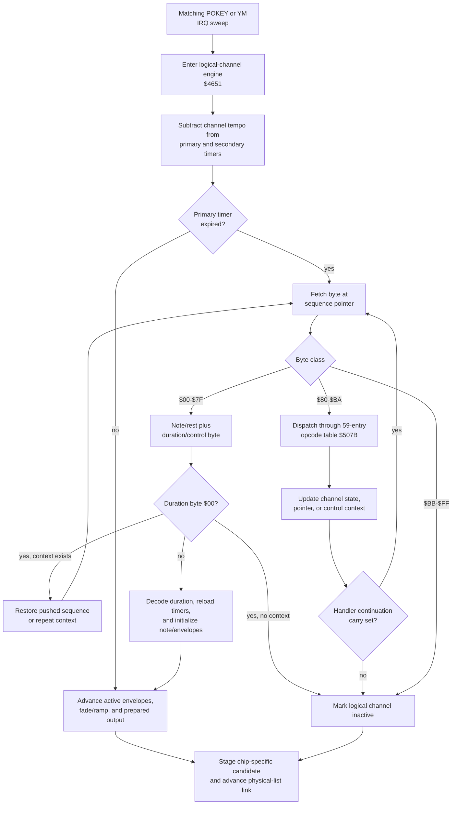
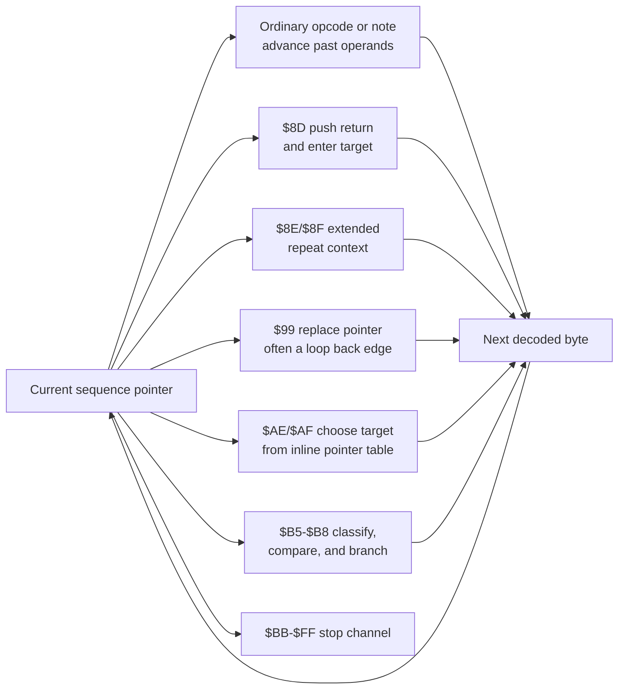

# 06 — Sequence Engine

## Scope

Type-7 commands use a bytecode engine shared by POKEY and YM2151 logical
channels. The physical channel selected by the chain record determines
chip-specific behavior. Type-11 speech does **not** use this bytecode.

## Basic stream format

At a sequence pointer:

- byte 0 `$00-$7F`: note/rest value, followed by a duration/control byte;
- byte 0 `$80-$BA`: opcode, dispatched through `$507B`;
- byte 0 `$BB-$FF`: end marker.

For a note/rest, byte 1 is interpreted as:

| Bits | Meaning |
|---|---|
| 3..0 | Index into 16-entry duration table `$5C5F` |
| 5..4 | Secondary division/control field |
| 6 | Dotted-duration modifier |
| 7 | Sustain mode |

The pair `xx 00` is a chain/return marker rather than a zero-duration note. It
returns from a pushed subsequence when a return context exists; otherwise it
ends the current stream.

The IRQ-time interpreter advances one logical channel until it has scheduled a
new timed event, reached an end marker, or completed the non-expired timer path.

## Control-flow model

The control-flow opcodes change the same sequence pointer and context state
used by the interpreter above; they are not separate execution engines.

- `$8D` pushes a return and enters a 16-bit target.
- `$8E/$8F` implement extended repeat/push/pop state.
- `$99` replaces the sequence pointer, commonly forming loops.
- `$AE/$AF` implement variable-length conditional skip/jump behavior.
- `$B5-$B8` compare classified variables and branch to 16-bit targets.
- End markers `$BB-$FF` stop the logical channel.

Exact interval mapping must therefore follow targets; sorting entry pointers is
not sufficient to determine stream boundaries.

The sequence at `$8378` consumes `$837F-$8380` as a complete `00 00`
chain/end marker. The next byte, `$8381`, is the first instruction of the
board-control routine. This establishes the mixed-region exclusive end as
`$8381` (**Verified**).

The current bounded static traversal follows calls and every indexed target and
terminates basic blocks at `$99`, `$AE/$AF`, chain/end markers, or an already
visited instruction. From the 153 distinct table seeds it found 2,166
instructions, 4,670 consumed bytes, 72 explicit edges, including 34 `$AE`
sites and five `$99` edges. Three edge targets are shared. These are
**Verified** properties of the conservative generated static map.

All conditional feasibility is now resolved. `$AE/$AF` index packed target
tables rather than branching to one target or falling through. Thirty-one
`$AB 00` sites force index zero in a one-entry table. The other three follow
classifier `$B2 05` (POKEY RANDOM) and masks `$03/$0F`; the supplied 9-bit and
17-bit polynomial domains reach every index. Conservative and feasible maps
are therefore identical. Which RNG-selected entry runs remains
runtime-dependent.

## Opcode reference

The verified target table has 59 entries for `$80-$BA`. Names below describe
the current best understanding; chip-specific differences are important.

`$5029` implements synthesized 6502 dispatch: it doubles the opcode, pushes
the target-minus-one word from `$507B-$50F0`, restores logical-channel X,
loads the first operand from `($06),Y`, sets carry, and returns into the
selected handler. Handler carry is the interpreter continuation contract; end
markers `$BB-$FF` instead store `$FF` in `$0228,X` and return carry clear. All
59 resolved rows are generated in `bytecode_handler_catalog.csv` (**Verified**).

| Opcode | Handler | Name | Args | Summary |
|---:|---:|---|---:|---|
| `$80` | `$5173` | SET_TEMPO | 1 | Set channel tempo from argument |
| `$81` | `$516A` | ADD_TEMPO | 1 | Add to channel tempo |
| `$82` | `$5192` | SET_VOLUME | 1 | POKEY volume; YM reloads volume envelope |
| `$83` | `$517A` | ADD_VOLUME | 1 | POKEY add volume; YM applies a carrier-TL delta |
| `$84` | `$51AE` | SET_TRANSPOSE | 1 | Replace transpose |
| `$85` | `$51AA` | ADD_TRANSPOSE | 1 | Add transpose |
| `$86` | `$515F` | SET_FREQ_ENV | 2 | Set frequency-envelope pointer |
| `$87` | `$5154` | SET_VOL_ENV | 2 | Set volume-envelope pointer |
| `$88` | `$50F1` | RESET_TIMER | 1 | Reset timer/repeat state |
| `$89` | `$514B` | SET_REPEAT | 1 | Set repeat counter |
| `$8A` | `$51B3` | SET_DISTORTION | 1 | Set distortion shape/mask input |
| `$8B` | `$51B7` | SET_CTRL_BITS | 1 | Chip-specific OR/control operation |
| `$8C` | `$51E2` | SET_VIBRATO | 1 | Set vibrato depth |
| `$8D` | `$51E6` | PUSH_SEQ | 2 | Call 16-bit subsequence |
| `$8E` | `$5214` | PUSH_SEQ_EXT | 1 | Allocate extended repeat context |
| `$8F` | `$523F` | POP_SEQ | 1 | Repeat or pop context; argument ignored |
| `$90` | `$54CC` | SWITCH_POKEY | 1 | Clear channel type/status bit |
| `$91` | `$54E5` | SWITCH_YM2151 | 1 | Set YM status and sync argument |
| `$92-$95` | `$4719` | NOP | 1 | Consume argument, common return |
| `$96` | `$54F4` | QUEUE_OUTPUT | 1 | Queue byte for main CPU |
| `$97` | `$54F9` | FADEOUT_ENV | 1 | Reset envelope and mark `$FE`; arg ignored |
| `$98` | `$4719` | NOP | 1 | Consume argument |
| `$99` | `$5515` | SET_SEQ_PTR | 2 | Unconditional 16-bit sequence jump |
| `$9A` | `$5524` | PLAY_SPEECH_CMD | 1 | Trigger type-11/TMS5220 command |
| `$9B` | `$51CB` | CLR_CTRL_BITS | 1 | Chip-specific AND/control operation |
| `$9C` | `$54B1` | FORCE_POKEY | 1 | Force/synchronize POKEY mode |
| `$9D` | `$5535` | SET_VOICE | 2 | Load YM2151 voice definition |
| `$9E` | `$5613` | YM_LOAD_ENV | 2 | Load YM envelope/register data |
| `$9F` | `$5655` | YM_LOAD_REG | 2 | Load YM register block |
| `$A0` | `$568A` | YM_FREQ_OFFSET | 1 | YM-only frequency offset |
| `$A1` | `$5715` | YM_CARRIER_TL_DELTA | 1 | Negate signed operand and apply it to algorithm-selected carrier TLs |
| `$A2` | `$56CB` | YM_VOL_ENV_NEG | 1 | YM-only negative envelope position |
| `$A3` | `$56AF` | YM_VOL_ENV_SUB | 1 | YM-only subtract/clamp |
| `$A4` | `$5271` | VAR_LOAD | 2 | Load working variables/rate |
| `$A5` | `$4719` | NOP | 1 | Consume argument |
| `$A6` | `$5703` | YM_SHIFT_LEFT | 1 | YM-only shift operation |
| `$A7` | `$56DC` | FREQ_ADD | 1 | YM-only signed frequency add |
| `$A8` | `$5711` | SET_FREQ_ENV_LOOP | 1 | Set frequency-envelope loop |
| `$A9` | `$529E` | REG_ADD | 1 | General register add |
| `$AA` | `$52AA` | REG_SUB | 1 | General register subtract |
| `$AB` | `$52B4` | REG_AND | 1 | General register AND |
| `$AC` | `$52BA` | REG_OR | 1 | General register OR |
| `$AD` | `$52C0` | REG_XOR | 1 | General register XOR |
| `$AE` | `$5320` | COND_JUMP_REG_Z | variable | Index inline 16-bit target table by register |
| `$AF` | `$5347` | COND_JUMP_INC | variable | As `$AE`, then increment register |
| `$B0` | `$5375` | VAR_STORE | 1 | Store register to workspace index 6..21 |
| `$B1` | `$53C2` | VAR_APPLY_YM | 1 | Apply register to YM destination |
| `$B2` | `$53FB` | VAR_CLASSIFY_LOAD | 1 | Classify/load variable into register |
| `$B3` | `$52C6` | SHIFT_REG_RIGHT | 1 | Shift general register right |
| `$B4` | `$52F3` | SHIFT_REG_LEFT | 1 | Shift general register left |
| `$B5` | `$5410` | COND_JUMP_EQ | 3 | Classify and jump if equal/zero |
| `$B6` | `$5417` | COND_JUMP_NE | 3 | Jump if nonzero |
| `$B7` | `$541E` | COND_JUMP_PL | 3 | Jump if nonnegative |
| `$B8` | `$5425` | COND_JUMP_MI | 3 | Jump if negative |
| `$B9` | `$5401` | REG_CLASSIFY_SUB | 1 | Shadow = register - classified value |
| `$BA` | `$5404` | REG_SUB_STORE | 1 | Shadow = register - immediate |

## Variable classifier

`$5444` maps an index to chip/channel/global state:

| Index | POKEY | YM2151 |
|---:|---|---|
| 0 | Base volume | Leaves A unchanged / unresolved |
| 1 | Tempo | Tempo |
| 2 | Transpose | Transpose |
| 3 | Register-shadow fallback | Volume-envelope position |
| 4 | Register-shadow fallback | Base volume |
| 5 | POKEY RNG `$180A` | POKEY RNG `$180A` |
| 6..21 | Workspace `$18+index-6` | Same |
| 22+ | Register shadow | Register shadow |

Bounded listings verify that `$5444` preserves caller Y through `$11`, maps
6..21 to zero-page `$18-$27`, reads POKEY RANDOM for index 5, and maps 22+ to
`$07C8,X`. The YM index-0 path returns without loading A, so its value is
caller-preserved rather than an unidentified RAM field.

## YM voice and auxiliary loaders

The `$9D` handler stores its 16-bit operand, initializes voice/envelope state,
and, only for a live YM context, writes a 28-byte register image. Offsets
`$00-$03` map to channel registers `$20/$28/$30/$38`; offsets `$04-$1B` are
six register-bank bytes for M1, M2, C1, and C2 in that order. All 147
configured references select 39 distinct bases, exhaustively recorded in
`generated/ym_voice_field_catalog.csv`.

The following bytes complete the 42-byte instrument record rather than the
28-byte register image. `$4C16` deliberately skips offset `$1C`, and no
configured consumer of that byte was found. Offsets `$1D,$1F,$21,$23` are
M1/M2/C1/C2 total-level transform descriptors whose high and low nibbles feed
the `$72DC/$5B5B` transforms. Offsets `$1E,$20,$22` form an attenuation chain:
each is the current operator's correction source and the next operator's
nonlinear-index seed. `$0826=0` seeds M1 and live volume at `$082E` supplies
C2's final correction. `$9E` consumes offsets `$24-$28`, writing registers
`$18,$19,$19,$1B`, then register `$01=0` plus shadow `$083E`. `$9F` separately
consumes offset `$29` for register `$0F`.
`$5676` is the `$9E/$9F` shared indirect YM writer and skips hardware access
when `$17` marks the suppressed update path.

The volume-base reload entry beginning `$5755` continues through `$578F`,
not `$5774`: it reloads four operator TL bases at record offsets 5/11/17/23,
indexes a Verified 16-byte signed carrier-attenuation table at `$5790-$579F`,
and tail-jumps to `$5715`. `$5715` negates the signed input and saturating-adds
it only to carriers selected by `$57A0[algorithm]`; it does not modify KC, KF,
DT1, or DT2. The former detune label and `$5774` boundary are **Contradicted**.

The four 30-byte logical-channel arrays beginning at `$0426/$0444/$0462/$0480`
are intentionally mode-overloaded. POKEY bytecode `$87/$86` uses them as two
16-bit envelope pointers. In YM mode, `$5755` loads voice TL offsets
5/11/17/23 into those same locations and `$4C16` stages them as the four
operator base total levels. Treating the YM view as envelope pointers is
**Contradicted**.

Configured reachability is narrower than the opcode table: no sequence reaches
SET_VIBRATO `$8C`, while all 13 SET_FREQ_ENV `$86` operations execute in POKEY
mode. Since allocation zeros `$0660` and the zero-depth note path clears
`$067E/$069C`, the YM nonzero-delta convergence block at `$4C69-$4CBD` is
dormant for this ROM's configured command set.

## Type-7 chain topology

| Chain size | Commands |
|---:|---:|
| 1 | 22 |
| 2 | 24 |
| 3 | 1 |
| 4 | 2 |
| 5 | 1 |
| 8 | 12 |

Command `$04` is the important offset-zero case: it drives eight YM2151
channels using sequences `$690C` onward. The old resolver omitted the entire
command because it confused a valid starting record with a next-link sentinel.

## Timing

Durations combine the 16-bit duration-table value, channel tempo, dotted and
division controls, and physical-device updates. The ROM alternates POKEY and YM
per IRQ, so a logical channel's timer is serviced once per matching full sweep.
Using the implementation clock configuration independently confirmed by a
schematic calculation, that is 119.8454952 Hz or 8.344077 ms per update. The
rate and alternating ROM scheduler are **Verified**.

The bounded consumer verifies the arithmetic staging:
`$4651` subtracts `$05CA,X` from both 16-bit timers; `$4844` adds the selected
16-bit duration and optionally half of it for bit 6; with sustain bit 7 clear,
it derives the secondary timer after subtracting twice the tempo and optionally
dividing for control field `$10`. The primary timer is a phase accumulator, so
individual event spacings can differ by one service interval when duration is
not divisible by tempo; its long-run mean is duration/tempo updates before
dotted and division modifiers. A simple per-note `ceil(duration/tempo)` formula
would discard the carried subtraction residue and is therefore not exact.

The generated secondary-timer trace resolves representative articulation.
For command `$04` channel 1, the first C4 is active for 58 of its 60 sweep
intervals: 0.483956 s followed by a 2-sweep silent gap. For command `$40`
channel 1, the preceding rest leaves residue -4; tempo 26 and note control
`$1A` produce primary 236, secondary 184 before division, and secondary 92
after the `$10` control-field shift. Key-off follows after 4 sweeps
(0.033376 s), six sweeps before the next event. Sustain control `$81` at
`$69A5` keeps the secondary high byte at `$7F`; its 480-sweep loop re-arms the
timer before expiry. Seconds use the schematic-confirmed clock; timer values
and branch behavior are **Verified**.

Cycle composition now executes command `$44` directly from its type-7
allocation state with an NMOS-6502 subset executor. The first service consumes
1,637/1,656 cycles while decoding `$8B,$87,$86,$90,$82,$8A` and REST. The
second service consumes 510/529 cycles: both envelope counts go 2->1 and the
REST secondary timer expires. The third consumes 557/576 while both envelopes
reload continuing count-`$12` records.

This execution corrects the earlier isolated boundary count. Frequency bytes
`12 00 00` do not take the termination branch: after `CMP #$FF`, accumulator
`A` remains `$12`, so ORing the two zero delta bytes remains nonzero. The
post-state advances frequency offset 2->5 and volume offset 1->3, with both
countdowns reloaded to `$12`.

One `$FF` cost is now closed. Command `$05` channel 2's `$68F3` frequency
envelope executes `$FF FF 06` in 505/524 total `$4651` cycles from a configured
active boundary. The consumer changes the base to `$68ED`, sets `$05AC,X=$FF`,
and reloads count `$FC` with offset 11. The two measured phases execute 145 and
149 instructions.

Whole-device execution supplies the missing command `$05` context. Allocator
code `$44FD-$4618` chooses slots 29,28,27,26 and stores slot+1 into physical
heads `$1E,$1F,$20,$21`. The first POKEY sweep executes all four setup/REST
streams in 6,874 cycles normally or 6,950 on the rotate phase. Four
phase-aligned 1,000-service traces retain two looping channels after the finite
pair ends; their largest post-initial device service is 4,201 cycles.

Converting an arbitrary sequence to seconds now has an established service
unit, but requires a stateful timer trace across note boundaries. Exported MIDI
timing remains an implementation hypothesis until compared with such traces.
For pitch, the tool uses the consumer-validated `MIDI=note+11` convention only
through ROM note 97. Values 98..127 are displayed as raw bytes and omitted from
MIDI pitch events until their effective overlapping KC/KF state is traced.

The first generated stateful trace now covers the seven finite channels of
command `$04`. Type-7 allocation at `$4537` initializes tempo to `$10` and both
primary timer bytes to zero. On the first matching device sweep, subtraction
makes the timer negative and bytecode begins; each duration is then added to
that signed residue. The seven chip-test streams end after exactly 120, 240,
360, 480, 600, 720, and 840 intervals from their first event, respectively.
At 119.8454952 Hz these are 1.001289 through 7.009024 seconds. All finish with
residue -16, directly validating carried-residue arithmetic for these streams.

`gauntlet_disasm.py` statistics and score timelines now use the Verified default
tempo `$10` and the implementation-derived service rate instead of tempo zero
and an exact 120 Hz approximation. Its fractional duration presentation remains
a mean model; `timing_duration_trace_catalog.csv` is the exact selected trace.

Type-7 WAV export no longer uses that fractional presentation or the former
per-channel synthesis heuristic. `SoundRomRegisterTrace` executes the ROM's
`$41E6` reset, `$432E` command dispatch/type-7 allocation, and repeated `$41C8`
IRQ audio services with the Verified 6502 and IRQ clocks. Consequently the ROM
itself performs carried timer arithmetic, bytecode dispatch, repeats, envelope
stepping, priority/list arbitration, POKEY joined-mode selection, YM total-level
transforms, keying, and hardware-register writes. All four POKEY channels feed
one shared emulator, while YM register writes feed the supplied YMFM core via
`ymfm_renderer.cpp`. This control/register path is **Verified** against the ROM
and supplied chip implementation. Standalone amplitude normalization does not
model the cabinet's analog mixer, and the deterministic POKEY RNG seed selects
one of the already Verified-feasible random branches.

The trace now also executes tempo changes and extended counted repeats:

- command `$09` sets `$F0 >> 2 = $3C`; all three channels end after 104
  intervals (0.867784 s) with residue -16;
- command `$2A` starts at `$B0 >> 2 = 44` and uses eleven raw modulo additions
  `$FF/$FE/.../$FA` as decrements, ending at tempo 6 after 68 intervals
  (0.567397 s) with residue -4;
- command `$1C` uses `$8E 02/$8F` to execute its eight-event body twice and
  ends after 274 intervals (2.286277 s);
- command `$20` uses `$8E 0A/$8F` to execute one sustained whole note ten
  times. Because the first subtraction occurs at allocation tempo 16 before
  `$80 30` sets tempo 12, it ends after 6,399 rather than 6,400 intervals:
  53.393747 s with residue -4.

Bounded consumers verify `$80` shifts right twice before storing tempo, `$81`
performs raw 8-bit addition, and `$8E/$8F` saves and restores the post-push
sequence pointer while decrementing the stored count. Score/statistics output
now expands these configured repeats; command `$20` therefore reports about
53.4 seconds instead of the former single-body 5.3-second estimate.

Every Verified-feasible value of all three POKEY-RNG computed jumps is now
traced. The masked value indexes a four- or sixteen-entry target table:

| Command/site | Values | Result for every value |
|---|---:|---:|
| `$2B/$6736` | 0..3 | 1 note, 60 intervals |
| `$2C/$6794` | 0..15 | 1 note, 12 intervals |
| `$3A/$7D26` | 0..15 | 1 note, 120 intervals |

All 36 variants finish with residue -16. This resolves finite primary-timer
duration for every runtime-feasible RNG target, though the probability of each
outcome remains a hardware-polynomial/runtime-state question.

The nonzero `$3A` path also demonstrates that sequence note bytes need not stay
chromatic. Its eight values above 97 all use duration `$7D`; `$48D7` clears the
note-transition delta, and voice `$6E6E` supplies zero base KF. They therefore
index the overlapping KC view directly, producing six KC `$00` events followed
by KC `$01` and `$02`. The disassembler preserves these as raw note bytes
rather than exporting misleading high MIDI notes.

All five `$99` back edges are now bounded-traced. Each is a tight self-loop, and
the first three replay periods are identical while retaining residue -16:

| Command/channel | Prefix to first loop boundary | Repeating period |
|---|---:|---:|
| `$2E` | 480 intervals | 480 intervals |
| `$37` | 15 intervals | 15 intervals |
| `$05` channel 1 | 60 intervals | 30 intervals |
| `$05` channel 2 | 60 intervals | 30 intervals |
| `$04` channel 8 | 1,500 intervals | 480 intervals |

The prefix includes the first loop-body note/rest before reaching `$99`.
Command `$04` channel 8 therefore reaches its sustained-C5 back edge after
12.516115 seconds, then repeats every 4.005157 seconds under the implementation
clock. These are prefix/period measurements, not finite play times. The
disassembler now labels `$99` statistics as a decoded loop prefix accordingly.
